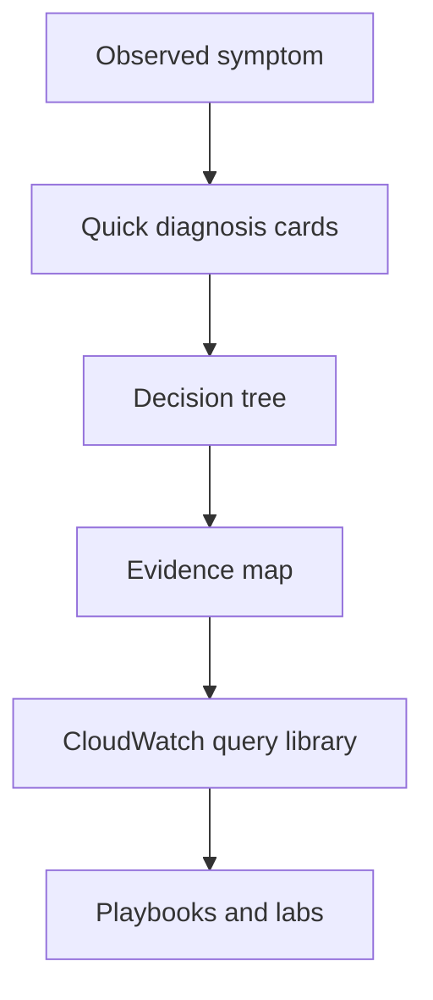

# Troubleshooting

Use this section when a Lambda function fails, slows down, or behaves differently after a deployment. Start with the symptom, collect evidence from the right AWS signal, and then move into the matching playbook or CloudWatch Logs Insights query.

## What This Section Covers

| Area | Purpose | Start here |
|---|---|---|
| Core troubleshooting model | Build a correct mental model before changing code or config | [Mental Model](./mental-model.md) |
| Symptom triage | Route common Lambda symptoms to the right investigation path | [Decision Tree](./decision-tree.md) |
| Evidence collection | Gather logs, metrics, traces, and control-plane records fast | [Evidence Map](./evidence-map.md) |
| Fast incident response | Use short symptom cards during live troubleshooting | [Quick Diagnosis Cards](./quick-diagnosis-cards.md) |
| Logs Insights library | Reusable CloudWatch Logs Insights queries for Lambda incidents | [CloudWatch Query Library](./cloudwatch/index.md) |

## Suggested Workflow

1. Confirm the symptom category.
2. Check the matching quick diagnosis card.
3. Use the decision tree to narrow the failure domain.
4. Collect primary and secondary evidence.
5. Run the matching CloudWatch Logs Insights query.
6. Move into the detailed playbook or lab if the cause is still unclear.

## Subsections

### Core Pages

- [Architecture Overview](./architecture-overview.md)
- [Decision Tree](./decision-tree.md)
- [Mental Model](./mental-model.md)
- [Evidence Map](./evidence-map.md)
- [Quick Diagnosis Cards](./quick-diagnosis-cards.md)

### CloudWatch Logs Insights Query Library

- [CloudWatch Query Library Overview](./cloudwatch/index.md)
- [Invocation Queries](./cloudwatch/invocation/index.md)
- [Application Queries](./cloudwatch/application/index.md)
- [Platform Queries](./cloudwatch/platform/index.md)
- [Correlation Queries](./cloudwatch/correlation/index.md)

### Related Troubleshooting Paths

- [First 10 Minutes](./first-10-minutes/index.md)
- [Playbooks](./playbooks/index.md)
- [Hands-on Labs](./lab-guides/index.md)
- [Methodology](./methodology/troubleshooting-method.md)
- [Log Sources Map](./methodology/log-sources-map.md)

## Common Symptom Buckets

| Symptom | Typical first signal | Best next page |
|---|---|---|
| Function returns an error | Application log lines, `Errors` metric | [Quick Diagnosis Cards](./quick-diagnosis-cards.md) |
| Function times out | `Task timed out` log entry, high `Duration` | [Timeout Errors Query](./cloudwatch/application/timeout-errors.md) |
| Throttling | `Throttles` metric, invoke failures in CloudTrail | [Throttle Trend](./cloudwatch/invocation/throttle-trend.md) |
| Cold start latency | `Init Duration` in `REPORT` lines | [Cold Start Duration](./cloudwatch/invocation/cold-start-duration.md) |
| Memory pressure | `Max Memory Used` near configured limit | [Memory Utilization](./cloudwatch/platform/memory-utilization.md) |
| VPC connectivity | Long duration, downstream timeouts, ENI-related setup issues | [VPC Connectivity Playbook](./playbooks/networking/vpc-connectivity.md) |

!!! tip
    In Lambda, not every failure is visible in the same place. Application exceptions usually appear in `/aws/lambda/$FUNCTION_NAME`, throttles often show up first in metrics or caller-side logs, and deployment regressions often require CloudTrail plus function logs together.

## See Also

- [Architecture Overview](./architecture-overview.md)
- [Decision Tree](./decision-tree.md)
- [Evidence Map](./evidence-map.md)
- [CloudWatch Query Library](./cloudwatch/index.md)
- [Reference: Lambda Diagnostics](../reference/lambda-diagnostics.md)

## Sources

- [AWS Lambda Developer Guide](https://docs.aws.amazon.com/lambda/latest/dg/welcome.html)
- [Monitoring Lambda functions with CloudWatch](https://docs.aws.amazon.com/lambda/latest/dg/monitoring-functions.html)
- [Analyzing log data with CloudWatch Logs Insights](https://docs.aws.amazon.com/AmazonCloudWatch/latest/logs/AnalyzingLogData.html)
