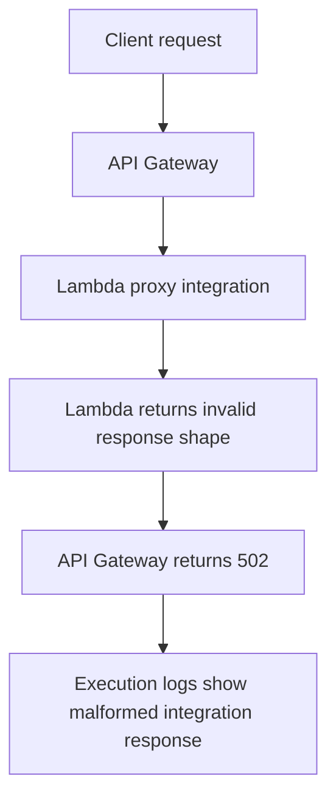

# Lab: API Gateway Integration

Reproduce an API Gateway 502 response caused by a Lambda proxy integration response format mismatch and practice proving that the integration contract, not the business logic, is the real failure point.

## Lab Metadata
| Attribute | Value |
|---|---|
| Difficulty | Intermediate |
| Duration | 30 minutes |
| Failure Mode | Lambda returns a payload shape that does not match API Gateway proxy integration requirements |
| Skills Practiced | API Gateway integration diagnosis, Lambda response validation, CloudWatch log correlation, SAM deployment |

## 1) Background
### 1.1 Why this lab exists
API Gateway 502 errors are frequently blamed on the gateway itself, but many are caused by Lambda returning a structurally invalid proxy response.

### 1.2 Platform behavior model
With Lambda proxy integration, API Gateway expects a specific response structure including `statusCode` and `body`. If Lambda returns a different shape, API Gateway treats the integration as failed and returns 502 to the client.

### 1.3 Diagram


## 2) Hypothesis
### 2.1 Original hypothesis
API Gateway returns 502 because Lambda does not return a valid proxy integration response document.

### 2.2 Causal chain
Client request -> API Gateway invokes Lambda -> Lambda returns malformed object -> API Gateway cannot map integration response -> client receives 502.

### 2.3 Proof criteria
- API Gateway returns 502 while Lambda logs show the handler completed.
- API Gateway execution logs indicate malformed or invalid Lambda proxy response.
- Returning a valid `statusCode` and string `body` fixes the error.

### 2.4 Disproof criteria
- Lambda itself fails before returning any response.
- API Gateway configuration points to the wrong function or permission error blocks invoke.

## 3) Runbook
1. Deploy a SAM application with API Gateway and a Lambda function that intentionally returns an invalid object such as `{"ok": true}`.

```bash
sam build

sam deploy \
    --stack-name "$STACK_NAME" \
    --resolve-s3 \
    --capabilities CAPABILITY_IAM \
    --region "$REGION"
```

2. Invoke the API endpoint.

```bash
curl --include "$API_URL"
```

3. Inspect Lambda logs to confirm the handler ran.

```bash
aws logs tail "/aws/lambda/$FUNCTION_NAME" \
    --since 10m \
    --region "$REGION"
```

4. Inspect API Gateway execution logs or access logs for the failed integration.

```bash
aws logs tail "$API_GATEWAY_LOG_GROUP" \
    --since 10m \
    --region "$REGION"
```

5. Fix the handler to return a valid proxy response and redeploy.

```bash
sam build

sam deploy \
    --stack-name "$STACK_NAME" \
    --resolve-s3 \
    --capabilities CAPABILITY_IAM \
    --region "$REGION"
```

6. Re-test the endpoint and confirm 2xx behavior.

```bash
curl --include "$API_URL"
```

## 4) Analysis
This lab separates Lambda execution success from integration success. The handler can run and return data, yet API Gateway still returns 502 if the response contract is wrong. The combination of Lambda logs showing successful completion and API Gateway logs showing malformed proxy output is what proves the real cause. Without both views, responders often chase the wrong layer.

## 5) Cleanup
```bash
aws cloudformation delete-stack \
    --stack-name "$STACK_NAME" \
    --region "$REGION"
```

## See Also
- [Hands-on Labs](./index.md)
- [Deployment Failed](./deployment-failed.md)
- [First 10 Minutes: Invocation Errors](../first-10-minutes/invocation-errors.md)
- [Troubleshooting Method](../methodology/troubleshooting-method.md)

## Sources
- [Set up Lambda proxy integrations in API Gateway](https://docs.aws.amazon.com/apigateway/latest/developerguide/set-up-lambda-proxy-integrations.html)
- [Using API Gateway with Lambda](https://docs.aws.amazon.com/lambda/latest/dg/services-apigateway.html)
- [Viewing CloudWatch logs for Lambda](https://docs.aws.amazon.com/lambda/latest/dg/monitoring-cloudwatchlogs-view.html)
