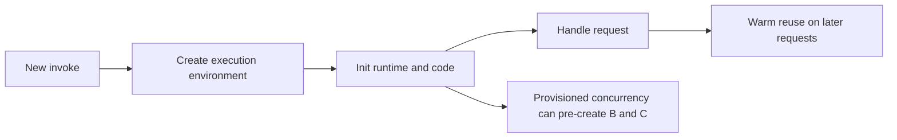

# Lab: Cold Start Latency

Measure cold start latency with and without VPC attachment, then compare behavior again with provisioned concurrency so you can isolate how initialization cost changes across deployment choices.

## Lab Metadata
| Attribute | Value |
|---|---|
| Difficulty | Intermediate |
| Duration | 45 minutes |
| Failure Mode | Cold start latency spikes during scale-out or after deployment |
| Skills Practiced | Cold start analysis, `Init Duration` interpretation, provisioned concurrency, VPC impact measurement, alias testing |

## 1) Background
### 1.1 Why this lab exists
Cold starts are often discussed generically. This lab makes the latency visible so you can compare observed behavior instead of relying on assumptions about VPC or provisioned concurrency.

### 1.2 Platform behavior model
When Lambda creates a new execution environment, it initializes the runtime, loads code, and performs any initialization work before processing the event. Provisioned concurrency keeps pre-initialized environments ready for an alias or version.

### 1.3 Diagram


## 2) Hypothesis
### 2.1 Original hypothesis
VPC attachment increases cold start latency, and provisioned concurrency reduces user-visible latency by pre-initializing environments.

### 2.2 Causal chain
New environment required -> initialization occurs -> extra network and configuration work for VPC path -> first invoke latency rises -> provisioned concurrency shifts that init cost before traffic arrives.

### 2.3 Proof criteria
- `REPORT` lines show higher `Init Duration` for the VPC-attached version.
- User-visible latency drops when invoking an alias with provisioned concurrency configured.
- Warm invocations remain much faster than cold invocations.

### 2.4 Disproof criteria
- `Init Duration` remains similar across variants.
- Latency stays high even after provisioned concurrency because the dominant delay is downstream work, not init.

## 3) Runbook
1. Deploy a baseline function without VPC attachment and enable detailed logs.

```bash
sam build

sam deploy \
    --stack-name "$STACK_NAME" \
    --resolve-s3 \
    --capabilities CAPABILITY_IAM \
    --region "$REGION"
```

2. Invoke the function several times with pauses to force cold starts.

```bash
for i in 1 2 3; do
    aws lambda invoke \
        --function-name "$FUNCTION_NAME" \
        --payload '{}' \
        --cli-binary-format raw-in-base64-out \
        "response-$i.json" \
        --region "$REGION"
    sleep 120
done
```

3. Inspect `REPORT` lines and note `Init Duration`.

```bash
aws logs tail "/aws/lambda/$FUNCTION_NAME" \
    --since 30m \
    --filter-pattern "REPORT" \
    --region "$REGION"
```

4. Update the function to run in private subnets in a VPC, redeploy, and repeat the invoke sequence.

```bash
sam deploy \
    --stack-name "$STACK_NAME" \
    --resolve-s3 \
    --capabilities CAPABILITY_IAM \
    --region "$REGION"
```

5. Publish a version, create an alias, and configure provisioned concurrency.

```bash
aws lambda publish-version \
    --function-name "$FUNCTION_NAME" \
    --region "$REGION"

aws lambda create-alias \
    --function-name "$FUNCTION_NAME" \
    --name live \
    --function-version 1 \
    --region "$REGION"

aws lambda put-provisioned-concurrency-config \
    --function-name "$FUNCTION_NAME" \
    --qualifier live \
    --provisioned-concurrent-executions 2 \
    --region "$REGION"
```

6. Invoke the alias and compare observed latency and `Init Duration` behavior.

```bash
aws lambda invoke \
    --function-name "$FUNCTION_NAME:live" \
    --payload '{}' \
    --cli-binary-format raw-in-base64-out \
    response-live.json \
    --region "$REGION"
```

## 4) Analysis
Cold starts are visible when new environments are created, not on every request. The VPC-attached variant typically has a more expensive initialization path, while provisioned concurrency reduces user-facing latency by moving environment preparation ahead of demand. If latency remains high even with provisioned concurrency, the bottleneck is likely in the handler's own work or a downstream dependency rather than initialization.

## 5) Cleanup
```bash
rm --force response-*.json response-live.json

aws lambda delete-provisioned-concurrency-config \
    --function-name "$FUNCTION_NAME" \
    --qualifier live \
    --region "$REGION"

aws cloudformation delete-stack \
    --stack-name "$STACK_NAME" \
    --region "$REGION"
```

## See Also
- [Hands-on Labs](./index.md)
- [First 10 Minutes: Cold Start Spikes](../first-10-minutes/cold-start-spikes.md)
- [High Duration](./high-duration.md)
- [VPC Connectivity](./vpc-connectivity.md)

## Sources
- [Lambda execution environment](https://docs.aws.amazon.com/lambda/latest/dg/lambda-runtime-environment.html)
- [Configuring provisioned concurrency for a function](https://docs.aws.amazon.com/lambda/latest/dg/provisioned-concurrency.html)
- [Giving Lambda functions access to resources in an Amazon VPC](https://docs.aws.amazon.com/lambda/latest/dg/configuration-vpc.html)
- [Monitoring metrics for Lambda functions](https://docs.aws.amazon.com/lambda/latest/dg/monitoring-metrics.html)
