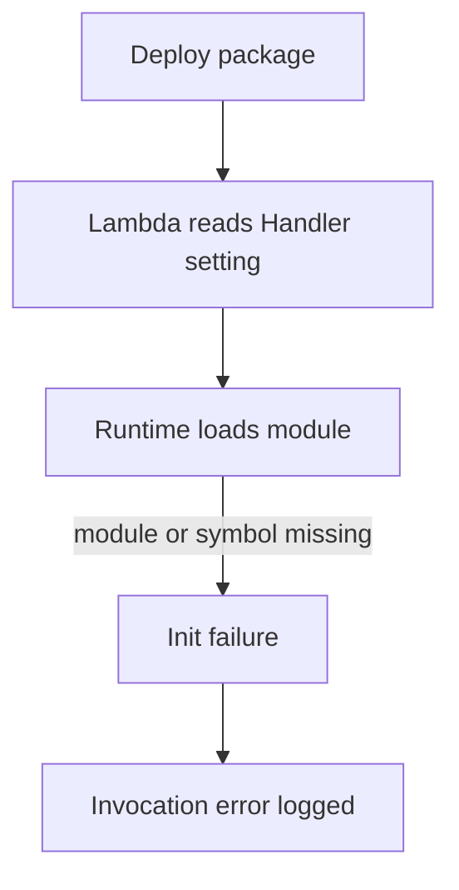

# Lab: Deployment Failed

Deploy a Lambda function with an invalid handler reference, invoke it, and prove whether the failure is in package layout and handler configuration instead of in business logic or permissions.

## Lab Metadata
| Attribute | Value |
|---|---|
| Difficulty | Beginner |
| Duration | 25 minutes |
| Failure Mode | Handler configuration points to a missing module or function |
| Skills Practiced | Deployment validation, function configuration review, log-based handler diagnosis, SAM deployment |

## 1) Background
### 1.1 Why this lab exists
Broken handler references are common after refactoring, packaging changes, or runtime migration. The symptom often appears only at invoke time, which can mislead responders into looking at request payloads first.

### 1.2 Platform behavior model
Lambda loads the configured runtime and resolves the handler string to a module and function. If the module path or exported handler does not exist, initialization fails before business logic starts.

### 1.3 Diagram


## 2) Hypothesis
### 2.1 Original hypothesis
The function fails because the configured handler does not match the deployed code package.

### 2.2 Causal chain
Bad handler value -> runtime cannot import module or function -> init error before handler runs -> every invoke fails immediately.

### 2.3 Proof criteria
- Logs show handler import, module load, or symbol resolution failure.
- `get-function-configuration` shows a handler string that does not exist in the package.
- Correcting the handler resolves the error without changing request input.

### 2.4 Disproof criteria
- The handler loads successfully and the failure happens later in business logic.
- The issue is caused by permission denial or timeout rather than init failure.

## 3) Runbook
1. Create a SAM function and intentionally configure an invalid handler such as `app.missing_handler`.

```bash
sam build

sam deploy \
    --stack-name "$STACK_NAME" \
    --resolve-s3 \
    --capabilities CAPABILITY_IAM \
    --region "$REGION"
```

2. Confirm the deployed handler value.

```bash
aws lambda get-function-configuration \
    --function-name "$FUNCTION_NAME" \
    --query '{Handler:Handler,Runtime:Runtime,LastModified:LastModified}' \
    --region "$REGION"
```

3. Invoke the function.

```bash
aws lambda invoke \
    --function-name "$FUNCTION_NAME" \
    --payload '{}' \
    --cli-binary-format raw-in-base64-out \
    response.json \
    --region "$REGION"
```

4. Read the latest log stream.

```bash
aws logs tail "/aws/lambda/$FUNCTION_NAME" \
    --since 10m \
    --region "$REGION"
```

5. Correct the handler in `template.yaml`, rebuild, and redeploy.

```bash
sam build

sam deploy \
    --stack-name "$STACK_NAME" \
    --resolve-s3 \
    --capabilities CAPABILITY_IAM \
    --region "$REGION"
```

6. Invoke again and confirm the error disappears.

```bash
aws lambda invoke \
    --function-name "$FUNCTION_NAME" \
    --payload '{}' \
    --cli-binary-format raw-in-base64-out \
    response-fixed.json \
    --region "$REGION"
```

## 4) Analysis
This lab shows why deployment success is not the same as runtime readiness. CloudFormation and SAM can complete the resource update while the function still fails at invocation because the handler value is invalid. The fastest proof path is configuration plus logs: the handler string names what Lambda tried to load, and the init error explains why that load failed. No amount of request replay or IAM inspection fixes a broken entry point.

## 5) Cleanup
```bash
rm --force response.json response-fixed.json

aws cloudformation delete-stack \
    --stack-name "$STACK_NAME" \
    --region "$REGION"
```

## See Also
- [Hands-on Labs](./index.md)
- [First 10 Minutes: Invocation Errors](../first-10-minutes/invocation-errors.md)
- [Permission Denied](./permission-denied.md)
- [Troubleshooting Method](../methodology/troubleshooting-method.md)

## Sources
- [Lambda function configuration](https://docs.aws.amazon.com/lambda/latest/dg/configuration-function-common.html)
- [Troubleshoot Lambda functions](https://docs.aws.amazon.com/lambda/latest/dg/troubleshooting-execution.html)
- [Deploying serverless applications with AWS SAM](https://docs.aws.amazon.com/serverless-application-model/latest/developerguide/serverless-deploying.html)
