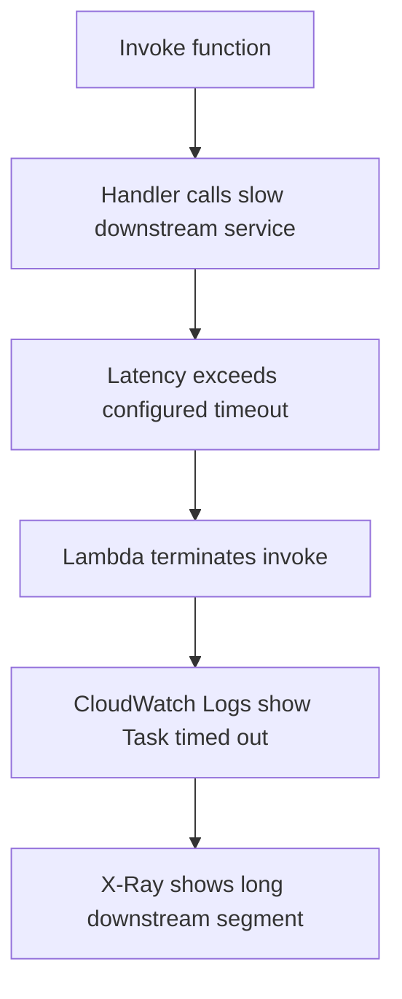

# Lab: Function Timeout

Reproduce a Lambda function that waits too long on a downstream dependency and exceeds its configured timeout so you can practice proving whether the timeout is caused by the function itself or by the dependency path.

## Lab Metadata
| Attribute | Value |
|---|---|
| Difficulty | Intermediate |
| Duration | 35 minutes |
| Failure Mode | Function exceeds configured timeout while waiting on a slow downstream HTTP service |
| Skills Practiced | Lambda timeout analysis, CloudWatch logs, X-Ray tracing, SAM deployment, downstream latency isolation |

## 1) Background
### 1.1 Why this lab exists
Timeout alarms are easy to misread. Responders often increase the timeout first even when the real fault is a slow dependency, broken network path, or inefficient retry loop.

### 1.2 Platform behavior model
Lambda runs the invocation until the configured timeout expires. If the function does not return in time, Lambda terminates the invocation, emits a timeout message to CloudWatch Logs, and counts the request as an error.

### 1.3 Diagram


## 2) Hypothesis
### 2.1 Original hypothesis
The function times out because a downstream HTTP dependency takes longer than the function's configured timeout.

### 2.2 Causal chain
Slow dependency response -> handler blocks waiting for result -> invocation duration approaches timeout -> Lambda terminates execution -> caller sees failure.

### 2.3 Proof criteria
- CloudWatch Logs contain `Task timed out after ... seconds`.
- `Duration` metric climbs close to the configured timeout.
- X-Ray or application logs show the downstream HTTP call consumes most of the invocation time.

### 2.4 Disproof criteria
- Logs show the handler fails early with an exception before the timeout.
- Duration remains well below the timeout and the error is caused by malformed input or permission denial.

## 3) Runbook
1. Create a SAM application with a short timeout and tracing enabled.

```bash
sam init \
    --name "$STACK_NAME" \
    --runtime python3.12 \
    --app-template hello-world \
    --package-type Zip
```

2. Edit `template.yaml` so the function uses `Timeout: 3`, `Tracing: Active`, and an environment variable that points to a slow endpoint such as a delayed API route.

```bash
sam build

sam deploy \
    --stack-name "$STACK_NAME" \
    --resolve-s3 \
    --capabilities CAPABILITY_IAM \
    --region "$REGION"
```

3. Invoke the function with a test event that forces the slow code path.

```bash
aws lambda invoke \
    --function-name "$FUNCTION_NAME" \
    --payload '{"delaySeconds":5}' \
    --cli-binary-format raw-in-base64-out \
    response.json \
    --region "$REGION"
```

4. Inspect logs and metrics.

```bash
aws logs tail "/aws/lambda/$FUNCTION_NAME" \
    --since 10m \
    --region "$REGION"

aws cloudwatch get-metric-statistics \
    --namespace AWS/Lambda \
    --metric-name Duration \
    --dimensions Name=FunctionName,Value="$FUNCTION_NAME" \
    --start-time "2026-04-07T00:00:00Z" \
    --end-time "2026-04-07T00:20:00Z" \
    --period 60 \
    --extended-statistics p95 p99 \
    --region "$REGION"
```

5. Confirm the configured timeout and trace settings.

```bash
aws lambda get-function-configuration \
    --function-name "$FUNCTION_NAME" \
    --query '{Timeout:Timeout,TracingConfig:TracingConfig}' \
    --region "$REGION"

aws xray get-service-graph \
    --start-time 1712448000 \
    --end-time 1712449200 \
    --region "$REGION"
```

6. Fix the lab by increasing timeout only after proving the dependency latency, or by reducing the downstream delay and re-running the invoke.

```bash
aws lambda update-function-configuration \
    --function-name "$FUNCTION_NAME" \
    --timeout 10 \
    --region "$REGION"
```

## 4) Analysis
The failure is not that Lambda stopped working. Lambda enforced the timeout exactly as configured. The real question is where the time was spent. When the downstream segment consumes most of the invocation, increasing timeout only masks the dependency problem unless the longer wait is explicitly acceptable. X-Ray and log timestamps let you distinguish between slow initialization, slow business logic, and slow downstream I/O.

## 5) Cleanup
```bash
aws cloudformation delete-stack \
    --stack-name "$STACK_NAME" \
    --region "$REGION"
```

## See Also
- [Hands-on Labs](./index.md)
- [First 10 Minutes: Timeout Failures](../first-10-minutes/timeout-failures.md)
- [High Duration](./high-duration.md)
- [NAT Gateway Issues](./nat-gateway-issues.md)

## Sources
- [Configuring function timeout](https://docs.aws.amazon.com/lambda/latest/dg/configuration-timeout.html)
- [Configuring AWS X-Ray for Lambda](https://docs.aws.amazon.com/lambda/latest/dg/services-xray.html)
- [Monitoring metrics for Lambda functions](https://docs.aws.amazon.com/lambda/latest/dg/monitoring-metrics.html)
- [Deploying serverless applications with AWS SAM](https://docs.aws.amazon.com/serverless-application-model/latest/developerguide/serverless-deploying.html)
