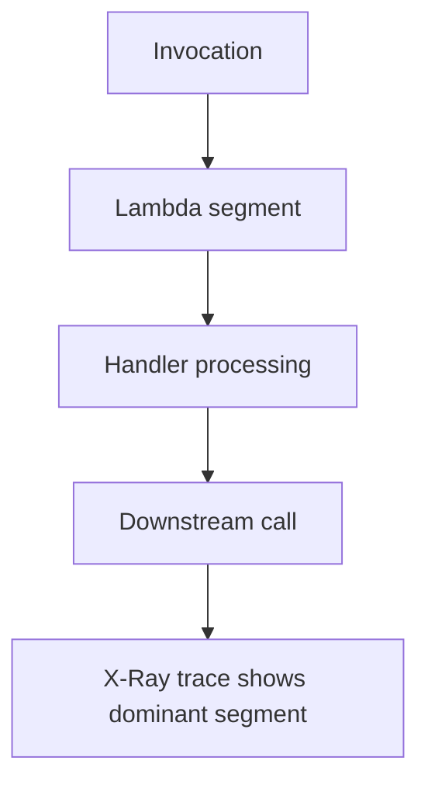

# Lab: High Duration

Diagnose a Lambda function with consistently slow execution by turning on X-Ray, tracing the request path, and proving whether the delay is caused by the function code or by a downstream dependency.

## Lab Metadata
| Attribute | Value |
|---|---|
| Difficulty | Intermediate |
| Duration | 40 minutes |
| Failure Mode | Invocation duration is high even though requests do not always time out |
| Skills Practiced | X-Ray tracing, duration analysis, dependency isolation, CloudWatch metrics, Lambda configuration review |

## 1) Background
### 1.1 Why this lab exists
High duration often precedes user-visible failure. This lab teaches you to locate where the time is being spent before the symptom turns into full timeout or concurrency pressure.

### 1.2 Platform behavior model
Lambda measures billed and actual duration for every invoke, but duration alone does not explain where the time went. X-Ray traces break the invocation into handler work and downstream segments so you can isolate the slow hop.

### 1.3 Diagram


## 2) Hypothesis
### 2.1 Original hypothesis
High duration is caused by a slow downstream service call, not by Lambda initialization or an insufficient timeout value.

### 2.2 Causal chain
Invocation enters function -> handler calls downstream API -> downstream latency dominates total duration -> p95 and p99 latency rise -> user-facing response time increases.

### 2.3 Proof criteria
- `Duration` metric rises while `Init Duration` is not the dominant cost.
- X-Ray traces show a downstream segment consuming most of the request time.
- Reducing downstream latency lowers total duration without other changes.

### 2.4 Disproof criteria
- X-Ray shows time is spent mostly in local compute or initialization.
- Logs show retries, loops, or serialization overhead in handler code instead.

## 3) Runbook
1. Deploy a SAM function that calls a deliberately slow downstream API and enable active tracing.

```bash
sam build

sam deploy \
    --stack-name "$STACK_NAME" \
    --resolve-s3 \
    --capabilities CAPABILITY_IAM \
    --region "$REGION"
```

2. Generate multiple requests to establish a latency pattern.

```bash
for i in 1 2 3 4 5; do
    aws lambda invoke \
        --function-name "$FUNCTION_NAME" \
        --payload '{"mode":"slow"}' \
        --cli-binary-format raw-in-base64-out \
        "response-$i.json" \
        --region "$REGION"
done
```

3. Review duration metrics.

```bash
aws cloudwatch get-metric-statistics \
    --namespace AWS/Lambda \
    --metric-name Duration \
    --dimensions Name=FunctionName,Value="$FUNCTION_NAME" \
    --start-time "2026-04-07T00:00:00Z" \
    --end-time "2026-04-07T00:20:00Z" \
    --period 60 \
    --extended-statistics p95 p99 \
    --region "$REGION"
```

4. Pull service graph data from X-Ray.

```bash
aws xray get-service-graph \
    --start-time 1712448000 \
    --end-time 1712449200 \
    --region "$REGION"
```

5. Correlate the trace with logs.

```bash
aws logs tail "/aws/lambda/$FUNCTION_NAME" \
    --since 20m \
    --region "$REGION"
```

6. Reduce the downstream delay or point the function at a faster endpoint, then rerun the test to confirm duration drops.

```bash
aws lambda update-function-configuration \
    --function-name "$FUNCTION_NAME" \
    --environment 'Variables={TARGET_MODE=fast}' \
    --region "$REGION"
```

## 4) Analysis
High duration is a symptom, not a cause. The value of X-Ray is that it keeps you from treating all slow functions the same way. If the trace shows a dominant downstream segment, memory tuning or provisioned concurrency will not solve the main problem. If the trace shows local compute or serialization dominating, then the fix belongs inside the handler code path. The lab trains that distinction.

## 5) Cleanup
```bash
rm --force response-*.json

aws cloudformation delete-stack \
    --stack-name "$STACK_NAME" \
    --region "$REGION"
```

## See Also
- [Hands-on Labs](./index.md)
- [Function Timeout](./function-timeout.md)
- [First 10 Minutes: Timeout Failures](../first-10-minutes/timeout-failures.md)
- [Log Sources Map](../methodology/log-sources-map.md)

## Sources
- [Monitoring metrics for Lambda functions](https://docs.aws.amazon.com/lambda/latest/dg/monitoring-metrics.html)
- [Configuring AWS X-Ray for Lambda](https://docs.aws.amazon.com/lambda/latest/dg/services-xray.html)
- [Lambda execution environment](https://docs.aws.amazon.com/lambda/latest/dg/lambda-runtime-environment.html)
