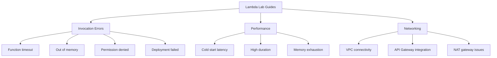

# Hands-on Labs

Use these labs to reproduce common Lambda failures in a controlled environment, practice forming hypotheses, and verify the exact evidence path before making a fix.

## Lab Categories

## Invocation Errors

| Lab | Failure mode | Main evidence |
|---|---|---|
| [Function Timeout](./function-timeout.md) | function exceeds configured timeout waiting on downstream call | `Task timed out`, `Duration`, X-Ray latency |
| [Out of Memory](./out-of-memory.md) | runtime exceeds memory limit on large payload processing | `Max Memory Used`, runtime reset, error logs |
| [Permission Denied](./permission-denied.md) | execution role lacks required action | `AccessDeniedException`, IAM simulation |
| [Deployment Failed](./deployment-failed.md) | invalid handler or package entry point | init error, handler import failure, config mismatch |

## Performance

| Lab | Failure mode | Main evidence |
|---|---|---|
| [Cold Start Latency](./cold-start-latency.md) | init latency rises with VPC or no provisioned concurrency | `Init Duration`, alias config, deployment timing |
| [High Duration](./high-duration.md) | downstream call or code path causes slow invoke time | X-Ray segment timing, `Duration`, logs |
| [Memory Exhaustion](./memory-exhaustion.md) | function approaches memory ceiling and slows or fails | `REPORT` line memory values, Insights telemetry |

## Networking

| Lab | Failure mode | Main evidence |
|---|---|---|
| [VPC Connectivity](./vpc-connectivity.md) | VPC Lambda cannot reach DynamoDB privately | timeout or SDK error, route path, endpoint missing |
| [API Gateway Integration](./api-gateway-integration.md) | API Gateway returns 502 for malformed Lambda response | API 502, execution logs, invalid proxy response |
| [NAT Gateway Issues](./nat-gateway-issues.md) | VPC Lambda cannot reach external API | timeout, failed egress, route table or NAT issue |

## How to Use the Labs

1. Reproduce the failure exactly as written.
2. Write the original hypothesis before looking at the answer.
3. Collect the listed evidence first.
4. Decide whether the evidence proves or disproves the hypothesis.
5. Apply the minimal fix and verify metrics and logs return to normal.

## Suggested Sequence

- Start with [Function Timeout](./function-timeout.md) and [Permission Denied](./permission-denied.md) for fast signal.
- Move to [Cold Start Latency](./cold-start-latency.md) and [High Duration](./high-duration.md) for performance analysis.
- Finish with [VPC Connectivity](./vpc-connectivity.md) and [NAT Gateway Issues](./nat-gateway-issues.md) for multi-service diagnosis.

## See Also

- [First 10 Minutes](../first-10-minutes/index.md)
- [Troubleshooting Method](../methodology/troubleshooting-method.md)
- [Log Sources Map](../methodology/log-sources-map.md)

## Sources

- [Troubleshoot Lambda functions](https://docs.aws.amazon.com/lambda/latest/dg/troubleshooting-execution.html)
- [Testing serverless applications with AWS SAM](https://docs.aws.amazon.com/serverless-application-model/latest/developerguide/using-sam-cli-local-testing.html)
- [Lambda execution environment](https://docs.aws.amazon.com/lambda/latest/dg/lambda-runtime-environment.html)
