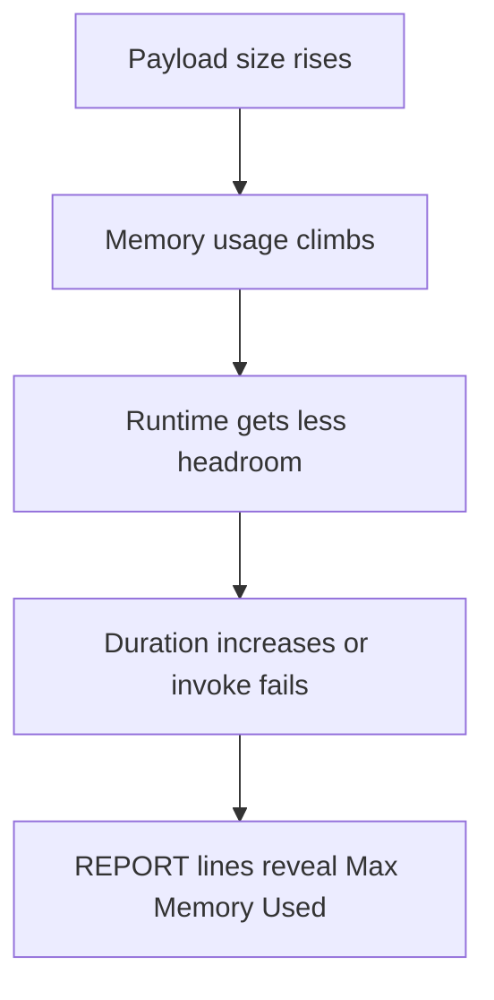

# Lab: Memory Exhaustion

Practice identifying a Lambda function that is approaching its memory ceiling by reading `REPORT` lines, comparing memory settings, and distinguishing near-exhaustion from full out-of-memory failure.

## Lab Metadata
| Attribute | Value |
|---|---|
| Difficulty | Intermediate |
| Duration | 30 minutes |
| Failure Mode | Function nears memory limit and becomes unstable or slow under load |
| Skills Practiced | `REPORT` line analysis, memory trend interpretation, Lambda Insights usage, configuration tuning |

## 1) Background
### 1.1 Why this lab exists
Not every memory problem ends in an immediate crash. Functions can approach the limit, slow down, or become fragile before complete failure. This lab focuses on the early warning signs.

### 1.2 Platform behavior model
Memory size controls available memory and influences CPU allocation. As a function approaches the limit, local processing and garbage collection overhead can rise. The `REPORT` line and Lambda Insights can reveal this trend before a hard failure occurs.

### 1.3 Diagram


## 2) Hypothesis
### 2.1 Original hypothesis
The function is slow because it is operating near the configured memory ceiling.

### 2.2 Causal chain
Larger working set -> less free memory -> more runtime overhead and reduced headroom -> longer duration or instability -> eventual failure if the trend continues.

### 2.3 Proof criteria
- `REPORT` lines show `Max Memory Used` consistently near `Memory Size`.
- Increasing memory lowers duration or eliminates instability.
- Lambda Insights indicates high memory utilization during the slow path.

### 2.4 Disproof criteria
- Memory remains far below the limit.
- Slow behavior is explained by downstream latency or cold starts instead.

## 3) Runbook
1. Deploy a function with modest memory such as `MemorySize: 256` and code that allocates a sizable in-memory working set without always crashing.

```bash
sam build

sam deploy \
    --stack-name "$STACK_NAME" \
    --resolve-s3 \
    --capabilities CAPABILITY_IAM \
    --region "$REGION"
```

2. Invoke the function repeatedly with medium and large payloads.

```bash
aws lambda invoke \
    --function-name "$FUNCTION_NAME" \
    --payload '{"size":"medium"}' \
    --cli-binary-format raw-in-base64-out \
    response-medium.json \
    --region "$REGION"

aws lambda invoke \
    --function-name "$FUNCTION_NAME" \
    --payload '{"size":"large"}' \
    --cli-binary-format raw-in-base64-out \
    response-large.json \
    --region "$REGION"
```

3. Inspect `REPORT` lines.

```bash
aws logs tail "/aws/lambda/$FUNCTION_NAME" \
    --since 15m \
    --filter-pattern "REPORT" \
    --region "$REGION"
```

4. Review current memory settings.

```bash
aws lambda get-function-configuration \
    --function-name "$FUNCTION_NAME" \
    --query '{MemorySize:MemorySize,Timeout:Timeout}' \
    --region "$REGION"
```

5. If Lambda Insights is enabled in the lab stack, inspect memory telemetry there. Then increase memory and repeat the test.

```bash
aws lambda update-function-configuration \
    --function-name "$FUNCTION_NAME" \
    --memory-size 512 \
    --region "$REGION"
```

6. Compare pre-change and post-change duration plus memory headroom.

```bash
aws cloudwatch get-metric-statistics \
    --namespace AWS/Lambda \
    --metric-name Duration \
    --dimensions Name=FunctionName,Value="$FUNCTION_NAME" \
    --start-time "2026-04-07T00:00:00Z" \
    --end-time "2026-04-07T00:20:00Z" \
    --period 60 \
    --extended-statistics p95 p99 \
    --region "$REGION"
```

## 4) Analysis
Near-exhaustion is a stability warning, not just a cost question. When memory headroom is small, minor payload changes can turn a slow function into a crashing function. The lab teaches you to read `REPORT` lines as early evidence, then verify whether more memory changes both duration and reliability. Because memory also scales CPU, the fix can improve speed even when the workload is partly compute-bound.

## 5) Cleanup
```bash
rm --force response-medium.json response-large.json

aws cloudformation delete-stack \
    --stack-name "$STACK_NAME" \
    --region "$REGION"
```

## See Also
- [Hands-on Labs](./index.md)
- [Out of Memory](./out-of-memory.md)
- [First 10 Minutes: Timeout Failures](../first-10-minutes/timeout-failures.md)
- [Log Sources Map](../methodology/log-sources-map.md)

## Sources
- [Configuring Lambda function memory](https://docs.aws.amazon.com/lambda/latest/dg/configuration-memory.html)
- [Using Lambda Insights](https://docs.aws.amazon.com/AmazonCloudWatch/latest/monitoring/Lambda-Insights.html)
- [Viewing CloudWatch logs for Lambda](https://docs.aws.amazon.com/lambda/latest/dg/monitoring-cloudwatchlogs-view.html)
