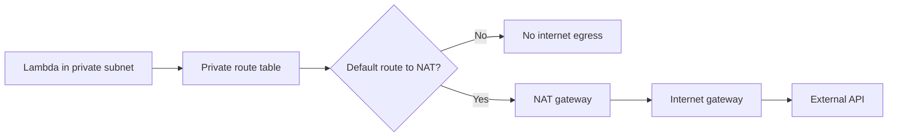

# Lab: NAT Gateway Issues

Deploy a Lambda function into private subnets, reproduce failure to reach an external API, and diagnose the missing or broken NAT egress path before restoring connectivity.

## Lab Metadata
| Attribute | Value |
|---|---|
| Difficulty | Advanced |
| Duration | 45 minutes |
| Failure Mode | VPC-attached Lambda in private subnets cannot reach a public internet endpoint |
| Skills Practiced | NAT gateway diagnosis, route table validation, VPC Lambda troubleshooting, timeout analysis, Flow Log reasoning |

## 1) Background
### 1.1 Why this lab exists
Once Lambda runs in private subnets, internet egress is no longer implicit. External API failures then look like timeouts unless you reason through the route path explicitly.

### 1.2 Platform behavior model
Lambda attached to private subnets uses the VPC route tables for outbound traffic. To reach a public endpoint, the subnet usually needs a default route to a NAT gateway in a public subnet, plus working internet gateway connectivity for the NAT path.

### 1.3 Diagram


## 2) Hypothesis
### 2.1 Original hypothesis
The function cannot reach the external API because the private subnets do not have a working NAT egress path.

### 2.2 Causal chain
Function attached to private subnets -> outbound request follows VPC route table -> no default route or broken NAT path -> socket connection hangs or times out -> invocation fails.

### 2.3 Proof criteria
- The function succeeds before VPC attachment or from non-VPC path but fails inside private subnets.
- Logs show timeout or connection errors to the external API.
- Adding or fixing the NAT route restores connectivity.

### 2.4 Disproof criteria
- External API is healthy and reachable through the same route path.
- Failure is due to DNS, TLS, or application-level bug rather than egress.

## 3) Runbook
1. Deploy a VPC-attached Lambda function in private subnets that calls a public test API, but omit the default route to a NAT gateway.

```bash
sam build

sam deploy \
    --stack-name "$STACK_NAME" \
    --resolve-s3 \
    --capabilities CAPABILITY_IAM \
    --region "$REGION"
```

2. Invoke the function.

```bash
aws lambda invoke \
    --function-name "$FUNCTION_NAME" \
    --payload '{}' \
    --cli-binary-format raw-in-base64-out \
    response.json \
    --region "$REGION"
```

3. Review logs for timeout or connect failures.

```bash
aws logs tail "/aws/lambda/$FUNCTION_NAME" \
    --since 15m \
    --region "$REGION"
```

4. Inspect route tables and NAT gateway state.

```bash
aws ec2 describe-route-tables \
    --filters Name=vpc-id,Values="$VPC_ID" \
    --region "$REGION"

aws ec2 describe-nat-gateways \
    --filter Name=vpc-id,Values="$VPC_ID" \
    --region "$REGION"
```

5. Add or fix the default route from the private route table to the NAT gateway.

```bash
aws ec2 create-route \
    --route-table-id "$ROUTE_TABLE_ID" \
    --destination-cidr-block 0.0.0.0/0 \
    --nat-gateway-id "$NAT_GATEWAY_ID" \
    --region "$REGION"
```

6. Invoke again and confirm the public API call succeeds.

```bash
aws lambda invoke \
    --function-name "$FUNCTION_NAME" \
    --payload '{}' \
    --cli-binary-format raw-in-base64-out \
    response-fixed.json \
    --region "$REGION"
```

## 4) Analysis
The important distinction is between application timeout and network egress timeout. In this lab, Lambda is healthy, IAM is fine, and the code path is correct, but the private subnet has no usable path to the public internet. Route table inspection plus recovery after adding the NAT route provides stronger proof than logs alone. VPC Flow Logs can add another evidence layer when you need packet-level confirmation of rejected or missing traffic.

## 5) Cleanup
```bash
rm --force response.json response-fixed.json

aws cloudformation delete-stack \
    --stack-name "$STACK_NAME" \
    --region "$REGION"
```

## See Also
- [Hands-on Labs](./index.md)
- [VPC Connectivity](./vpc-connectivity.md)
- [First 10 Minutes: Timeout Failures](../first-10-minutes/timeout-failures.md)
- [Log Sources Map](../methodology/log-sources-map.md)

## Sources
- [Giving Lambda functions access to resources in an Amazon VPC](https://docs.aws.amazon.com/lambda/latest/dg/configuration-vpc.html)
- [NAT gateways](https://docs.aws.amazon.com/vpc/latest/userguide/vpc-nat-gateway.html)
- [Log IP traffic using VPC Flow Logs](https://docs.aws.amazon.com/vpc/latest/userguide/flow-logs.html)
