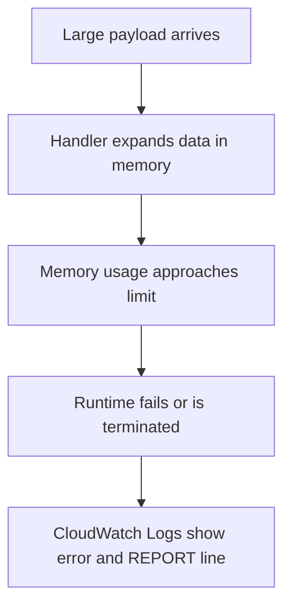

# Lab: Out of Memory

Reproduce a Lambda invocation that exhausts available memory while processing a large payload so you can practice using `REPORT` lines and memory configuration data to prove memory pressure instead of guessing from generic runtime failure symptoms.

## Lab Metadata
| Attribute | Value |
|---|---|
| Difficulty | Intermediate |
| Duration | 30 minutes |
| Failure Mode | Runtime exhausts available memory while expanding or transforming a large payload |
| Skills Practiced | Memory diagnosis, CloudWatch log interpretation, memory sizing, SAM deployment, payload-driven reproduction |

## 1) Background
### 1.1 Why this lab exists
Many Lambda crashes that look like random runtime exits are actually memory exhaustion. Without reading the `REPORT` line, responders often misclassify the incident as a code defect or timeout.

### 1.2 Platform behavior model
Lambda allocates a fixed memory amount per execution environment. If the function allocates beyond that limit, the runtime can terminate or fail the invoke. The `REPORT` line includes `Max Memory Used`, which is one of the fastest proof points.

### 1.3 Diagram


## 2) Hypothesis
### 2.1 Original hypothesis
The function fails because the payload expansion path exceeds the configured memory size.

### 2.2 Causal chain
Large input -> in-memory expansion or buffering -> memory saturation -> runtime instability or termination -> invocation error.

### 2.3 Proof criteria
- `REPORT` lines show `Max Memory Used` at or near the configured `Memory Size`.
- Failures happen only for large payloads.
- Increasing memory or changing the data handling pattern removes the failure.

### 2.4 Disproof criteria
- Memory stays well below the configured limit.
- The function fails because of timeout, invalid JSON, or an IAM permission error instead.

## 3) Runbook
1. Create a SAM function with intentionally low memory such as `MemorySize: 128` and code that copies or decompresses a large payload in memory.

```bash
sam build

sam deploy \
    --stack-name "$STACK_NAME" \
    --resolve-s3 \
    --capabilities CAPABILITY_IAM \
    --region "$REGION"
```

2. Generate a large test payload locally.

```bash
python3 - <<'PY'
import json
payload = {"records": ["x" * 1024 for _ in range(250000)]}
with open("large-event.json", "w") as f:
    json.dump(payload, f)
PY
```

3. Invoke the function with the large payload.

```bash
aws lambda invoke \
    --function-name "$FUNCTION_NAME" \
    --payload fileb://large-event.json \
    response.json \
    --region "$REGION"
```

4. Inspect logs and configuration.

```bash
aws logs tail "/aws/lambda/$FUNCTION_NAME" \
    --since 10m \
    --region "$REGION"

aws lambda get-function-configuration \
    --function-name "$FUNCTION_NAME" \
    --query '{MemorySize:MemorySize,EphemeralStorage:EphemeralStorage}' \
    --region "$REGION"
```

5. Re-run with a smaller payload to test the payload-size hypothesis.

```bash
python3 - <<'PY'
import json
payload = {"records": ["x" * 1024 for _ in range(1000)]}
with open("small-event.json", "w") as f:
    json.dump(payload, f)
PY

aws lambda invoke \
    --function-name "$FUNCTION_NAME" \
    --payload fileb://small-event.json \
    response-small.json \
    --region "$REGION"
```

6. Increase memory and repeat to verify the fix.

```bash
aws lambda update-function-configuration \
    --function-name "$FUNCTION_NAME" \
    --memory-size 512 \
    --region "$REGION"
```

## 4) Analysis
When `Max Memory Used` tracks closely to the configured memory ceiling and only large payloads fail, memory pressure is the simplest explanation. The function design, not just the memory setting, matters: buffering full payloads, decompressing large objects, or duplicating arrays can trigger failures even when the final business result is small. A strong fix can be either a higher memory size or a streaming or chunked processing model.

## 5) Cleanup
```bash
rm --force large-event.json small-event.json response.json response-small.json

aws cloudformation delete-stack \
    --stack-name "$STACK_NAME" \
    --region "$REGION"
```

## See Also
- [Hands-on Labs](./index.md)
- [Memory Exhaustion](./memory-exhaustion.md)
- [First 10 Minutes: Invocation Errors](../first-10-minutes/invocation-errors.md)
- [Log Sources Map](../methodology/log-sources-map.md)

## Sources
- [Configuring Lambda function memory](https://docs.aws.amazon.com/lambda/latest/dg/configuration-memory.html)
- [Troubleshoot Lambda functions](https://docs.aws.amazon.com/lambda/latest/dg/troubleshooting-execution.html)
- [Viewing CloudWatch logs for Lambda](https://docs.aws.amazon.com/lambda/latest/dg/monitoring-cloudwatchlogs-view.html)
- [Best practices for working with AWS Lambda functions](https://docs.aws.amazon.com/lambda/latest/dg/best-practices.html)
