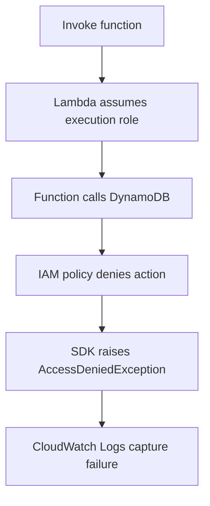

# Lab: Permission Denied

Deploy a Lambda function with an execution role that lacks a required permission, trigger the failing code path, and prove that the incident is caused by IAM policy scope rather than by application or network behavior.

## Lab Metadata
| Attribute | Value |
|---|---|
| Difficulty | Intermediate |
| Duration | 30 minutes |
| Failure Mode | Execution role lacks permission to call a required AWS API |
| Skills Practiced | IAM diagnosis, CloudWatch log review, CloudTrail correlation, policy simulation, SAM deployment |

## 1) Background
### 1.1 Why this lab exists
Permission failures often look like application exceptions unless responders read the exception type and compare it with the execution role policy. This lab trains that exact correlation path.

### 1.2 Platform behavior model
Lambda assumes the execution role when the function runs. If the code calls an AWS API that the role does not allow, the downstream service returns `AccessDeniedException` or an equivalent authorization error to the function.

### 1.3 Diagram


## 2) Hypothesis
### 2.1 Original hypothesis
The function fails because its execution role lacks the DynamoDB permission required by the handler.

### 2.2 Causal chain
Function assumes restricted role -> handler calls DynamoDB API -> IAM evaluation denies action -> SDK returns authorization error -> invocation fails.

### 2.3 Proof criteria
- Logs show `AccessDeniedException` or a clear authorization error.
- The execution role policy omits the required action.
- IAM simulation shows the action is denied for the role.

### 2.4 Disproof criteria
- The API call is allowed and the error is due to timeout, bad endpoint, or malformed request.
- The function never reaches the AWS SDK call because of earlier code failure.

## 3) Runbook
1. Deploy a SAM stack with a Lambda function that calls `dynamodb:GetItem`, but attach a role policy that omits that action.

```bash
sam build

sam deploy \
    --stack-name "$STACK_NAME" \
    --resolve-s3 \
    --capabilities CAPABILITY_IAM \
    --region "$REGION"
```

2. Invoke the function.

```bash
aws lambda invoke \
    --function-name "$FUNCTION_NAME" \
    --payload '{"id":"123"}' \
    --cli-binary-format raw-in-base64-out \
    response.json \
    --region "$REGION"
```

3. Read the latest logs.

```bash
aws logs tail "/aws/lambda/$FUNCTION_NAME" \
    --since 10m \
    --region "$REGION"
```

4. Identify the execution role ARN and inspect the attached policy.

```bash
aws lambda get-function-configuration \
    --function-name "$FUNCTION_NAME" \
    --query 'Role' \
    --output text \
    --region "$REGION"

aws iam list-attached-role-policies \
    --role-name "$ROLE_NAME"
```

5. Simulate the missing permission.

```bash
aws iam simulate-principal-policy \
    --policy-source-arn "arn:aws:iam::<account-id>:role/$ROLE_NAME" \
    --action-names dynamodb:GetItem \
    --resource-arns "arn:aws:dynamodb:$REGION:<account-id>:table/$TABLE_NAME"
```

6. Add the required permission and verify the invoke succeeds.

```bash
aws iam put-role-policy \
    --role-name "$ROLE_NAME" \
    --policy-name AllowDynamoDbRead \
    --policy-document file://allow-dynamodb-read.json
```

## 4) Analysis
This failure originates in authorization, not in the Lambda runtime. Lambda executed the function correctly, but the assumed role could not perform the requested action. The strongest proof is the combination of an authorization error in logs and an IAM simulation result showing explicit or implicit denial for the exact action and resource. Broadening the policy without that proof increases risk and hides the real least-privilege gap.

## 5) Cleanup
```bash
rm --force response.json

aws cloudformation delete-stack \
    --stack-name "$STACK_NAME" \
    --region "$REGION"
```

## See Also
- [Hands-on Labs](./index.md)
- [First 10 Minutes: Invocation Errors](../first-10-minutes/invocation-errors.md)
- [Deployment Failed](./deployment-failed.md)
- [Troubleshooting Method](../methodology/troubleshooting-method.md)

## Sources
- [Execution role for Lambda](https://docs.aws.amazon.com/lambda/latest/dg/lambda-intro-execution-role.html)
- [AWS IAM policy simulation](https://docs.aws.amazon.com/IAM/latest/UserGuide/access_policies_testing-policies.html)
- [Granting Lambda function access to AWS services](https://docs.aws.amazon.com/lambda/latest/dg/permissions-user-function.html)
- [Deploying serverless applications with AWS SAM](https://docs.aws.amazon.com/serverless-application-model/latest/developerguide/serverless-deploying.html)
