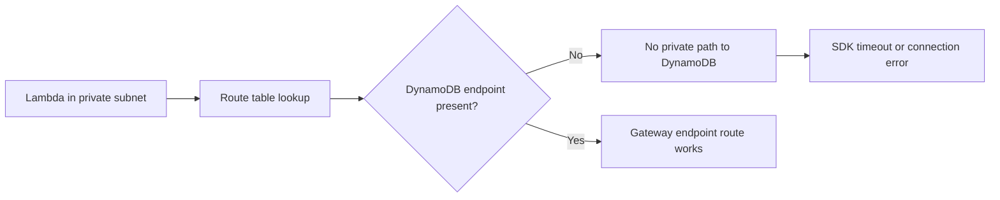

# Lab: VPC Connectivity

Deploy a Lambda function into private subnets, reproduce a failure to reach DynamoDB, and diagnose why the function needs a VPC endpoint when there is no direct path to the service from those subnets.

## Lab Metadata
| Attribute | Value |
|---|---|
| Difficulty | Advanced |
| Duration | 45 minutes |
| Failure Mode | VPC-attached Lambda cannot reach DynamoDB from private subnets until a VPC endpoint is added |
| Skills Practiced | VPC Lambda networking, route reasoning, endpoint diagnosis, security group review, CloudWatch log analysis |

## 1) Background
### 1.1 Why this lab exists
Teams often place Lambda into a VPC for database access and then discover that service access assumptions changed. DynamoDB access from private subnets needs an intentional network design.

### 1.2 Platform behavior model
When Lambda is attached to a VPC, the function uses that VPC path for outbound traffic. Private subnets without the right route design or endpoint access can no longer reach services the function previously accessed through the public Lambda-managed path.

### 1.3 Diagram


## 2) Hypothesis
### 2.1 Original hypothesis
The function cannot reach DynamoDB because the private subnets lack a VPC endpoint path for the service.

### 2.2 Causal chain
Function moves into private subnets -> outbound path changes to VPC routing -> no DynamoDB endpoint in route path -> SDK call hangs or fails -> invocation errors or timeouts occur.

### 2.3 Proof criteria
- The failure appears only after VPC attachment.
- Logs show timeout or connection failure on DynamoDB calls.
- Adding the DynamoDB VPC endpoint restores connectivity.

### 2.4 Disproof criteria
- The endpoint exists and traffic still fails because of IAM denial or application bug.
- The function succeeds from the same VPC path, proving networking is not the cause.

## 3) Runbook
1. Deploy a SAM stack that creates a Lambda function in private subnets with an execution role that allows DynamoDB access, but do not create a DynamoDB VPC endpoint initially.

```bash
sam build

sam deploy \
    --stack-name "$STACK_NAME" \
    --resolve-s3 \
    --capabilities CAPABILITY_IAM \
    --region "$REGION"
```

2. Invoke the function on a code path that reads from DynamoDB.

```bash
aws lambda invoke \
    --function-name "$FUNCTION_NAME" \
    --payload '{"id":"123"}' \
    --cli-binary-format raw-in-base64-out \
    response.json \
    --region "$REGION"
```

3. Inspect logs and configuration.

```bash
aws logs tail "/aws/lambda/$FUNCTION_NAME" \
    --since 15m \
    --region "$REGION"

aws lambda get-function-configuration \
    --function-name "$FUNCTION_NAME" \
    --query 'VpcConfig' \
    --region "$REGION"
```

4. Confirm the current VPC endpoints.

```bash
aws ec2 describe-vpc-endpoints \
    --filters Name=vpc-id,Values="$VPC_ID" \
    --region "$REGION"
```

5. Create a DynamoDB gateway endpoint and associate the correct route tables.

```bash
aws ec2 create-vpc-endpoint \
    --vpc-id "$VPC_ID" \
    --service-name "com.amazonaws.$REGION.dynamodb" \
    --vpc-endpoint-type Gateway \
    --route-table-ids "$ROUTE_TABLE_ID" \
    --region "$REGION"
```

6. Invoke again and verify the function reaches DynamoDB successfully.

```bash
aws lambda invoke \
    --function-name "$FUNCTION_NAME" \
    --payload '{"id":"123"}' \
    --cli-binary-format raw-in-base64-out \
    response-fixed.json \
    --region "$REGION"
```

## 4) Analysis
The key lesson is that Lambda VPC attachment changes the networking model. A function that could reach DynamoDB before VPC attachment can fail afterward if the private route design does not include a DynamoDB endpoint path. The proof depends on timing and topology: success before VPC, failure after VPC, and recovery after endpoint creation. That sequence isolates the network path as the root cause more convincingly than logs alone.

## 5) Cleanup
```bash
rm --force response.json response-fixed.json

aws cloudformation delete-stack \
    --stack-name "$STACK_NAME" \
    --region "$REGION"
```

## See Also
- [Hands-on Labs](./index.md)
- [First 10 Minutes: Timeout Failures](../first-10-minutes/timeout-failures.md)
- [Cold Start Latency](./cold-start-latency.md)
- [NAT Gateway Issues](./nat-gateway-issues.md)

## Sources
- [Giving Lambda functions access to resources in an Amazon VPC](https://docs.aws.amazon.com/lambda/latest/dg/configuration-vpc.html)
- [Gateway endpoints for Amazon DynamoDB](https://docs.aws.amazon.com/vpc/latest/privatelink/vpc-endpoints-ddb.html)
- [Log IP traffic using VPC Flow Logs](https://docs.aws.amazon.com/vpc/latest/userguide/flow-logs.html)
