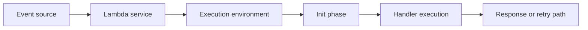
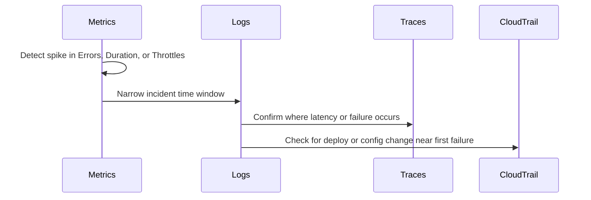

# Troubleshooting Mental Model

Think about Lambda failures as breaks in an invocation path, not as isolated log messages. A useful model is: event source, Lambda service, execution environment, handler code, and response path.



## Invocation Path and Failure Points

| Stage | What happens | Typical failure modes |
|---|---|---|
| Event source | A service sends or exposes an event | Bad event shape, disabled trigger, queue backlog, retry storm |
| Lambda service | Permission check, routing, scaling, scheduling | Throttling, invoke permission failure, async delivery issue |
| Execution environment | Runtime starts or reuses a warm environment | Slow init, layer load cost, extension startup problems |
| Handler | Your code parses input and calls dependencies | Exceptions, timeouts, memory exhaustion, downstream errors |
| Response path | Result returns to caller or async destination | Integration mapping issue, retry, DLQ or destination handoff |

## Correlation Model



## How to Think About Common Failures

### Before `START RequestId`

The function may not have started at all. Suspect invoke permissions, reserved concurrency exhaustion, account concurrency limits, or event source mapping problems.

### Between `START` and `REPORT`

The runtime executed but your function did not finish cleanly. Suspect exceptions, timeouts, downstream latency, or memory pressure.

### `REPORT` Shows High `Init Duration`

The handler may be healthy, but initialization cost is too high. Suspect large deployment packages, heavy frameworks, layer load time, VPC networking setup, or runtime-specific startup cost.

### Errors Started Right After a Deployment

Treat the change as the leading hypothesis until disproven. Correlate CloudTrail deploy activity with the first log error or metric spike.

## Practical Correlation Techniques

1. Start with the first timestamp where the symptom becomes visible.
2. Compare logs and metrics in the same 5- or 15-minute window.
3. Check CloudTrail for `UpdateFunctionCode`, `UpdateFunctionConfiguration`, `PublishVersion`, and alias changes.
4. If tracing is enabled, confirm whether time is lost in init, handler logic, or downstream dependencies.
5. Only after correlation should you change memory, timeout, concurrency, or VPC settings.

## A Minimal Incident Loop

```bash
aws cloudwatch get-metric-statistics \
    --namespace AWS/Lambda \
    --metric-name Errors \
    --dimensions Name=FunctionName,Value="$FUNCTION_NAME" \
    --start-time 2026-04-07T00:00:00Z \
    --end-time 2026-04-07T01:00:00Z \
    --period 300 \
    --statistics Sum \
    --region "$REGION"

aws logs tail "/aws/lambda/$FUNCTION_NAME" \
    --since 30m \
    --region "$REGION"
```

!!! tip
    Good Lambda troubleshooting is mostly timeline construction. Once you align symptom onset, deployment activity, log evidence, and trace segments, the root-cause domain usually becomes obvious.

## See Also

- [Troubleshooting Hub](./index.md)
- [Architecture Overview](./architecture-overview.md)
- [Decision Tree](./decision-tree.md)
- [Evidence Map](./evidence-map.md)
- [Deploy vs Errors](./cloudwatch/correlation/deploy-vs-errors.md)

## Sources

- [Understanding the Lambda execution environment lifecycle](https://docs.aws.amazon.com/lambda/latest/dg/lambda-runtime-environment.html)
- [Invoking Lambda functions](https://docs.aws.amazon.com/lambda/latest/dg/lambda-invocation.html)
- [Monitoring Lambda functions with CloudWatch](https://docs.aws.amazon.com/lambda/latest/dg/monitoring-functions.html)
- [AWS X-Ray and Lambda](https://docs.aws.amazon.com/lambda/latest/dg/services-xray.html)
- [Logging AWS API calls with CloudTrail](https://docs.aws.amazon.com/lambda/latest/dg/logging-using-cloudtrail.html)
