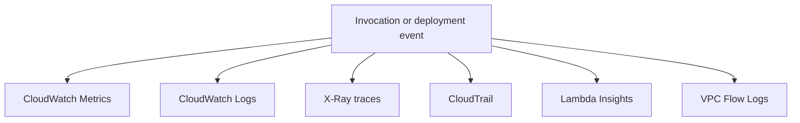
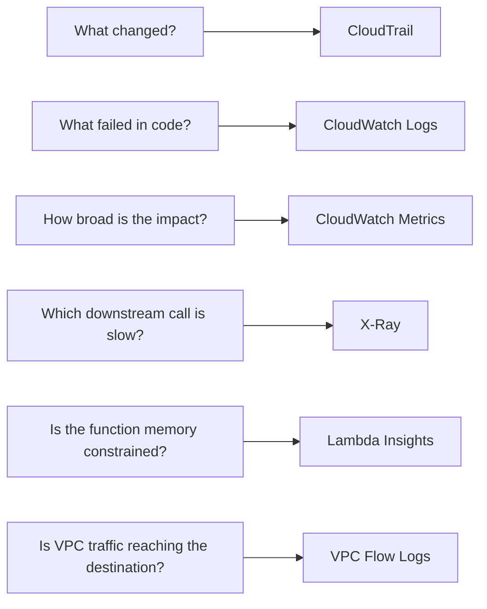

# Log Sources Map

Lambda incidents leave evidence in multiple telemetry systems. Use this map to decide which source answers which question fastest.

## Evidence Flow



## Source Map

| Source | What it shows | When to use | How to access |
|---|---|---|---|
| CloudWatch Logs (`/aws/lambda/$FUNCTION_NAME`) | handler logs, stack traces, `START`, `END`, `REPORT`, timeout messages, init duration | first stop for invoke-level failures and runtime exceptions | CloudWatch Logs console, `aws logs tail "/aws/lambda/$FUNCTION_NAME" --since 10m --region "$REGION"` |
| CloudWatch Metrics | request count, `Errors`, `Duration`, `Throttles`, `ConcurrentExecutions`, async delivery metrics | establish timing, blast radius, and trend | CloudWatch console, `aws cloudwatch get-metric-statistics` |
| X-Ray traces | end-to-end request path, downstream latency, service map, segment timing | slow requests, timeout analysis, downstream bottlenecks | X-Ray console, `aws xray batch-get-traces`, `aws xray get-service-graph` |
| CloudTrail | control-plane API calls such as `CreateFunction`, `UpdateFunctionCode`, `UpdateFunctionConfiguration`, policy changes | confirm recent changes and deployment correlation | CloudTrail console, `aws cloudtrail lookup-events` |
| Lambda Insights | system-level telemetry including memory pressure, CPU usage, network stats, enhanced invoke telemetry | performance tuning, memory saturation, noisy-neighbor style investigation | CloudWatch Lambda Insights console and log groups |
| VPC Flow Logs | accepted or rejected network flows at ENI level | VPC-attached function cannot reach private or public endpoints | VPC console, CloudWatch Logs, Athena on flow log destination |

## Which Source Answers Which Question



## Fast Access Commands

```bash
aws logs tail "/aws/lambda/$FUNCTION_NAME" \
    --since 10m \
    --region "$REGION"

aws cloudtrail lookup-events \
    --lookup-attributes AttributeKey=ResourceName,AttributeValue="$FUNCTION_NAME" \
    --max-results 20 \
    --region "$REGION"

aws lambda get-function-configuration \
    --function-name "$FUNCTION_NAME" \
    --region "$REGION"
```

## Source Selection Rules

- Start with **metrics** to see scope and timing.
- Move to **logs** to see the exact runtime symptom.
- Use **CloudTrail** to correlate recent change events.
- Use **X-Ray** when the problem is slow rather than obviously broken.
- Use **VPC Flow Logs** only when the function is VPC-attached and connectivity is part of the hypothesis.

## See Also

- [Troubleshooting Method](./troubleshooting-method.md)
- [First 10 Minutes](../first-10-minutes/index.md)
- [Cold Start Spikes](../first-10-minutes/cold-start-spikes.md)
- [Timeout Failures](../first-10-minutes/timeout-failures.md)

## Sources

- [Viewing CloudWatch logs for Lambda](https://docs.aws.amazon.com/lambda/latest/dg/monitoring-cloudwatchlogs-view.html)
- [Monitoring metrics for Lambda functions](https://docs.aws.amazon.com/lambda/latest/dg/monitoring-metrics.html)
- [Configuring AWS X-Ray for Lambda](https://docs.aws.amazon.com/lambda/latest/dg/services-xray.html)
- [Logging AWS Lambda API calls with AWS CloudTrail](https://docs.aws.amazon.com/lambda/latest/dg/logging-using-cloudtrail.html)
- [Using Lambda Insights](https://docs.aws.amazon.com/AmazonCloudWatch/latest/monitoring/Lambda-Insights.html)
- [Log IP traffic using VPC Flow Logs](https://docs.aws.amazon.com/vpc/latest/userguide/flow-logs.html)
