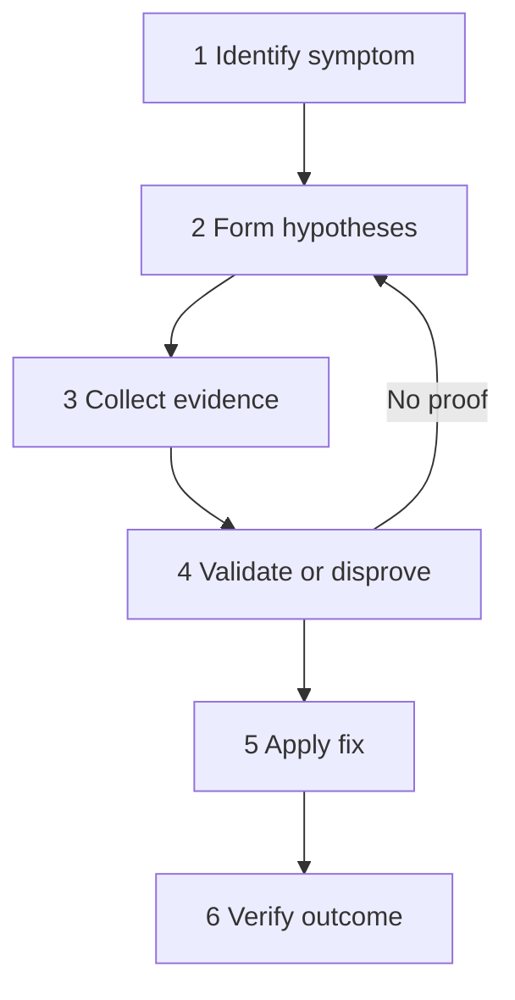
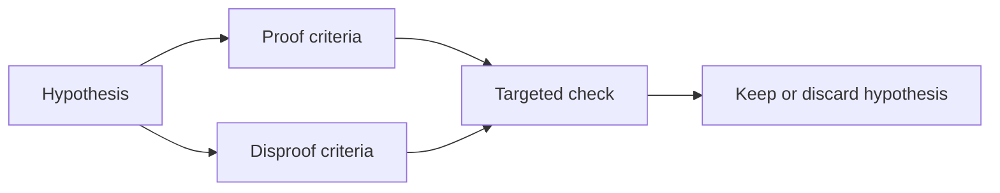

# Troubleshooting Method

Lambda troubleshooting works best when you treat incidents as testable systems behavior, not as code guessing. Start with the symptom, form a small set of plausible hypotheses, collect the evidence that can prove or disprove each one, then change only the part that the evidence isolates.

## Six-Step Method

## 1) Identify Symptom

State the problem in operational terms:

- Which function, alias, version, or event source is affected?
- Is the symptom error rate, timeout, duration, throttle, permission failure, or malformed integration response?
- When did it start?
- Is the issue limited to one region, one environment, or one traffic path?

Good symptom statement:

> `live` alias for `$FUNCTION_NAME` in `$REGION` began returning 502 responses through API Gateway at 14:05 UTC after a deployment.

## 2) Form Hypotheses

Keep the list short and causal.

Examples:

- The function package changed and the configured handler no longer exists.
- The execution role lost permission to access DynamoDB.
- The function moved into a VPC and cannot reach a private or public dependency.
- Latency increased because scale-out caused cold starts and provisioned concurrency was not available.

## 3) Collect Evidence

Prefer evidence that aligns directly to the failure path.

| Source | Typical evidence |
|---|---|
| CloudWatch Metrics | Errors, Duration, Throttles, ConcurrentExecutions |
| CloudWatch Logs | exceptions, `REPORT` lines, timeout messages |
| X-Ray | downstream latency, integration timing, service graph |
| CloudTrail | `UpdateFunctionCode`, `UpdateFunctionConfiguration`, IAM changes |
| Lambda configuration | timeout, memory, handler, VPC, tracing, role |

## 4) Validate or Disprove

For each hypothesis, write clear proof and disproof criteria before making changes.

Examples:

- If the hypothesis is **invalid handler**, proof is a runtime log that the handler cannot be imported and configuration shows the wrong handler string.
- If the hypothesis is **missing IAM permission**, proof is `AccessDeniedException` plus policy simulation or role policy review showing the action is not allowed.
- If the hypothesis is **cold start**, proof is elevated `Init Duration` aligned with first requests on new environments.

## 5) Apply Fix

Apply the smallest fix that matches the evidence.

- Roll an alias back instead of redeploying unrelated changes.
- Add the missing IAM permission instead of widening permissions broadly.
- Add a VPC endpoint when the failure is private-service connectivity from a VPC-attached function.
- Increase memory only after confirming the function is CPU- or memory-constrained.

## 6) Verify

Verification must prove the symptom is gone and the blast radius is understood.

Check:

1. Metrics returned to expected baseline.
2. Logs no longer show the prior error pattern.
3. User-visible path is healthy.
4. No secondary symptom appeared, such as throttles after a timeout fix.

## Short Example

| Step | Example |
|---|---|
| Identify symptom | `Errors` and API Gateway 502 responses rose after deployment |
| Hypothesis | Lambda response format no longer matches API Gateway proxy integration |
| Collect evidence | function logs, API Gateway execution logs, recent code diff |
| Validate or disprove | malformed response in logs proves it; clean proxy-shaped response disproves it |
| Apply fix | return statusCode, headers, and body as required |
| Verify | 2xx responses restored and 5xx metric falls |

## Operating Rules

- Do not start with a fix you cannot justify.
- Do not trust a single datapoint if the path spans multiple services.
- Do not assume the last code deploy is the only recent change.
- Always capture timestamps and request IDs while the incident is active.

## See Also

- [Log Sources Map](./log-sources-map.md)
- [First 10 Minutes](../first-10-minutes/index.md)
- [Lab Guides](../lab-guides/index.md)
- [Quick Diagnosis Cards](../quick-diagnosis-cards.md)

## Sources

- [Troubleshoot Lambda functions](https://docs.aws.amazon.com/lambda/latest/dg/troubleshooting-execution.html)
- [Monitoring metrics for Lambda functions](https://docs.aws.amazon.com/lambda/latest/dg/monitoring-metrics.html)
- [Viewing CloudWatch logs for Lambda](https://docs.aws.amazon.com/lambda/latest/dg/monitoring-cloudwatchlogs-view.html)
- [Configuring AWS X-Ray for Lambda](https://docs.aws.amazon.com/lambda/latest/dg/services-xray.html)
- [Logging AWS Lambda API calls with AWS CloudTrail](https://docs.aws.amazon.com/lambda/latest/dg/logging-using-cloudtrail.html)
