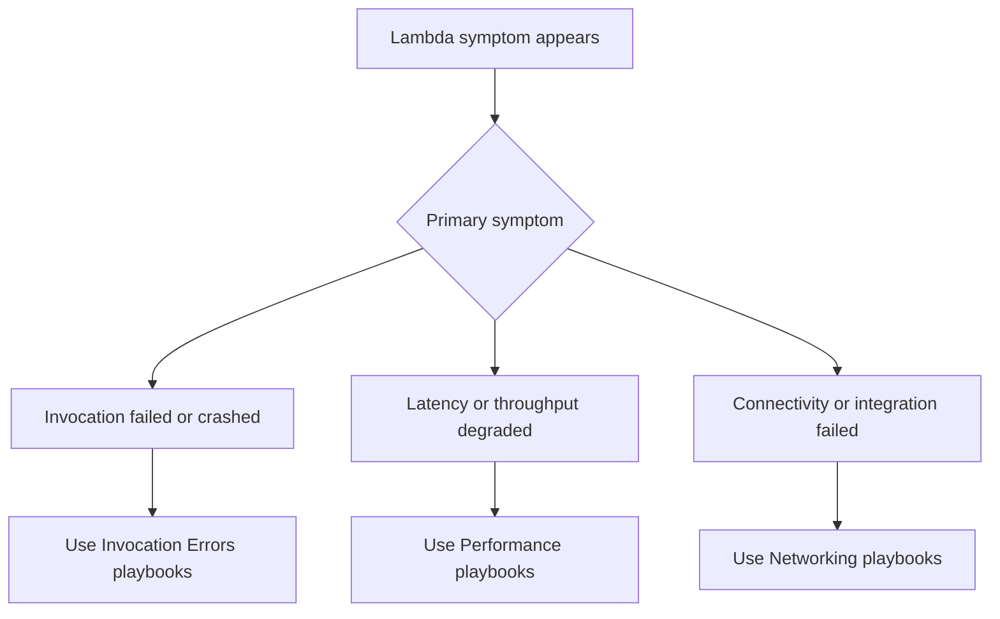

# Troubleshooting Playbooks

## Summary
Use these playbooks when you already know the dominant symptom and need a hypothesis-driven path from first evidence to mitigation. The catalog is organized by the failure mode operators usually see first: invocation errors, performance regressions, and networking faults.

## Invocation Errors

| Playbook | Symptom | When to use it |
| --- | --- | --- |
| [Function Timeout](invocation-errors/function-timeout.md) | Invocation hits configured timeout | The function ends with `Task timed out` or upstream callers see deadline failures. |
| [Out of Memory](invocation-errors/out-of-memory.md) | Runtime exceeds memory limit | REPORT lines show max memory near the configured limit or the runtime exits without finishing work. |
| [Permission Denied](invocation-errors/permission-denied.md) | Execution role cannot call another AWS service | Logs show `AccessDeniedException`, `not authorized`, or missing resource policy access. |
| [Deployment Failed](invocation-errors/deployment-failed.md) | Create or update operation fails | `update-function-code` or `update-function-configuration` returns a validation, packaging, or state-transition error. |
| [Cold Start Latency](invocation-errors/cold-start-latency.md) | Sporadic slow first invocation | P99 latency spikes happen after idle periods, scaling events, or new version rollout. |
| [Throttling](invocation-errors/throttling.md) | Invocation rejected with throttle signals | CloudWatch shows `Throttles` or callers receive `TooManyRequestsException`. |
| [Runtime Crash](invocation-errors/runtime-crash.md) | Process exits unexpectedly | The runtime segfaults, exits early, or fails before the handler returns. |

## Performance

| Playbook | Symptom | When to use it |
| --- | --- | --- |
| [High Duration](performance/high-duration.md) | Duration exceeds SLA | Average or percentile duration rises even though functions still complete. |
| [Memory Exhaustion](performance/memory-exhaustion.md) | Max memory approaches limit | Functions still succeed, but memory headroom is disappearing and duration often rises with it. |
| [Cold Start Optimization](performance/cold-start-optimization.md) | Need to reduce init latency | You already know cold starts are the issue and need evidence-backed optimization options. |
| [Concurrency Limits](performance/concurrency-limits.md) | Account or function concurrency becomes the bottleneck | Scale-out stops where expected request volume should still fit. |
| [Downstream Latency](performance/downstream-latency.md) | DynamoDB, RDS, or external APIs slow the function | Lambda itself looks healthy, but end-to-end latency follows a dependency. |

## Networking

| Playbook | Symptom | When to use it |
| --- | --- | --- |
| [VPC Connectivity](networking/vpc-connectivity.md) | VPC-attached Lambda cannot reach private resources | The function times out or connection-refuses when reaching RDS, ElastiCache, or internal services. |
| [NAT Gateway Issues](networking/nat-gateway-issues.md) | VPC-attached Lambda cannot reach the internet | Calls to public AWS APIs or external endpoints fail only when the function runs inside the VPC. |
| [API Gateway Integration](networking/api-gateway-integration.md) | API Gateway returns integration failures | 500, 502, or malformed proxy responses originate at the Lambda integration boundary. |
| [RDS Proxy Connectivity](networking/rds-proxy-connectivity.md) | Cannot connect through RDS Proxy | Authentication, TLS, target group health, or network path issues block database sessions. |
| [Endpoint Timeout](networking/endpoint-timeout.md) | VPC endpoint or external endpoint times out | Network path exists intermittently, but requests stall until the Lambda timeout or client timeout. |

## How to Use These Playbooks

1. Anchor the incident with the first failing UTC timestamp from CloudWatch metrics or `/aws/lambda/$FUNCTION_NAME` logs.
2. Pick the playbook by symptom, not by your first guess at root cause.
3. Work hypotheses in order and explicitly disprove weak theories before changing the system.
4. Preserve example logs, metric screenshots, and CLI output before retrying or redeploying.

## See Also
- [Troubleshooting Overview](../index.md)
- [Decision Tree](../decision-tree.md)
- [Evidence Map](../evidence-map.md)

## Sources
- [Troubleshoot Lambda functions](https://docs.aws.amazon.com/lambda/latest/dg/troubleshooting-execution.html)
- [Monitoring Lambda metrics in Amazon CloudWatch](https://docs.aws.amazon.com/lambda/latest/dg/monitoring-metrics.html)
- [Lambda function logs](https://docs.aws.amazon.com/lambda/latest/dg/monitoring-cloudwatchlogs.html)
