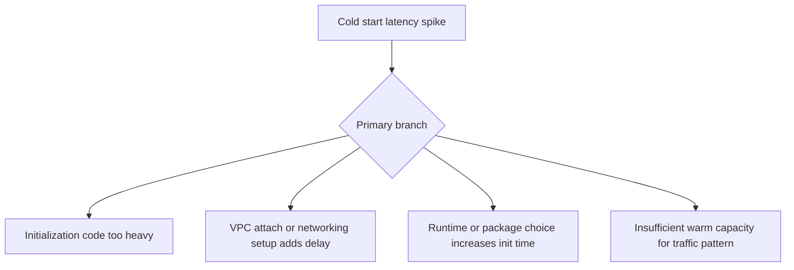

# Cold Start Latency

## 1. Summary
Cold start latency is the extra delay incurred when Lambda must create a new execution environment before running the handler. The symptom usually appears as intermittent slow invocations after idle periods, scale-out, or version changes rather than as continuous degradation.



## 2. Common Misreadings
- Every slow invocation is a cold start.
- Provisioned concurrency is the only cold start mitigation.
- Java and .NET cold starts are always unacceptable.
- VPC functions are always slow because of ENI creation.
- Cold starts matter only at very low traffic.

## 3. Competing Hypotheses
- H1: Initialization code performs too much work before the handler starts — Primary evidence should confirm or disprove whether init activity dominates the first-invoke duration.
- H2: VPC attachment or outbound initialization adds startup delay — Primary evidence should confirm or disprove whether network setup or first outbound connections are the main init cost.
- H3: Runtime, artifact size, or layers increase startup time — Primary evidence should confirm or disprove whether package composition or runtime choice explains the latency.
- H4: Traffic pattern causes frequent environment creation — Primary evidence should confirm or disprove whether burst or idle behavior exceeds warm capacity.

## 4. What to Check First
### Metrics
- `Duration` p95 and p99 compared to average.
- `Invocations` and `ConcurrentExecutions` around each spike.
- If provisioned concurrency is configured, `ProvisionedConcurrencyInvocations` and `ProvisionedConcurrencySpilloverInvocations`.

### Logs
- REPORT lines including `Init Duration` in `/aws/lambda/$FUNCTION_NAME`.
- App logs emitted during module import, dependency setup, or connection bootstrap.
- Version/alias changes near the onset of slow first calls.

### Platform Signals
- Run `aws lambda get-function-configuration --function-name $FUNCTION_NAME` to inspect runtime, memory, package type, layers, and VPC settings.
- Compare cold-start log streams with warm log streams from the same version.
- Confirm whether traffic bursts exceed reserved or provisioned concurrency.

| Signal | Normal | Abnormal | Why it matters |
| --- | --- | --- | --- |
| Init Duration | Small fraction of total duration | Large repeated init duration on first invokes | Direct indicator of cold start cost |
| ConcurrentExecutions | Smooth reuse of environments | Bursts require many new environments | Shows whether traffic pattern forces cold starts |
| Package composition | Small package and minimal layers | Large artifact or many layers | Startup work grows with package complexity |
| VPC behavior | Similar init time inside and outside VPC | VPC-attached version is materially slower | Narrows cause to networking setup or connections |

## 5. Evidence to Collect
### Required Evidence
- REPORT lines with `Init Duration` from several slow invocations.
- Function configuration with runtime, memory, layers, and VPC settings.
- Traffic pattern during the slow window.
- Current alias or version mapping.

### Useful Context
- Whether the issue began after adding a layer, SDK, extension, or VPC config.
- Whether provisioned concurrency is enabled and on which alias.
- Whether the function uses container images instead of ZIPs.

### CLI Investigation Commands
#### 1. Confirm runtime and package composition

```bash
aws lambda get-function-configuration \
    --function-name $FUNCTION_NAME
```

Example output:

```json
{
  "FunctionName": "$FUNCTION_NAME",
  "Runtime": "java21",
  "MemorySize": 1024,
  "PackageType": "Zip",
  "Layers": [
    {"Arn": "arn:aws:lambda:$REGION:<account-id>:layer:shared-observability:4"}
  ]
}
```

#### 2. Pull duration metrics during spike windows

```bash
aws cloudwatch get-metric-statistics \
    --namespace AWS/Lambda \
    --metric-name Duration \
    --dimensions Name=FunctionName,Value=$FUNCTION_NAME \
    --statistics Average Maximum \
    --start-time 2026-04-07T12:00:00Z \
    --end-time 2026-04-07T12:20:00Z \
    --period 60
```

Example output:

```json
{
  "Datapoints": [
    {"Timestamp": "2026-04-07T12:05:00+00:00", "Average": 190.0, "Maximum": 2470.0},
    {"Timestamp": "2026-04-07T12:06:00+00:00", "Average": 185.0, "Maximum": 2310.0}
  ],
  "Label": "Duration"
}
```

#### 3. Read logs for init duration evidence

```bash
aws logs tail /aws/lambda/$FUNCTION_NAME \
    --since 30m \
    --format short
```

Example output:

```text
2026-04-07T12:05:11 START RequestId: 12341234-5678-90ab-cdef-111111111111 Version: 12
2026-04-07T12:05:11 INFO loading configuration and SDK clients
2026-04-07T12:05:14 REPORT RequestId: 12341234-5678-90ab-cdef-111111111111 Duration: 2450.63 ms Billed Duration: 2451 ms Memory Size: 1024 MB Max Memory Used: 286 MB Init Duration: 2187.22 ms
```

## 6. Validation and Disproof by Hypothesis
### H1: Initialization code performs too much work before the handler starts

| Observation | Normal | Abnormal |
| --- | --- | --- |
| Init logs | Minimal setup before handler | Imports, config loads, or client creation dominate slow invocation |
| Warm vs cold delta | Small difference | Warm calls are fast but cold calls are much slower |

### H2: VPC attachment or outbound initialization adds startup delay

| Observation | Normal | Abnormal |
| --- | --- | --- |
| VPC comparison | Similar init time in all configs | VPC-attached version has materially higher init duration |
| First network call | Fast initial connection | DNS, TLS, or socket creation consumes init window |

### H3: Runtime, artifact size, or layers increase startup time

| Observation | Normal | Abnormal |
| --- | --- | --- |
| Package size | Small asset, few layers | Large artifact or many layers correlate with longer init |
| Runtime comparison | Comparable init across runtimes | Specific runtime/version shows persistent extra startup cost |

### H4: Traffic pattern causes frequent environment creation

| Observation | Normal | Abnormal |
| --- | --- | --- |
| Traffic shape | Steady load keeps environments warm | Bursts or idle periods precede every latency spike |
| Provisioned capacity | Warm capacity covers demand | Spillover invocations align with slow requests |

## 7. Likely Root Cause Patterns
1. Heavy import-time initialization dominates startup. SDK client creation, configuration fetches, and dependency injection setup commonly add hundreds of milliseconds or more before the handler runs.
2. Traffic shape is bursty relative to warm capacity. Even efficient functions can exhibit noticeable cold-start spikes when concurrency ramps from near zero to high demand.
3. Package composition is bloated. Large layers, container images, and unnecessary dependencies increase startup work and code-loading time.
4. VPC and first-connection behavior add extra latency. Modern Lambda networking improved ENI behavior, but DNS, TLS, and private path setup can still be expensive at initialization time.

## 8. Immediate Mitigations
1. Increase memory to reduce init time via additional CPU allocation.

```bash
aws lambda update-function-configuration \
    --function-name $FUNCTION_NAME \
    --memory-size 1536
```

2. Enable or increase provisioned concurrency on the production alias if the latency target requires warm capacity.

```bash
aws lambda put-provisioned-concurrency-config \
    --function-name $FUNCTION_NAME \
    --qualifier prod \
    --provisioned-concurrent-executions 10
```

3. Remove heavy init work from import time and lazy-load rarely used dependencies.
4. Roll back the last layer or runtime change if cold-start spikes started immediately after deployment.

## 9. Prevention
1. Track `Init Duration` in routine log reviews and release verification.
2. Keep deployment packages and layers minimal.
3. Match provisioned concurrency to predictable burst patterns.
4. Initialize only mandatory clients at startup; lazy-load the rest.
5. Benchmark cold starts after runtime, layer, or VPC changes.

## See Also
- [Troubleshooting Playbooks](../index.md)
- [Cold Start Optimization](../performance/cold-start-optimization.md)
- [Throttling](throttling.md)

## Sources
- [Understanding the Lambda execution environment lifecycle](https://docs.aws.amazon.com/lambda/latest/dg/lambda-runtime-environment.html)
- [Configuring provisioned concurrency](https://docs.aws.amazon.com/lambda/latest/dg/provisioned-concurrency.html)
- [Monitoring Lambda metrics in Amazon CloudWatch](https://docs.aws.amazon.com/lambda/latest/dg/monitoring-metrics.html)
