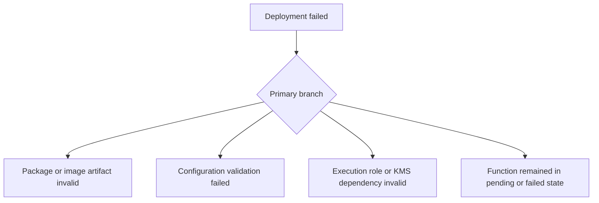

# Deployment Failed

## 1. Summary
A Lambda deployment failure means `create-function`, `update-function-code`, or `update-function-configuration` did not reach a stable successful state. The root cause is often packaging, image, IAM, storage, or state-transition validation rather than Lambda service unavailability.



## 2. Common Misreadings
- A failed code update means the runtime code itself is broken.
- If the ZIP uploaded, the deployment should succeed.
- Configuration and code updates fail for the same reasons.
- Container image Lambda failures are unrelated to ECR permissions.
- Retrying without collecting state information is harmless.

## 3. Competing Hypotheses
- H1: The deployment artifact is invalid or incompatible — Primary evidence should confirm or disprove whether the ZIP, layer, or image cannot be used by the configured runtime.
- H2: Configuration values failed Lambda validation — Primary evidence should confirm or disprove whether timeout, memory, VPC, env vars, or image settings are rejected.
- H3: IAM, ECR, or KMS dependencies are misconfigured — Primary evidence should confirm or disprove whether an external permission or encryption dependency blocked activation.
- H4: The function is stuck in a transient or failed update state — Primary evidence should confirm or disprove whether state reason codes show an earlier incomplete transition.

## 4. What to Check First
### Metrics
- `Errors` on the old version or alias if traffic continued during a failed rollout.
- Deployment timing versus any caller error spike.
- If using provisioned concurrency, `ProvisionedConcurrencySpilloverInvocations` after a version update.

### Logs
- CLI or pipeline output showing the first AWS error response.
- `/aws/lambda/$FUNCTION_NAME` logs for post-deploy runtime failures if activation partially succeeded.
- CloudTrail or pipeline logs for denied ECR, IAM, or KMS actions.

### Platform Signals
- Run `aws lambda get-function --function-name $FUNCTION_NAME` and `aws lambda get-function-configuration --function-name $FUNCTION_NAME`.
- Capture `State`, `StateReason`, `LastUpdateStatus`, and `LastUpdateStatusReason` before retrying.
- Compare the failing artifact reference to the last successful version.

| Signal | Normal | Abnormal | Why it matters |
| --- | --- | --- | --- |
| Last update status | `Successful` | `Failed` or `InProgress` persists | Reveals Lambda control plane state |
| State reason | Empty or expected | Validation or dependency failure text | Gives the first actionable clue |
| Artifact reference | Matches built asset | Wrong handler, digest, or layer version | Connects pipeline output to runtime configuration |
| Role and KMS path | Stable dependencies | Missing trust, decrypt, or image pull permission | Explains why valid code still cannot activate |

## 5. Evidence to Collect
### Required Evidence
- Full CLI or pipeline error message from the failed deploy.
- Function state and last update status fields.
- The exact artifact identifier: ZIP checksum, S3 object, or image URI digest.
- Last known good version or alias pointer.

### Useful Context
- Whether code and configuration changed together.
- Whether the function uses container images, layers, or customer-managed KMS keys.
- Whether the failure is reproducible across environments or only one account/region.

### CLI Investigation Commands
#### 1. Inspect function state and last update status

```bash
aws lambda get-function-configuration \
    --function-name $FUNCTION_NAME
```

Example output:

```json
{
  "FunctionName": "$FUNCTION_NAME",
  "State": "Failed",
  "StateReason": "Image access denied",
  "LastUpdateStatus": "Failed",
  "LastUpdateStatusReason": "Lambda does not have permission to access the ECR image"
}
```

#### 2. Read full function metadata including code location

```bash
aws lambda get-function \
    --function-name $FUNCTION_NAME
```

Example output:

```json
{
  "Configuration": {
    "FunctionArn": "arn:aws:lambda:$REGION:<account-id>:function:$FUNCTION_NAME",
    "PackageType": "Image"
  },
  "Code": {
    "ImageUri": "<account-id>.dkr.ecr.$REGION.amazonaws.com/orders-api@sha256:aaaaaaaa"
  }
}
```

#### 3. Verify the latest published versions

```bash
aws lambda list-versions-by-function \
    --function-name $FUNCTION_NAME
```

Example output:

```json
{
  "Versions": [
    {"Version": "$LATEST", "LastModified": "2026-04-07T11:40:10.000+0000"},
    {"Version": "41", "LastModified": "2026-04-06T09:10:04.000+0000"}
  ]
}
```

## 6. Validation and Disproof by Hypothesis
### H1: The deployment artifact is invalid or incompatible

| Observation | Normal | Abnormal |
| --- | --- | --- |
| Package metadata | Handler, runtime, and package type align | Wrong handler, incompatible architecture, or invalid image digest |
| Version activation | New artifact activates cleanly elsewhere | Same artifact fails consistently in Lambda validation |

### H2: Configuration values failed Lambda validation

| Observation | Normal | Abnormal |
| --- | --- | --- |
| Update error text | No validation messages | Timeout, env var, VPC, or image config rejected |
| Change scope | Only artifact changed | Failure begins only when config values changed |

### H3: IAM, ECR, or KMS dependencies are misconfigured

| Observation | Normal | Abnormal |
| --- | --- | --- |
| Dependency permissions | Role and image pull path valid | Missing ECR, trust, or KMS permission blocks activation |
| State reason | No external dependency clue | State reason explicitly references access denied or decrypt failure |

### H4: The function is stuck in a transient or failed update state

| Observation | Normal | Abnormal |
| --- | --- | --- |
| LastUpdateStatus | Quickly becomes `Successful` | Remains `InProgress` or `Failed` after control plane action |
| Retry behavior | Fresh deploy works after stabilization | Repeated updates fail until stale state is resolved |

## 7. Likely Root Cause Patterns
1. The artifact and runtime configuration drifted apart. Common examples are wrong handler names, incompatible architectures, or image builds that do not include the expected entrypoint.
2. The deployment introduced a control-plane dependency failure. ECR pull permissions, missing IAM trust, or KMS decrypt access often break activation before the function ever runs.
3. Packaging limits or content errors blocked Lambda validation. Oversized ZIPs, invalid layer references, or malformed environment variable changes surface here.
4. Code and configuration changed together, obscuring the first cause. Separating the two usually reveals whether the incident is packaging or configuration driven.

## 8. Immediate Mitigations
1. Repoint production aliases to the last known good published version.

```bash
aws lambda update-alias \
    --function-name $FUNCTION_NAME \
    --name prod \
    --function-version 41
```

2. Re-deploy only the last known good artifact or only the last known good configuration, not both.
3. Correct ECR, IAM, or KMS permissions before retrying image- or encryption-related updates.
4. Publish a clean version only after `LastUpdateStatus` returns `Successful`.

## 9. Prevention
1. Validate ZIP/image artifacts and handler paths in CI before deployment.
2. Separate code rollout from configuration rollout when possible.
3. Alert on `LastUpdateStatus=Failed` in deployment automation.
4. Keep aliases so rollback is a metadata change, not a rebuild.
5. Version-control layer, architecture, and image settings with the function.

## See Also
- [Troubleshooting Playbooks](../index.md)
- [Permission Denied](permission-denied.md)
- [Runtime Crash](runtime-crash.md)

## Sources
- [Creating and updating Lambda functions](https://docs.aws.amazon.com/lambda/latest/dg/gettingstarted-package.html)
- [Lambda function states](https://docs.aws.amazon.com/lambda/latest/dg/functions-states.html)
- [Using container images with Lambda](https://docs.aws.amazon.com/lambda/latest/dg/images-create.html)
