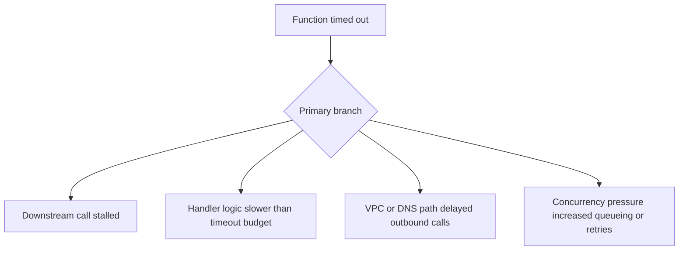

# Function Timeout

## 1. Summary
A Lambda timeout means the runtime did not finish before the configured function timeout expired. The visible error is often late in the failure chain because the real cause may be dependency latency, blocked I/O, CPU starvation, or an undersized timeout budget.



## 2. Common Misreadings
- Increasing the timeout always fixes the incident.
- `Task timed out` proves the function code is broken.
- A timeout means the function produced no useful logs.
- If average duration looks normal, long-tail latency is irrelevant.
- VPC-attached functions time out only when the destination is down.

## 3. Competing Hypotheses
- H1: Downstream dependency latency dominates the invocation — Primary evidence should confirm or disprove whether a specific dependency consumed most of the remaining timeout budget.
- H2: Handler logic is CPU-bound or inefficient — Primary evidence should confirm or disprove whether application work, not waiting, consumed most execution time.
- H3: VPC, DNS, or endpoint routing delays outbound calls — Primary evidence should confirm or disprove whether network path establishment caused the stall.
- H4: Concurrency pressure or retries amplified duration — Primary evidence should confirm or disprove whether scaling pressure increased effective per-request work.

## 4. What to Check First
### Metrics
- `Duration` with p95 and p99 during the incident window.
- `Errors` and `Throttles` on the same timeline.
- `ConcurrentExecutions` and `UnreservedConcurrentExecutions` to detect scale pressure.

### Logs
- `Task timed out after 30.00 seconds` in `/aws/lambda/$FUNCTION_NAME`.
- REPORT lines showing durations clustered near the configured timeout.
- App logs around the final successful step before the timeout.

### Platform Signals
- Run `aws lambda get-function-configuration --function-name $FUNCTION_NAME` to confirm timeout, memory, runtime, and VPC settings.
- Run CloudWatch metric queries for `Duration`, `Errors`, and `ConcurrentExecutions` in the same UTC window.
- Compare one healthy invocation log stream to one failing log stream.

| Signal | Normal | Abnormal | Why it matters |
| --- | --- | --- | --- |
| Duration percentile | p95 remains well below timeout | p95 or p99 approaches timeout | Shows whether this is isolated or systemic |
| REPORT line | Duration varies with healthy headroom | Duration repeatedly stops just before timeout | Confirms hard timeout boundary rather than caller timeout |
| Error pattern | Errors track application exceptions | Errors spike with `Task timed out` | Separates timeout from logic failure |
| Concurrency | Stable relative to baseline | Sudden rise before timeout spike | Suggests scale pressure or downstream saturation |

## 5. Evidence to Collect
### Required Evidence
- Exact timeout value from function configuration.
- UTC timestamps for first timeout and last known healthy invocation.
- REPORT lines from at least three failing invocations.
- Dependency call timing from application logs if available.

### Useful Context
- Whether the issue started after code deploy, config change, or traffic surge.
- Whether the function is in a VPC and which downstream targets it calls.
- Whether retries from API Gateway, SQS, or EventBridge are present.

### CLI Investigation Commands
#### 1. Confirm timeout and execution settings

```bash
aws lambda get-function-configuration \
    --function-name $FUNCTION_NAME
```

Example output:

```json
{
  "FunctionName": "$FUNCTION_NAME",
  "Timeout": 30,
  "MemorySize": 512,
  "VpcConfig": {
    "SubnetIds": ["subnet-xxxxxxxx", "subnet-yyyyyyyy"],
    "SecurityGroupIds": ["sg-xxxxxxxx"]
  },
  "FunctionArn": "arn:aws:lambda:$REGION:<account-id>:function:$FUNCTION_NAME"
}
```

#### 2. Pull timeout-related metrics

```bash
aws cloudwatch get-metric-statistics \
    --namespace AWS/Lambda \
    --metric-name Duration \
    --dimensions Name=FunctionName,Value=$FUNCTION_NAME \
    --statistics Average Maximum \
    --start-time 2026-04-07T09:00:00Z \
    --end-time 2026-04-07T09:30:00Z \
    --period 60
```

Example output:

```json
{
  "Datapoints": [
    {"Timestamp": "2026-04-07T09:12:00+00:00", "Average": 27480.0, "Maximum": 30000.0},
    {"Timestamp": "2026-04-07T09:13:00+00:00", "Average": 29110.0, "Maximum": 30000.0}
  ],
  "Label": "Duration"
}
```

#### 3. Read the Lambda log group around the failure

```bash
aws logs tail /aws/lambda/$FUNCTION_NAME \
    --since 15m \
    --format short
```

Example output:

```text
2026-04-07T09:12:18 START RequestId: 11111111-2222-3333-4444-555555555555 Version: $LATEST
2026-04-07T09:12:47 INFO fetching customer profile from downstream API
2026-04-07T09:12:48 INFO retry 2 for https://example.internal/profile
2026-04-07T09:12:48 Task timed out after 30.00 seconds
```

## 6. Validation and Disproof by Hypothesis
### H1: Downstream dependency latency dominates the invocation

| Observation | Normal | Abnormal |
| --- | --- | --- |
| Dependency timing logs | Calls complete within usual latency budget | One dependency consumes most of the invocation wall time |
| External service metrics | Dependency latency flat | Dependency p95 rises with Lambda timeouts |

### H2: Handler logic is CPU-bound or inefficient

| Observation | Normal | Abnormal |
| --- | --- | --- |
| In-function checkpoints | Progress advances steadily | Logs stop during compute-heavy stage without I/O waits |
| Memory/CPU proxy | Duration improves with more memory | Duration unchanged when dependency latency is flat |

### H3: VPC, DNS, or endpoint routing delays outbound calls

| Observation | Normal | Abnormal |
| --- | --- | --- |
| VPC-only behavior | Same code succeeds inside and outside VPC | Timeouts occur only for VPC-attached versions or subnets |
| Connection setup logs | Fast connect and DNS resolution | Long gap before socket connect or first byte |

### H4: Concurrency pressure or retries amplified duration

| Observation | Normal | Abnormal |
| --- | --- | --- |
| ConcurrentExecutions | Follows normal demand envelope | Spikes before timeout cluster appears |
| Retry volume | No repeat processing | Duplicate work or backlog raises effective execution time |

## 7. Likely Root Cause Patterns
1. A downstream API, database, or AWS service slowed first, and Lambda simply exposed the latency budget overrun. Timeouts often appear only after retries or connection establishment consumed the remaining wall clock.
2. The handler does too much synchronous work for the configured timeout. Large payload parsing, batch fan-in, or expensive serialization can make the function fail only at higher percentiles.
3. VPC routing is incomplete or intermittently degraded. Missing NAT, endpoint rules, or DNS reachability can make each outbound connection spend most of the invocation waiting.
4. Concurrency pressure worsened a previously acceptable path. Higher request volume can magnify downstream queueing, lock contention, or per-request retry behavior.

## 8. Immediate Mitigations
1. Increase timeout only when logs prove useful work is still making progress.

```bash
aws lambda update-function-configuration \
    --function-name $FUNCTION_NAME \
    --timeout 60
```

2. Raise memory to add proportional CPU when the handler is compute-bound.

```bash
aws lambda update-function-configuration \
    --function-name $FUNCTION_NAME \
    --memory-size 1024
```

3. Reduce downstream retry counts or set shorter client timeouts so failures surface before the Lambda timeout.

4. Shift callers to a stable alias or previous version if the issue began after a deployment.

## 9. Prevention
1. Set explicit client-side timeouts below the Lambda timeout.
2. Emit step-level timing logs for major dependency calls and compute stages.
3. Load test p95 and p99 latency, not only average duration.
4. Use reserved or provisioned concurrency when burst scaling is predictable.
5. Keep timeout budgets aligned with upstream SLAs and retry policies.

## See Also
- [Troubleshooting Playbooks](../index.md)
- [Downstream Latency](../performance/downstream-latency.md)
- [Endpoint Timeout](../networking/endpoint-timeout.md)

## Sources
- [Troubleshoot Lambda functions](https://docs.aws.amazon.com/lambda/latest/dg/troubleshooting-execution.html)
- [Monitoring Lambda metrics in Amazon CloudWatch](https://docs.aws.amazon.com/lambda/latest/dg/monitoring-metrics.html)
- [Configuring Lambda function options](https://docs.aws.amazon.com/lambda/latest/dg/configuration-function-common.html)
