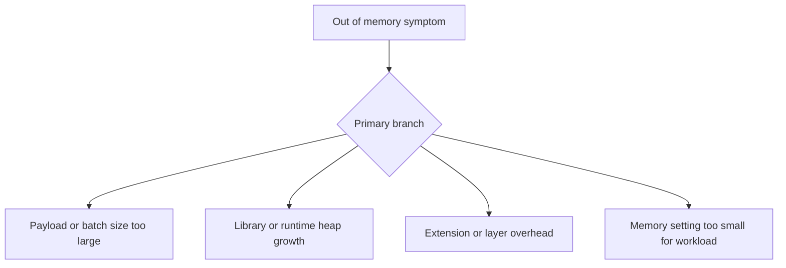

# Out of Memory

## 1. Summary
An out-of-memory failure means the runtime exceeded the configured Lambda memory allocation or came close enough that garbage collection, paging-like behavior inside libraries, or process termination made the invocation fail. The visible symptom is often a reset, crash, or abrupt end rather than a clean exception.



## 2. Common Misreadings
- Max memory near the limit is harmless if invocations still finish.
- More timeout will solve a memory problem.
- Only very large payloads can cause OOM.
- Lambda memory is independent from CPU allocation.
- One successful retry disproves memory exhaustion.

## 3. Competing Hypotheses
- H1: Request payloads or batch size exceed safe working-set size — Primary evidence should confirm or disprove whether input size growth maps directly to memory peaks.
- H2: The runtime or application leaks memory during execution — Primary evidence should confirm or disprove whether repeated allocations or retained objects drive heap growth.
- H3: Extensions, layers, or instrumentation consume too much memory — Primary evidence should confirm or disprove whether non-handler overhead removed expected headroom.
- H4: Memory allocation is simply undersized for the workload — Primary evidence should confirm or disprove whether the same code becomes stable at a higher memory setting.

## 4. What to Check First
### Metrics
- `Errors` and `Duration` around the failure window.
- `Invocations` to determine whether larger bursts changed payload mix.
- If available, Lambda Insights memory metrics for the function version.

### Logs
- REPORT lines with `Max Memory Used` close to `Memory Size`.
- `Runtime exited with error: signal: killed` or language-specific heap exceptions.
- App logs showing payload size, batch count, or processing stage before failure.

### Platform Signals
- Run `aws lambda get-function-configuration --function-name $FUNCTION_NAME` to confirm memory size, timeout, and layers.
- Compare one failing version with one healthy version after the last deployment.
- Preserve the exact REPORT lines because CloudWatch metrics alone do not expose `Max Memory Used`.

| Signal | Normal | Abnormal | Why it matters |
| --- | --- | --- | --- |
| REPORT memory | Comfortable headroom below limit | Max memory repeatedly reaches or nearly reaches limit | Best direct indicator of memory pressure |
| Error text | Clean handler exceptions | `signal: killed`, heap OOM, or abrupt reset | Distinguishes resource exhaustion from logic failure |
| Payload mix | Stable request sizes | Larger objects or batches before failures | Connects workload shape to working set |
| Layers/extensions | Small fixed overhead | New extension or instrumentation increased baseline memory | Identifies hidden consumers outside handler logic |

## 5. Evidence to Collect
### Required Evidence
- Three failing REPORT lines with `Max Memory Used`.
- Function configuration showing memory size and layers.
- Sample payload size or event batch count.
- Last known good version or alias for comparison.

### Useful Context
- Whether a recent dependency upgrade changed runtime footprint.
- Whether Lambda Insights, tracing, or extensions were enabled recently.
- Whether failures occur only on certain event sources or payload types.

### CLI Investigation Commands
#### 1. Confirm memory configuration and layers

```bash
aws lambda get-function-configuration \
    --function-name $FUNCTION_NAME
```

Example output:

```json
{
  "FunctionName": "$FUNCTION_NAME",
  "MemorySize": 512,
  "Timeout": 30,
  "Layers": [
    {"Arn": "arn:aws:lambda:$REGION:<account-id>:layer:monitoring-extension:7"}
  ]
}
```

#### 2. Pull recent error metrics

```bash
aws cloudwatch get-metric-statistics \
    --namespace AWS/Lambda \
    --metric-name Errors \
    --dimensions Name=FunctionName,Value=$FUNCTION_NAME \
    --statistics Sum \
    --start-time 2026-04-07T10:00:00Z \
    --end-time 2026-04-07T10:30:00Z \
    --period 60
```

Example output:

```json
{
  "Datapoints": [
    {"Timestamp": "2026-04-07T10:14:00+00:00", "Sum": 5.0},
    {"Timestamp": "2026-04-07T10:15:00+00:00", "Sum": 7.0}
  ],
  "Label": "Errors"
}
```

#### 3. Read failing REPORT lines from logs

```bash
aws logs tail /aws/lambda/$FUNCTION_NAME \
    --since 15m \
    --format short
```

Example output:

```text
2026-04-07T10:14:41 START RequestId: aaaaaaaa-bbbb-cccc-dddd-eeeeeeeeeeee Version: 42
2026-04-07T10:14:43 ERROR Runtime exited with error: signal: killed
2026-04-07T10:14:43 REPORT RequestId: aaaaaaaa-bbbb-cccc-dddd-eeeeeeeeeeee Duration: 2120.33 ms Billed Duration: 2200 ms Memory Size: 512 MB Max Memory Used: 511 MB
```

## 6. Validation and Disproof by Hypothesis
### H1: Request payloads or batch size exceed safe working-set size

| Observation | Normal | Abnormal |
| --- | --- | --- |
| Event size | Similar payload sizes succeed | Largest payloads or batches align with memory peaks |
| Event source batching | Stable batch count | Failures start after batch size increase |

### H2: The runtime or application leaks memory during execution

| Observation | Normal | Abnormal |
| --- | --- | --- |
| Stage-by-stage logging | Memory-intensive stage ends cleanly | Same code path grows until the runtime is killed |
| Repeatability | Failure tied only to input size | Failure occurs even for moderate inputs after code change |

### H3: Extensions, layers, or instrumentation consume too much memory

| Observation | Normal | Abnormal |
| --- | --- | --- |
| Baseline overhead | Function has expected headroom | New extension leaves little memory before handler work starts |
| Version comparison | Old and new versions have similar footprint | Issue begins immediately after adding layer or agent |

### H4: Memory allocation is simply undersized for the workload

| Observation | Normal | Abnormal |
| --- | --- | --- |
| Scale-up test | Higher memory shows no change | Higher memory removes crashes and lowers duration |
| REPORT lines | Max memory far below limit | Max memory repeatedly reaches configured ceiling |

## 7. Likely Root Cause Patterns
1. Input shape changed faster than memory allocation. Larger SQS batches, oversized API payloads, or more complex records often push the working set past the old safe margin.
2. A dependency upgrade increased heap use. Serialization libraries, SDK clients, and observability agents can materially increase baseline footprint.
3. Temporary in-memory buffering is too large. Reading entire objects, query results, or compressed payloads into memory often causes failures that disappear when streaming is introduced.
4. The function was under-provisioned relative to both memory and CPU needs. Since Lambda allocates CPU proportionally to memory, raising memory can fix both OOM and duration regressions.

## 8. Immediate Mitigations
1. Raise memory size to restore headroom and CPU.

```bash
aws lambda update-function-configuration \
    --function-name $FUNCTION_NAME \
    --memory-size 1024
```

2. Reduce event source batch size or payload size where supported.

3. Roll back the last dependency, layer, or extension change if the incident started immediately after deployment.

4. Stream large files or records instead of buffering them in memory.

## 9. Prevention
1. Track `Max Memory Used` from REPORT lines in routine reviews.
2. Test with production-like payload sizes and batch counts.
3. Keep extensions and layers minimal on latency- or memory-sensitive functions.
4. Set alert thresholds before memory usage reaches the limit.
5. Prefer streaming and chunked processing for large objects.

## See Also
- [Troubleshooting Playbooks](../index.md)
- [Memory Exhaustion](../performance/memory-exhaustion.md)
- [Runtime Crash](runtime-crash.md)

## Sources
- [Troubleshoot memory issues in Lambda](https://docs.aws.amazon.com/lambda/latest/dg/troubleshooting-execution.html#troubleshooting-memory)
- [Configuring Lambda memory](https://docs.aws.amazon.com/lambda/latest/dg/configuration-memory.html)
- [Lambda function logs](https://docs.aws.amazon.com/lambda/latest/dg/monitoring-cloudwatchlogs.html)
