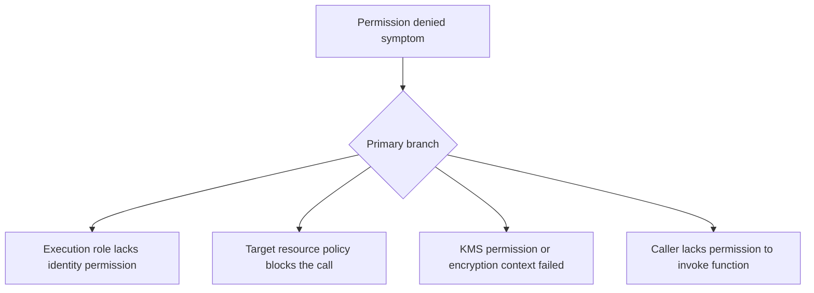

# Permission Denied

## 1. Summary
Permission-denied failures happen when the Lambda execution role, resource policy, or KMS permissions do not allow the action the function or caller is attempting. Operators often see the downstream error first even though the real fault is in IAM evaluation or a missing resource-based policy statement.



## 2. Common Misreadings
- The function role has `AWSLambdaBasicExecutionRole`, so all AWS calls should work.
- An `AccessDeniedException` always means the Lambda execution role is wrong.
- Resource policies matter only for S3 buckets.
- If one alias works, permissions for all aliases and versions must be identical.
- KMS-related denials are unrelated to Lambda configuration.

## 3. Competing Hypotheses
- H1: The execution role is missing an identity-based permission — Primary evidence should confirm or disprove whether the role attached to the function lacks the required action on the target resource.
- H2: The target service requires a resource-based policy statement — Primary evidence should confirm or disprove whether the target resource rejected the call despite the role permission.
- H3: KMS permissions or encryption settings block the operation — Primary evidence should confirm or disprove whether decrypt or data key access failed first.
- H4: The invoking principal is not allowed to call Lambda — Primary evidence should confirm or disprove whether the caller lacks `lambda:InvokeFunction` or the function resource policy is incomplete.

## 4. What to Check First
### Metrics
- `Errors` for the Lambda function and any upstream service retry metric.
- `Invocations` to see whether failures affect all requests or only specific callers.
- If asynchronous, `DeadLetterErrors` or destination delivery errors.

### Logs
- `AccessDeniedException`, `not authorized`, or `User: arn:aws:sts::<account-id>:assumed-role/...` patterns in `/aws/lambda/$FUNCTION_NAME`.
- KMS errors such as `kms:Decrypt` or `GenerateDataKey` denied.
- API Gateway or event source logs that show Lambda invocation denial.

### Platform Signals
- Run `aws lambda get-function-configuration --function-name $FUNCTION_NAME` to capture the execution role ARN.
- Run `aws lambda get-policy --function-name $FUNCTION_NAME` to inspect resource-based invoke permissions.
- Review the exact denied action, resource ARN, and principal from the first failing log line.

| Signal | Normal | Abnormal | Why it matters |
| --- | --- | --- | --- |
| Denied action | No authorization errors | Specific action and resource are denied | Identifies exact IAM evaluation target |
| Function role | Expected least-privilege permissions present | Missing service action or resource scope | Confirms identity policy gap |
| Function resource policy | Expected invoke principals exist | Missing API Gateway, EventBridge, or account principal | Explains invoke failures from external services |
| Encryption path | No KMS denials | `kms:Decrypt` or key policy denial appears first | Prevents misclassifying encryption failures as app errors |

## 5. Evidence to Collect
### Required Evidence
- Full denied error line including action, resource, and principal.
- Function configuration with `Role` ARN.
- Function resource policy if another AWS service invokes the function.
- The exact target resource ARN involved in the denied call.

### Useful Context
- Whether the issue started after IAM, KMS, alias, or event source configuration changes.
- Whether only one environment, alias, or account is affected.
- Whether the target service also uses a resource-based policy.

### CLI Investigation Commands
#### 1. Confirm the execution role on the function

```bash
aws lambda get-function-configuration \
    --function-name $FUNCTION_NAME
```

Example output:

```json
{
  "FunctionName": "$FUNCTION_NAME",
  "Role": "arn:aws:iam::<account-id>:role/lambda-exec",
  "KMSKeyArn": "arn:aws:kms:$REGION:<account-id>:key/11111111-2222-3333-4444-555555555555"
}
```

#### 2. Inspect the Lambda resource policy

```bash
aws lambda get-policy \
    --function-name $FUNCTION_NAME
```

Example output:

```json
{
  "Policy": "{\"Statement\":[{\"Sid\":\"AllowExecutionFromApiGateway\",\"Principal\":{\"Service\":\"apigateway.amazonaws.com\"},\"Action\":\"lambda:InvokeFunction\",\"Resource\":\"arn:aws:lambda:$REGION:<account-id>:function:$FUNCTION_NAME\"}]}"
}
```

#### 3. Pull recent authorization failures from logs

```bash
aws logs tail /aws/lambda/$FUNCTION_NAME \
    --since 30m \
    --format short
```

Example output:

```text
2026-04-07T11:03:15 ERROR AccessDeniedException: User: arn:aws:sts::<account-id>:assumed-role/lambda-exec/$FUNCTION_NAME is not authorized to perform: dynamodb:PutItem on resource: arn:aws:dynamodb:$REGION:<account-id>:table/Orders
2026-04-07T11:03:15 REPORT RequestId: 99999999-8888-7777-6666-555555555555 Duration: 129.17 ms Billed Duration: 130 ms Memory Size: 512 MB Max Memory Used: 124 MB
```

## 6. Validation and Disproof by Hypothesis
### H1: The execution role is missing an identity-based permission

| Observation | Normal | Abnormal |
| --- | --- | --- |
| Denied action vs role scope | Action already granted on correct resource | Needed action or resource ARN missing from role permissions |
| Invocation path | Same role succeeds elsewhere | All calls from this role fail on same action |

### H2: The target service requires a resource-based policy statement

| Observation | Normal | Abnormal |
| --- | --- | --- |
| Target resource policy | Caller principal allowed | Resource policy does not trust the Lambda role or service principal |
| Identity policy | Role appears sufficient | Call still denied until target policy is updated |

### H3: KMS permissions or encryption settings block the operation

| Observation | Normal | Abnormal |
| --- | --- | --- |
| First error in logs | Service call denied directly | `kms:Decrypt` or key policy denial appears before service access |
| Encrypted resource behavior | Unencrypted path also fails | Only encrypted parameters, env vars, or payloads fail |

### H4: The invoking principal is not allowed to call Lambda

| Observation | Normal | Abnormal |
| --- | --- | --- |
| Function resource policy | Expected principal or source ARN present | Missing caller principal, source ARN, or alias qualifier |
| Upstream service logs | Invocation accepted | API Gateway, EventBridge, or account caller receives Lambda invoke denial |

## 7. Likely Root Cause Patterns
1. The function role was deployed without one required action or with an overly narrow resource ARN. This is common after moving from wildcard permissions to least privilege without full resource coverage.
2. The target resource uses a separate resource-based policy that was never updated. Lambda roles alone are not enough for S3 notifications, cross-account invoke paths, or some encrypted resources.
3. KMS key policy drift blocks Lambda from decrypting environment variables, secrets, or service data. Operators often investigate the application service first and miss the earlier KMS denial.
4. The invoke path changed with aliases, versions, or API Gateway source ARNs. A policy that worked for one integration can fail for another if the source ARN or qualifier no longer matches.

## 8. Immediate Mitigations
1. Add the missing permission to the execution role or widen the resource scope to the known-safe ARN set.
2. Add or correct the Lambda resource policy for the invoking service.

```bash
aws lambda add-permission \
    --function-name $FUNCTION_NAME \
    --statement-id apigw-invoke \
    --action lambda:InvokeFunction \
    --principal apigateway.amazonaws.com \
    --source-arn arn:aws:execute-api:$REGION:<account-id>:$API_ID/*/*/*
```

3. Update the KMS key policy when decrypt failures are first in the evidence chain.
4. Roll back to the last working role or alias if the denial started immediately after a deployment.

## 9. Prevention
1. Version-control IAM and resource policies with the function.
2. Test least-privilege changes against production-like calls before rollout.
3. Log the exact AWS action and resource before making service SDK calls where practical.
4. Review KMS key policy dependencies whenever adding encryption.
5. Keep invoke permissions scoped but explicit for every event source and alias.

## See Also
- [Troubleshooting Playbooks](../index.md)
- [API Gateway Integration](../networking/api-gateway-integration.md)
- [Deployment Failed](deployment-failed.md)

## Sources
- [Viewing resource-based IAM policies in Lambda](https://docs.aws.amazon.com/lambda/latest/dg/access-control-resource-based.html)
- [Defining Lambda function permissions with an execution role](https://docs.aws.amazon.com/lambda/latest/dg/lambda-intro-execution-role.html)
- [Troubleshoot permissions issues in Lambda](https://docs.aws.amazon.com/lambda/latest/dg/security_iam_troubleshoot.html)
