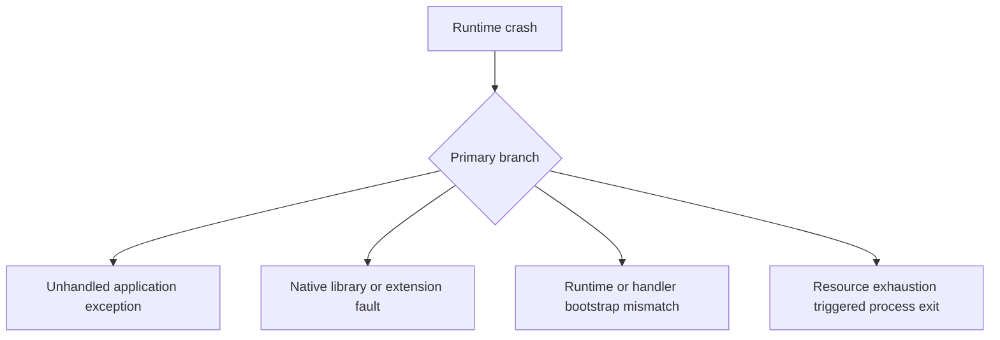

# Runtime Crash

## 1. Summary
A runtime crash occurs when the Lambda execution environment exits unexpectedly before the handler returns normally. Crashes can appear as segmentation faults, native library failures, abrupt process exits, or unhandled exceptions that terminate the runtime.



## 2. Common Misreadings
- Every crash is an out-of-memory event.
- Unhandled exceptions and runtime exits are the same failure mode.
- If the code works locally, native dependencies cannot be the issue.
- Lambda service instability is the most likely cause.
- A retry that succeeds disproves a crash defect.

## 3. Competing Hypotheses
- H1: The handler or bootstrap threw an unhandled exception — Primary evidence should confirm or disprove whether the runtime terminated because application code did not catch a fatal error.
- H2: A native library, layer, or extension crashed the process — Primary evidence should confirm or disprove whether non-managed code or an extension caused a fault signal.
- H3: Runtime configuration mismatched the artifact — Primary evidence should confirm or disprove whether handler, architecture, or bootstrap settings are incompatible with the deployed code.
- H4: Memory or other resource exhaustion forced the runtime to exit — Primary evidence should confirm or disprove whether the crash is secondary to a resource limit event.

## 4. What to Check First
### Metrics
- `Errors`, `Duration`, and `Invocations` in the same window.
- Any rise in `Throttles` or timeout symptoms that precede crashes.
- If available, Lambda Insights metrics for memory pressure or extension behavior.

### Logs
- `Runtime.ExitError`, `Runtime exited with error`, `signal: segmentation fault`, or stack traces in `/aws/lambda/$FUNCTION_NAME`.
- REPORT lines showing whether the crash happened early or late in execution.
- Extension or bootstrap logs emitted before the process exits.

### Platform Signals
- Run `aws lambda get-function-configuration --function-name $FUNCTION_NAME` to capture runtime, architecture, handler, and layers.
- Compare the failing version with the last healthy version.
- Check whether crashes started after adding a layer, extension, or native dependency.

| Signal | Normal | Abnormal | Why it matters |
| --- | --- | --- | --- |
| Error text | Handled app exceptions | Exit error, segfault, or abrupt runtime reset | Distinguishes crashes from regular failures |
| REPORT line | Predictable duration and memory | Very short or near-limit runtime before exit | Helps separate bootstrap faults from resource exhaustion |
| Version diff | No native/runtime changes | New layer, architecture, or runtime introduced | Narrows fault to packaging or dependency change |
| Repeatability | Crashes tied to specific payloads | Crashes on init or all invocations | Shows whether defect is code path or environment wide |

## 5. Evidence to Collect
### Required Evidence
- Full crash log lines from failing invocations.
- Function configuration including runtime, architecture, handler, and layers.
- Last known good version information.
- Sample payloads or triggers that reproduce the crash.

### Useful Context
- Whether the function uses native libraries, custom runtimes, or extensions.
- Whether a runtime upgrade happened recently.
- Whether the crash occurs during init or during handler execution.

### CLI Investigation Commands
#### 1. Confirm runtime, handler, architecture, and layers

```bash
aws lambda get-function-configuration \
    --function-name $FUNCTION_NAME
```

Example output:

```json
{
  "FunctionName": "$FUNCTION_NAME",
  "Runtime": "provided.al2023",
  "Handler": "bootstrap",
  "Architectures": ["arm64"],
  "Layers": [
    {"Arn": "arn:aws:lambda:$REGION:<account-id>:layer:image-processing-native:9"}
  ]
}
```

#### 2. Pull recent error metrics

```bash
aws cloudwatch get-metric-statistics \
    --namespace AWS/Lambda \
    --metric-name Errors \
    --dimensions Name=FunctionName,Value=$FUNCTION_NAME \
    --statistics Sum \
    --start-time 2026-04-07T14:00:00Z \
    --end-time 2026-04-07T14:30:00Z \
    --period 60
```

Example output:

```json
{
  "Datapoints": [
    {"Timestamp": "2026-04-07T14:08:00+00:00", "Sum": 9.0},
    {"Timestamp": "2026-04-07T14:09:00+00:00", "Sum": 11.0}
  ],
  "Label": "Errors"
}
```

#### 3. Read crash signatures from CloudWatch Logs

```bash
aws logs tail /aws/lambda/$FUNCTION_NAME \
    --since 30m \
    --format short
```

Example output:

```text
2026-04-07T14:08:21 START RequestId: fedcba98-7654-3210-1111-222222222222 Version: 7
2026-04-07T14:08:21 ERROR Runtime.ExitError: RequestId: fedcba98-7654-3210-1111-222222222222 Error: Runtime exited with error: signal: segmentation fault
2026-04-07T14:08:21 REPORT RequestId: fedcba98-7654-3210-1111-222222222222 Duration: 44.71 ms Billed Duration: 45 ms Memory Size: 1024 MB Max Memory Used: 188 MB
```

## 6. Validation and Disproof by Hypothesis
### H1: The handler or bootstrap threw an unhandled exception

| Observation | Normal | Abnormal |
| --- | --- | --- |
| Stack trace | Errors are caught and returned | Unhandled exception terminates the invocation |
| Reproduction | Only invalid inputs fail gracefully | Specific payload path crashes every time |

### H2: A native library, layer, or extension crashed the process

| Observation | Normal | Abnormal |
| --- | --- | --- |
| Error signature | Managed-language error only | Segfault, illegal instruction, or extension failure |
| Dependency change | No recent native changes | Crash begins after new layer, runtime, or architecture switch |

### H3: Runtime configuration mismatched the artifact

| Observation | Normal | Abnormal |
| --- | --- | --- |
| Handler/runtime alignment | Correct handler and architecture | Wrong bootstrap, architecture, or incompatible binary |
| Deployment comparison | Healthy version uses same config | Only new config/artifact pair crashes |

### H4: Memory or other resource exhaustion forced the runtime to exit

| Observation | Normal | Abnormal |
| --- | --- | --- |
| REPORT memory | Plenty of headroom | Max memory reaches limit or timeout occurs just before exit |
| Crash timing | Immediate or logic-specific failure | Crash clusters with OOM or timeout evidence |

## 7. Likely Root Cause Patterns
1. Unhandled exceptions were introduced on a new code path. These often appear as runtime exits only because the platform reports the failure after the process ends.
2. Native dependencies were built for the wrong architecture or incompatible system libraries. This is especially common after moving between x86_64 and arm64 or changing the base runtime.
3. An extension or observability layer destabilized the execution environment. The application code looks unchanged, but the runtime still crashes during init or shutdown.
4. Resource exhaustion caused the runtime to die abruptly. Out-of-memory conditions can manifest as generic exit errors when the process is terminated externally.

## 8. Immediate Mitigations
1. Roll back to the last healthy version or alias if the crash began after deployment.
2. Remove the most recently added layer or extension from the function configuration.

```bash
aws lambda update-function-configuration \
    --function-name $FUNCTION_NAME \
    --layers arn:aws:lambda:$REGION:<account-id>:layer:shared-runtime:3
```

3. Rebuild native dependencies for the function architecture and runtime.
4. Raise memory if evidence shows the crash is secondary to exhaustion.

## 9. Prevention
1. Test native dependencies on the exact Lambda architecture and runtime.
2. Keep crash-signature alerts for `Runtime.ExitError` and fault signals.
3. Roll out runtime and layer changes separately from application changes.
4. Capture input fingerprints for crash-prone paths without logging sensitive payloads.
5. Maintain a stable alias-based rollback path.

## See Also
- [Troubleshooting Playbooks](../index.md)
- [Out of Memory](out-of-memory.md)
- [Deployment Failed](deployment-failed.md)

## Sources
- [Troubleshoot execution issues in Lambda](https://docs.aws.amazon.com/lambda/latest/dg/troubleshooting-execution.html)
- [Lambda layers](https://docs.aws.amazon.com/lambda/latest/dg/chapter-layers.html)
- [Lambda runtimes](https://docs.aws.amazon.com/lambda/latest/dg/lambda-runtimes.html)
