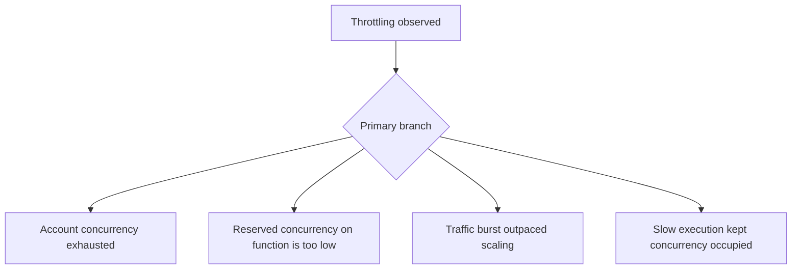

# Throttling

## 1. Summary
Lambda throttling means the service rejected invocations because the function or account hit a concurrency boundary faster than execution environments could be allocated. The immediate symptom is often `TooManyRequestsException`, retry storms, or growing upstream backlog.



## 2. Common Misreadings
- Throttling means Lambda failed to scale.
- Only the affected function matters; account-wide limits are irrelevant.
- Adding retries at the caller is always safe.
- Higher timeout helps throttling.
- Short invocations can never be throttled.

## 3. Competing Hypotheses
- H1: The account hit its regional concurrency limit — Primary evidence should confirm or disprove whether unreserved capacity was exhausted across functions.
- H2: Reserved concurrency on this function is the bottleneck — Primary evidence should confirm or disprove whether the configured per-function ceiling caused the rejection.
- H3: A bursty traffic profile exceeded available warm and scaling capacity — Primary evidence should confirm or disprove whether throttle spikes align with sudden demand ramps.
- H4: Execution duration increased and held concurrency open too long — Primary evidence should confirm or disprove whether slower completions, not more requests alone, caused saturation.

## 4. What to Check First
### Metrics
- `Throttles`, `ConcurrentExecutions`, and `UnreservedConcurrentExecutions`.
- `Invocations` and `Duration` on the same graph.
- Upstream retry or backlog metrics for API Gateway, SQS, EventBridge, or Kinesis.

### Logs
- `Rate Exceeded`, `TooManyRequestsException`, or event source backlog warnings.
- REPORT lines showing duration increase before throttle growth.
- Caller logs showing retries and exponential backoff behavior.

### Platform Signals
- Run `aws lambda get-function-concurrency --function-name $FUNCTION_NAME`.
- Run `aws lambda get-account-settings` to inspect account concurrency limits.
- Compare throttle spikes to recent deploys, traffic bursts, and duration changes.

| Signal | Normal | Abnormal | Why it matters |
| --- | --- | --- | --- |
| Throttles | Zero or brief isolated events | Sustained throttle counts | Confirms control-plane concurrency rejection |
| ConcurrentExecutions | Below reserved/account ceiling | Plateaus at ceiling during incidents | Identifies actual saturation point |
| Duration | Stable while traffic rises | Duration rises before or with throttles | Shows whether slow code caused saturation |
| Upstream backlog | Drains normally | Queue depth or retries grow after throttles | Measures user impact beyond Lambda metric alone |

## 5. Evidence to Collect
### Required Evidence
- Throttle metric window with `ConcurrentExecutions` and `Duration`.
- Function reserved concurrency setting, if any.
- Account concurrency settings.
- Caller or event source retry/backlog evidence.

### Useful Context
- Whether a new deployment changed duration or retry behavior.
- Whether other functions in the same account spiked concurrently.
- Whether provisioned concurrency exists on related aliases.

### CLI Investigation Commands
#### 1. Inspect reserved concurrency on the function

```bash
aws lambda get-function-concurrency \
    --function-name $FUNCTION_NAME
```

Example output:

```json
{
  "ReservedConcurrentExecutions": 25
}
```

#### 2. Check account-level concurrency settings

```bash
aws lambda get-account-settings
```

Example output:

```json
{
  "AccountLimit": {
    "ConcurrentExecutions": 1000,
    "UnreservedConcurrentExecutions": 75
  },
  "AccountUsage": {
    "FunctionCount": 84,
    "TotalCodeSize": 428734193
  }
}
```

#### 3. Pull throttle metrics during the incident

```bash
aws cloudwatch get-metric-statistics \
    --namespace AWS/Lambda \
    --metric-name Throttles \
    --dimensions Name=FunctionName,Value=$FUNCTION_NAME \
    --statistics Sum \
    --start-time 2026-04-07T13:00:00Z \
    --end-time 2026-04-07T13:30:00Z \
    --period 60
```

Example output:

```json
{
  "Datapoints": [
    {"Timestamp": "2026-04-07T13:11:00+00:00", "Sum": 42.0},
    {"Timestamp": "2026-04-07T13:12:00+00:00", "Sum": 57.0}
  ],
  "Label": "Throttles"
}
```

## 6. Validation and Disproof by Hypothesis
### H1: The account hit its regional concurrency limit

| Observation | Normal | Abnormal |
| --- | --- | --- |
| Account settings | Unreserved capacity available | `UnreservedConcurrentExecutions` nearly zero during throttles |
| Cross-function impact | Only one function affected | Multiple functions throttle at same time |

### H2: Reserved concurrency on this function is the bottleneck

| Observation | Normal | Abnormal |
| --- | --- | --- |
| Function concurrency config | No restrictive cap or ample cap | Throttles begin when executions hit reserved ceiling |
| Other functions | No correlated impact needed | Only this function throttles while account headroom remains |

### H3: A bursty traffic profile exceeded available warm and scaling capacity

| Observation | Normal | Abnormal |
| --- | --- | --- |
| Invocation ramp | Gradual traffic changes | Sharp surge immediately before throttle spike |
| Retry behavior | Clients spread demand | Retries stack onto the initial burst |

### H4: Execution duration increased and held concurrency open too long

| Observation | Normal | Abnormal |
| --- | --- | --- |
| Duration trend | Stable despite demand | Duration climbs before concurrency plateaus |
| Work completion | High throughput per concurrency unit | Same concurrency processes fewer requests per minute |

## 7. Likely Root Cause Patterns
1. Reserved concurrency was intentionally set low and normal demand outgrew it. This protects downstream systems but creates a visible throttle ceiling when not revisited.
2. Another function family consumed the account's unreserved pool first. The affected function is only the visible victim of a wider concurrency shortage.
3. Duration regressed after a deployment or dependency slowdown. Even modest demand can then saturate concurrency because each invocation occupies an environment longer.
4. Retry amplification turned a short burst into sustained overload. API clients, queues, and event sources can compound throttling if backoff is weak or absent.

## 8. Immediate Mitigations
1. Raise or remove the overly restrictive reserved concurrency cap if downstream systems can handle it.

```bash
aws lambda put-function-concurrency \
    --function-name $FUNCTION_NAME \
    --reserved-concurrent-executions 100
```

2. Reduce function duration by disabling heavy features or rolling back the last deployment.
3. Increase provisioned concurrency on a hot alias for predictable traffic.
4. Tighten caller backoff and queue batch behavior so retries do not amplify the surge.

## 9. Prevention
1. Alert on `Throttles` and on low unreserved account concurrency headroom.
2. Review reserved concurrency allocations whenever traffic or fleet size changes.
3. Treat duration regressions as concurrency risks, not only latency risks.
4. Load test burst traffic with realistic retries.
5. Isolate critical functions with reserved concurrency while protecting total account capacity.

## See Also
- [Troubleshooting Playbooks](../index.md)
- [Concurrency Limits](../performance/concurrency-limits.md)
- [Function Timeout](function-timeout.md)

## Sources
- [Lambda concurrency](https://docs.aws.amazon.com/lambda/latest/dg/lambda-concurrency.html)
- [Monitoring Lambda metrics in Amazon CloudWatch](https://docs.aws.amazon.com/lambda/latest/dg/monitoring-metrics.html)
- [Troubleshoot Lambda scaling and concurrency](https://docs.aws.amazon.com/lambda/latest/dg/troubleshooting-execution.html)
