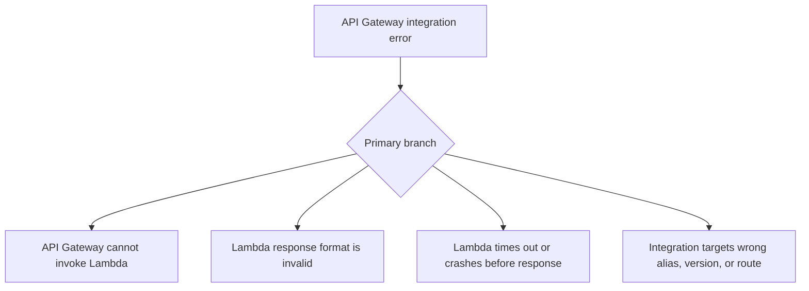

# API Gateway Integration Errors

## 1. Summary
API Gateway integration errors with Lambda usually present as 500, 502, or malformed responses even when the function appears to run. The root cause may be invoke permission, proxy response format, timeout budget mismatch, or integration configuration drift.



## 2. Common Misreadings
- A 502 from API Gateway always means API Gateway is broken.
- If Lambda logs a success message, the integration is healthy.
- Any JSON response is valid for Lambda proxy integration.
- Invoke permission issues and backend errors look obviously different.
- API Gateway and Lambda timeout budgets are interchangeable.

## 3. Competing Hypotheses
- H1: API Gateway lacks permission to invoke the function or alias — Primary evidence should confirm or disprove whether Lambda resource policy or source ARN scoping blocks invocation.
- H2: The function returns an invalid proxy response — Primary evidence should confirm or disprove whether status code, headers, or body shape fails API Gateway expectations.
- H3: Lambda timed out, crashed, or returned an internal error before API Gateway got a usable response — Primary evidence should confirm or disprove whether Lambda-side execution failed first.
- H4: API Gateway points at the wrong function, alias, or integration configuration — Primary evidence should confirm or disprove whether the route integration target drifted from the intended backend.

## 4. What to Check First
### Metrics
- Lambda `Errors`, `Duration`, and `Throttles`.
- API Gateway `5XXError`, `IntegrationLatency`, and `Latency` metrics where available.
- Request volume to see whether all routes or only one route are affected.

### Logs
- API Gateway execution logs if enabled.
- `/aws/lambda/$FUNCTION_NAME` logs around the failing request time.
- Messages like `Malformed Lambda proxy response` or invoke permission denials.

### Platform Signals
- Run `aws lambda get-policy --function-name $FUNCTION_NAME` to inspect invoke permissions.
- Confirm the function or alias ARN API Gateway should call.
- Compare one successful route integration with one failing route integration.

| Signal | Normal | Abnormal | Why it matters |
| --- | --- | --- | --- |
| API response code | 2xx or expected app error | 500/502 with integration error text | Confirms boundary between API Gateway and Lambda |
| Lambda logs | Request handled and response returned | Timeout, crash, or no matching invoke log | Distinguishes invoke failure from response failure |
| Resource policy | Correct API Gateway principal and source ARN | Missing or mismatched permission | Common cause of immediate integration failure |
| Response format | Valid proxy payload | Missing `statusCode`, bad body, or bad headers | Explains `Malformed Lambda proxy response` |

## 5. Evidence to Collect
### Required Evidence
- API Gateway error type and timestamp.
- Lambda logs for the same request window.
- Function resource policy.
- Expected integration target ARN or alias.

### Useful Context
- Whether the issue started after API deployment, Lambda alias change, or route update.
- Whether only one route or stage is affected.
- Whether the API uses REST API or HTTP API integration.

### CLI Investigation Commands
#### 1. Inspect the Lambda resource policy

```bash
aws lambda get-policy \
    --function-name $FUNCTION_NAME
```

Example output:

```json
{
  "Policy": "{\"Statement\":[{\"Sid\":\"AllowExecutionFromApiGateway\",\"Principal\":{\"Service\":\"apigateway.amazonaws.com\"},\"Action\":\"lambda:InvokeFunction\",\"Resource\":\"arn:aws:lambda:$REGION:<account-id>:function:$FUNCTION_NAME\",\"Condition\":{\"ArnLike\":{\"AWS:SourceArn\":\"arn:aws:execute-api:$REGION:<account-id>:$API_ID/*/*/*\"}}}]}"
}
```

#### 2. Confirm function configuration and timeout

```bash
aws lambda get-function-configuration \
    --function-name $FUNCTION_NAME
```

Example output:

```json
{
  "FunctionName": "$FUNCTION_NAME",
  "Timeout": 29,
  "FunctionArn": "arn:aws:lambda:$REGION:<account-id>:function:$FUNCTION_NAME"
}
```

#### 3. Read Lambda logs around the failing request

```bash
aws logs tail /aws/lambda/$FUNCTION_NAME \
    --since 30m \
    --format short
```

Example output:

```text
2026-04-07T18:05:11 START RequestId: 99990000-1111-2222-3333-444455556666 Version: 19
2026-04-07T18:05:11 ERROR Malformed response body produced by handler
2026-04-07T18:05:11 REPORT RequestId: 99990000-1111-2222-3333-444455556666 Duration: 58.31 ms Billed Duration: 59 ms Memory Size: 512 MB Max Memory Used: 118 MB
```

## 6. Validation and Disproof by Hypothesis
### H1: API Gateway lacks permission to invoke the function or alias

| Observation | Normal | Abnormal |
| --- | --- | --- |
| Resource policy | API Gateway principal and source ARN match | Missing statement or wrong source ARN/qualifier |
| Lambda logs | Matching invoke entries exist | API Gateway errors occur with no Lambda invoke log |

### H2: The function returns an invalid proxy response

| Observation | Normal | Abnormal |
| --- | --- | --- |
| Response shape | Has valid `statusCode`, headers, and string body | Malformed proxy response or invalid JSON/body type |
| Lambda execution | Handler succeeds with correct payload | Handler completes but API Gateway still returns 502 |

### H3: Lambda timed out, crashed, or returned an internal error before API Gateway got a usable response

| Observation | Normal | Abnormal |
| --- | --- | --- |
| Lambda logs | Request finishes cleanly | Timeout, crash, or internal exception occurs first |
| Integration latency | Low and stable | High latency approaches API Gateway or Lambda timeout |

### H4: API Gateway points at the wrong function, alias, or integration configuration

| Observation | Normal | Abnormal |
| --- | --- | --- |
| Intended target | Route points to correct function/alias | Stage or route still targets old or wrong backend |
| Deployment timing | No config drift after release | Error begins immediately after API or alias update |

## 7. Likely Root Cause Patterns
1. API Gateway invoke permission drifted after an alias or route change. The function exists and may even work from direct invocation, but API Gateway is not authorized for the new target.
2. The handler returns a payload incompatible with Lambda proxy integration. This is a frequent cause of 502 responses when application logs look superficially successful.
3. Lambda execution failed within API Gateway's integration window. API Gateway then surfaces the problem as a backend integration error rather than the original Lambda message.
4. API configuration drift points the route at the wrong target. This is common in staged deployments where aliases and integrations evolve separately.

## 8. Immediate Mitigations
1. Re-add invoke permission for API Gateway with the correct source ARN.

```bash
aws lambda add-permission \
    --function-name $FUNCTION_NAME \
    --statement-id apigw-prod \
    --action lambda:InvokeFunction \
    --principal apigateway.amazonaws.com \
    --source-arn arn:aws:execute-api:$REGION:<account-id>:$API_ID/*/*/*
```

2. Roll back to the last known good Lambda alias or API deployment.
3. Fix proxy response formatting in the handler.
4. Align Lambda timeout and API integration timeout budgets.

## 9. Prevention
1. Test API Gateway routes end-to-end after every alias or integration change.
2. Keep proxy response schemas under automated tests.
3. Version-control Lambda resource policies and API integrations.
4. Monitor API Gateway 5xx metrics alongside Lambda logs.
5. Use explicit aliases so API deployments target known versions.

## See Also
- [Troubleshooting Playbooks](../index.md)
- [Permission Denied](../invocation-errors/permission-denied.md)
- [Function Timeout](../invocation-errors/function-timeout.md)

## Sources
- [Using Lambda proxy integrations with API Gateway](https://docs.aws.amazon.com/apigateway/latest/developerguide/set-up-lambda-proxy-integrations.html)
- [Viewing resource-based IAM policies in Lambda](https://docs.aws.amazon.com/lambda/latest/dg/access-control-resource-based.html)
- [Troubleshoot API Gateway Lambda integrations](https://docs.aws.amazon.com/apigateway/latest/developerguide/http-api-troubleshooting-lambda.html)
