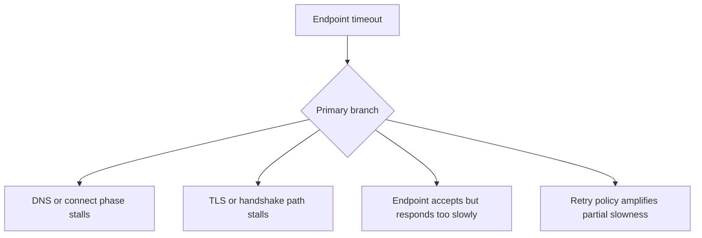

# Endpoint Timeout

## 1. Summary
Endpoint timeout incidents occur when the Lambda function can begin the network request but does not receive a response before the client timeout or Lambda timeout expires. The key question is whether the delay comes from routing, DNS, TLS/connect setup, or the endpoint processing time itself.



## 2. Common Misreadings
- A timeout proves the endpoint is completely down.
- If some calls succeed, the path is healthy.
- Raising Lambda timeout is the correct first fix.
- DNS and TLS delays are too small to matter.
- Endpoint timeouts are unrelated to VPC path design.

## 3. Competing Hypotheses
- H1: DNS lookup, route selection, or TCP connect is too slow — Primary evidence should confirm or disprove whether the timeout is consumed before the application sends the full request.
- H2: TLS negotiation or certificate validation is stalling — Primary evidence should confirm or disprove whether handshake setup, not endpoint processing, consumes the time.
- H3: The endpoint is reachable but responds too slowly — Primary evidence should confirm or disprove whether the remote service accepts requests but exceeds the response budget.
- H4: Client retries or timeout policy amplify a smaller latency problem — Primary evidence should confirm or disprove whether repeated attempts consume the overall invocation budget.

## 4. What to Check First
### Metrics
- Lambda `Duration`, `Errors`, and `Timeout`-adjacent symptoms.
- Concurrency and backlog metrics if timeouts stack up under load.
- Endpoint or dependency metrics if available.

### Logs
- Stage-level timing for DNS, connect, TLS, first byte, and retries in `/aws/lambda/$FUNCTION_NAME`.
- `ETIMEDOUT`, `Read timed out`, `socket hang up`, or TLS errors.
- REPORT lines showing whether the invocation ends at the function timeout or client timeout.

### Platform Signals
- Run `aws lambda get-function-configuration --function-name $FUNCTION_NAME` to inspect timeout and VPC context.
- Compare the same endpoint call from healthy and failing windows.
- Preserve the exact endpoint hostname, port, and client timeout settings before making changes.

| Signal | Normal | Abnormal | Why it matters |
| --- | --- | --- | --- |
| Phase timing | DNS, connect, TLS, and first byte are bounded | One phase consumes most of the budget | Locates the timeout stage |
| Error pattern | Fast success or fast fail | Near-timeout failures with retries | Shows budget exhaustion rather than hard denial |
| Client timeout | Below Lambda timeout with margin | Client retries approach or exceed Lambda timeout | Prevents retry-amplified failures |
| Path specificity | Same endpoint healthy from all paths | Only one VPC/subnet/route path times out | Narrows issue to networking design |

## 5. Evidence to Collect
### Required Evidence
- Exact endpoint hostname, port, and protocol.
- Client timeout and retry settings.
- Stage-level timing logs if available.
- Lambda duration and error metrics for the incident window.

### Useful Context
- Whether the issue affects public endpoints, private endpoints, or both.
- Whether the incident started after VPC, DNS, NAT, or certificate changes.
- Whether only one specific downstream path is timing out.

### CLI Investigation Commands
#### 1. Confirm function timeout and VPC configuration

```bash
aws lambda get-function-configuration \
    --function-name $FUNCTION_NAME
```

Example output:

```json
{
  "FunctionName": "$FUNCTION_NAME",
  "Timeout": 30,
  "VpcConfig": {
    "SubnetIds": ["subnet-private-a", "subnet-private-b"],
    "SecurityGroupIds": ["sg-egress-app"]
  }
}
```

#### 2. Pull duration metrics for the timeout window

```bash
aws cloudwatch get-metric-statistics \
    --namespace AWS/Lambda \
    --metric-name Duration \
    --dimensions Name=FunctionName,Value=$FUNCTION_NAME \
    --statistics Average Maximum \
    --start-time 2026-04-07T19:00:00Z \
    --end-time 2026-04-07T19:30:00Z \
    --period 60
```

Example output:

```json
{
  "Datapoints": [
    {"Timestamp": "2026-04-07T19:08:00+00:00", "Average": 14300.0, "Maximum": 30000.0},
    {"Timestamp": "2026-04-07T19:09:00+00:00", "Average": 14920.0, "Maximum": 30000.0}
  ],
  "Label": "Duration"
}
```

#### 3. Read endpoint timeout logs

```bash
aws logs tail /aws/lambda/$FUNCTION_NAME \
    --since 30m \
    --format short
```

Example output:

```text
2026-04-07T19:08:12 INFO dns=4 ms connect=22 ms tls=31 ms request_sent=true
2026-04-07T19:08:27 WARN first byte not received after 15000 ms from https://inventory.internal/api/items
2026-04-07T19:08:42 ERROR request timeout after 30000 ms
```

## 6. Validation and Disproof by Hypothesis
### H1: DNS lookup, route selection, or TCP connect is too slow

| Observation | Normal | Abnormal |
| --- | --- | --- |
| Early phases | DNS and connect complete quickly | Timeout budget lost before request is fully sent |
| Path specificity | Same path behaves consistently | One VPC or subnet path has long connect times |

### H2: TLS negotiation or certificate validation is stalling

| Observation | Normal | Abnormal |
| --- | --- | --- |
| Handshake timing | TLS completes promptly | Handshake dominates the elapsed time |
| Certificate behavior | No TLS validation issues | Certificate or SNI mismatch appears with timeout symptoms |

### H3: The endpoint is reachable but responds too slowly

| Observation | Normal | Abnormal |
| --- | --- | --- |
| Connect vs first byte | Connect fast and response fast | Connect fast but first byte or full response is slow |
| Endpoint-side evidence | Remote service healthy | Remote latency or saturation aligns with timeout window |

### H4: Client retries or timeout policy amplify a smaller latency problem

| Observation | Normal | Abnormal |
| --- | --- | --- |
| Retry count | Single attempt within budget | Multiple retries consume the invocation window |
| Timeout hierarchy | Per-call timeouts leave Lambda headroom | Aggregate retries approach Lambda timeout |

## 7. Likely Root Cause Patterns
1. The endpoint is reachable, but response time drifted beyond the client's budget. These incidents are often mistaken for full outages because the final symptom is still a timeout.
2. Network setup is only intermittently slow. DNS, NAT, or TLS negotiation can consume enough time to make healthy endpoint processing look broken.
3. Retry policy converts a mild latency issue into a full invocation failure. Without bounded per-call budgets, the function spends its entire timeout waiting.
4. Path-specific networking issues create partial outages. Only some subnets, endpoints, or route paths time out, making the problem look random until the path is isolated.

## 8. Immediate Mitigations
1. Reduce per-call retries and set explicit client timeouts that preserve Lambda headroom.
2. Route traffic to a healthier endpoint, replica, or alternative path if available.
3. Increase function timeout only after proving the endpoint is making progress and the SLA allows it.

```bash
aws lambda update-function-configuration \
    --function-name $FUNCTION_NAME \
    --timeout 60
```

4. Move AWS service traffic to VPC endpoints where possible to simplify the network path.

## 9. Prevention
1. Instrument DNS, connect, TLS, and first-byte timings in client logs.
2. Keep per-call timeout budgets below the Lambda timeout.
3. Use circuit breakers and bounded retries for unstable dependencies.
4. Validate endpoint behavior from the exact Lambda network path during releases.
5. Monitor endpoint latency and Lambda duration together.

## See Also
- [Troubleshooting Playbooks](../index.md)
- [Function Timeout](../invocation-errors/function-timeout.md)
- [NAT Gateway Issues](nat-gateway-issues.md)

## Sources
- [Lambda networking troubleshooting](https://docs.aws.amazon.com/lambda/latest/dg/troubleshooting-networking.html)
- [Troubleshoot execution issues in Lambda](https://docs.aws.amazon.com/lambda/latest/dg/troubleshooting-execution.html)
- [Giving Lambda functions access to resources in an Amazon VPC](https://docs.aws.amazon.com/lambda/latest/dg/configuration-vpc.html)
