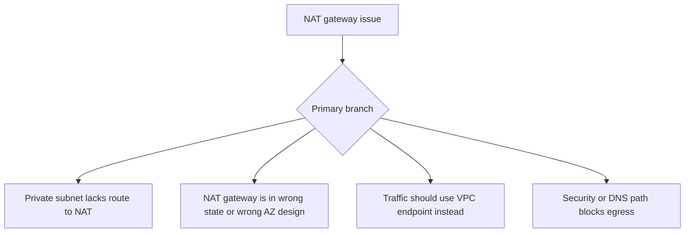

# NAT Gateway Issues

## 1. Summary
This playbook covers VPC-attached Lambda functions that cannot reach the public internet or public AWS service endpoints from private subnets. The usual root causes are missing NAT routing, incorrect subnet selection, or security and endpoint design assumptions that do not match the actual path.



## 2. Common Misreadings
- Putting Lambda in a VPC automatically gives internet access.
- NAT gateways fix all outbound connectivity issues.
- If one public API call succeeds, the NAT path is healthy.
- AWS service calls always require internet egress.
- Security groups alone decide internet reachability.

## 3. Competing Hypotheses
- H1: The function subnets do not route outbound traffic to a NAT gateway — Primary evidence should confirm or disprove whether the configured private subnets lack the required default route.
- H2: The NAT gateway or its surrounding design is unhealthy — Primary evidence should confirm or disprove whether NAT availability, AZ placement, or associated public subnet path is broken.
- H3: The traffic should be using an interface or gateway endpoint instead of NAT — Primary evidence should confirm or disprove whether the destination is an AWS service with a better private path.
- H4: DNS or security controls block egress even with NAT present — Primary evidence should confirm or disprove whether name resolution or policy rules prevent outbound connections.

## 4. What to Check First
### Metrics
- Lambda `Errors` and `Duration` during the egress failure window.
- NAT gateway CloudWatch metrics if available in your environment.
- Retries or backlog on callers that depend on outbound requests.

### Logs
- Connection timeout or DNS failure messages in `/aws/lambda/$FUNCTION_NAME`.
- Logs identifying whether the destination is a public API, AWS service endpoint, or package repository.
- REPORT lines showing timeout alignment with outbound calls.

### Platform Signals
- Run `aws lambda get-function-configuration --function-name $FUNCTION_NAME` to confirm subnet selection.
- Check whether the destination could use a VPC endpoint instead of NAT.
- Confirm the affected subnets are private subnets with routes through NAT, not isolated subnets.

| Signal | Normal | Abnormal | Why it matters |
| --- | --- | --- | --- |
| Subnet egress design | Private subnets route `0.0.0.0/0` to NAT | No default route or wrong target | Most common cause of internet failure |
| Destination type | Public internet truly required | AWS service could use a private endpoint | May avoid NAT entirely |
| Error pattern | Stable outbound connections | Timeouts, DNS failures, or TLS failures only in VPC | Narrows failure to egress path |
| AZ behavior | All configured subnets healthy | Failures align with one subnet or AZ | Indicates topology or route inconsistency |

## 5. Evidence to Collect
### Required Evidence
- Lambda VPC config with subnet IDs.
- First failing outbound destination names and ports.
- Error logs and REPORT lines.
- Whether the destination is public internet or an AWS service endpoint.

### Useful Context
- Recent route-table or NAT gateway changes.
- Whether the function recently moved into a VPC.
- Whether only one subnet or AZ shows failures.

### CLI Investigation Commands
#### 1. Confirm the Lambda subnet selection

```bash
aws lambda get-function-configuration \
    --function-name $FUNCTION_NAME
```

Example output:

```json
{
  "FunctionName": "$FUNCTION_NAME",
  "VpcConfig": {
    "SubnetIds": ["subnet-private-a", "subnet-private-b"],
    "SecurityGroupIds": ["sg-9999aaaa"],
    "VpcId": "vpc-xxxxxxxx"
  }
}
```

#### 2. Pull duration metrics around the outage

```bash
aws cloudwatch get-metric-statistics \
    --namespace AWS/Lambda \
    --metric-name Duration \
    --dimensions Name=FunctionName,Value=$FUNCTION_NAME \
    --statistics Average Maximum \
    --start-time 2026-04-07T17:30:00Z \
    --end-time 2026-04-07T18:00:00Z \
    --period 60
```

Example output:

```json
{
  "Datapoints": [
    {"Timestamp": "2026-04-07T17:41:00+00:00", "Average": 28500.0, "Maximum": 30000.0},
    {"Timestamp": "2026-04-07T17:42:00+00:00", "Average": 29780.0, "Maximum": 30000.0}
  ],
  "Label": "Duration"
}
```

#### 3. Read egress failure logs

```bash
aws logs tail /aws/lambda/$FUNCTION_NAME \
    --since 30m \
    --format short
```

Example output:

```text
2026-04-07T17:41:23 INFO requesting https://api.thirdparty.example/v1/orders
2026-04-07T17:41:53 ERROR connect ETIMEDOUT api.thirdparty.example:443
2026-04-07T17:41:53 REPORT RequestId: abcdabcd-1111-2222-3333-444455556666 Duration: 30000.00 ms Billed Duration: 30000 ms Memory Size: 1024 MB Max Memory Used: 166 MB
```

## 6. Validation and Disproof by Hypothesis
### H1: The function subnets do not route outbound traffic to a NAT gateway

| Observation | Normal | Abnormal |
| --- | --- | --- |
| Subnet design | Private subnets have working default route to NAT | Selected subnets are isolated or misrouted |
| Failure scope | All subnets behave the same with valid route | Only subnets without NAT path fail |

### H2: The NAT gateway or its surrounding design is unhealthy

| Observation | Normal | Abnormal |
| --- | --- | --- |
| Topology | NAT is available and aligned to subnet design | NAT unavailable, mis-AZed, or public subnet path broken |
| Traffic behavior | Outbound path stable | Intermittent or AZ-specific public egress failures |

### H3: The traffic should be using an interface or gateway endpoint instead of NAT

| Observation | Normal | Abnormal |
| --- | --- | --- |
| Destination class | Public service genuinely needs internet | Destination is AWS service better served by endpoint |
| Path simplicity | NAT is necessary | Private endpoint would remove fragile internet dependency |

### H4: DNS or security controls block egress even with NAT present

| Observation | Normal | Abnormal |
| --- | --- | --- |
| Resolution | Destination resolves correctly | DNS lookup fails or resolves unexpectedly |
| Security posture | SG/NACL allow egress and return path | Policies block outbound or ephemeral response traffic |

## 7. Likely Root Cause Patterns
1. Lambda was attached to isolated subnets with no route to a NAT gateway. This is the most common reason VPC-enabled functions suddenly lose internet access.
2. NAT design assumptions were incomplete across AZs. One subnet may have a working path while another quietly fails, making the incident look intermittent.
3. The workload depended on public AWS service endpoints even though private endpoints were available. NAT then became an unnecessary single point of complexity.
4. DNS or egress security rules broke the path after routing was set up correctly. Operators often stop after confirming the NAT exists and miss these second-order issues.

## 8. Immediate Mitigations
1. Move the function to private subnets that have a valid route to the NAT gateway.

```bash
aws lambda update-function-configuration \
    --function-name $FUNCTION_NAME \
    --vpc-config SubnetIds=subnet-private-a,subnet-private-b,SecurityGroupIds=sg-9999aaaa
```

2. Add VPC endpoints for AWS service dependencies so NAT is not required for those calls.
3. Correct security group, NACL, or DNS settings that block egress.
4. Temporarily move the function out of the VPC only if private resource access is not required and the change is operationally safe.

## 9. Prevention
1. Document which outbound dependencies require NAT and which should use VPC endpoints.
2. Keep subnet, route-table, and NAT design consistent across AZs.
3. Test outbound public egress after any VPC attachment change.
4. Prefer private endpoints for AWS services where supported.
5. Monitor NAT gateway health and Lambda timeout spikes together.

## See Also
- [Troubleshooting Playbooks](../index.md)
- [VPC Connectivity](vpc-connectivity.md)
- [Endpoint Timeout](endpoint-timeout.md)

## Sources
- [Giving Lambda functions access to resources in an Amazon VPC](https://docs.aws.amazon.com/lambda/latest/dg/configuration-vpc-internet.html)
- [Lambda networking troubleshooting](https://docs.aws.amazon.com/lambda/latest/dg/troubleshooting-networking.html)
- [VPC endpoints for AWS services](https://docs.aws.amazon.com/vpc/latest/privatelink/vpc-endpoints.html)
