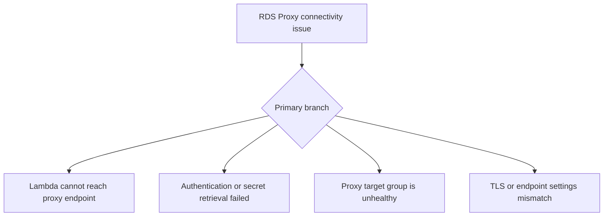

# RDS Proxy Connectivity

## 1. Summary
Use this playbook when Lambda cannot connect to the database through RDS Proxy or when connections through the proxy are unexpectedly slow or rejected. The main branches are authentication and secret handling, network reachability, proxy target health, and TLS or endpoint mismatch.



## 2. Common Misreadings
- If RDS Proxy exists, database connections should always work.
- Proxy connectivity problems are always database problems.
- IAM database authentication and Secrets Manager access fail in the same way.
- The Lambda security group only needs outbound rules.
- Using RDS Proxy removes the need to inspect query or target health.

## 3. Competing Hypotheses
- H1: The Lambda network path to the proxy endpoint is blocked — Primary evidence should confirm or disprove whether subnets, security groups, or DNS prevent reaching the proxy.
- H2: Authentication, secret access, or IAM DB auth is failing — Primary evidence should confirm or disprove whether the function cannot retrieve or present valid credentials.
- H3: The proxy target group or underlying database is unhealthy — Primary evidence should confirm or disprove whether the proxy itself is reachable but has no healthy backend target.
- H4: TLS or endpoint settings are mismatched — Primary evidence should confirm or disprove whether protocol, certificate, or endpoint-name expectations break the session.

## 4. What to Check First
### Metrics
- Lambda `Errors` and `Duration` during the connection failures.
- RDS Proxy and database health metrics if available.
- Retry or backlog metrics from the invoking service.

### Logs
- `ETIMEDOUT`, authentication failure, or TLS handshake messages in `/aws/lambda/$FUNCTION_NAME`.
- Secret retrieval or IAM auth token generation failures.
- REPORT lines showing whether the function waits until timeout or fails fast.

### Platform Signals
- Run `aws lambda get-function-configuration --function-name $FUNCTION_NAME` for VPC and role context.
- Confirm the configured proxy endpoint and whether the function uses Secrets Manager or IAM auth.
- Preserve the first failing host, auth mode, and SQL client error.

| Signal | Normal | Abnormal | Why it matters |
| --- | --- | --- | --- |
| Proxy reachability | Fast connection to proxy endpoint | Timeout or refusal before authentication | Separates network from auth issues |
| Secret/auth path | Credentials or tokens acquired successfully | Secret access or auth token generation fails | Identifies control-plane credential break |
| Proxy health | Healthy target group | Proxy reachable but backend unavailable | Shows issue is behind the proxy |
| TLS/session setup | Handshake succeeds | TLS or hostname mismatch | Prevents chasing general network faults |

## 5. Evidence to Collect
### Required Evidence
- Lambda VPC config and execution role.
- Proxy endpoint name and connection mode.
- Error lines from the Lambda logs.
- Proxy and database health state in the same UTC window.

### Useful Context
- Whether the issue began after secret rotation, DB failover, or SG changes.
- Whether only one function or all proxy clients are affected.
- Whether the client enforces TLS and server certificate validation.

### CLI Investigation Commands
#### 1. Confirm Lambda VPC and role configuration

```bash
aws lambda get-function-configuration \
    --function-name $FUNCTION_NAME
```

Example output:

```json
{
  "FunctionName": "$FUNCTION_NAME",
  "Role": "arn:aws:iam::<account-id>:role/lambda-db-access",
  "VpcConfig": {
    "SubnetIds": ["subnet-db-a", "subnet-db-b"],
    "SecurityGroupIds": ["sg-lambda-db"]
  }
}
```

#### 2. Pull Lambda error metrics during the issue

```bash
aws cloudwatch get-metric-statistics \
    --namespace AWS/Lambda \
    --metric-name Errors \
    --dimensions Name=FunctionName,Value=$FUNCTION_NAME \
    --statistics Sum \
    --start-time 2026-04-07T18:30:00Z \
    --end-time 2026-04-07T19:00:00Z \
    --period 60
```

Example output:

```json
{
  "Datapoints": [
    {"Timestamp": "2026-04-07T18:42:00+00:00", "Sum": 6.0},
    {"Timestamp": "2026-04-07T18:43:00+00:00", "Sum": 7.0}
  ],
  "Label": "Errors"
}
```

#### 3. Read Lambda logs for proxy connection failures

```bash
aws logs tail /aws/lambda/$FUNCTION_NAME \
    --since 30m \
    --format short
```

Example output:

```text
2026-04-07T18:42:19 INFO connecting to orders-proxy.proxy-abcdefghijkl.$REGION.rds.amazonaws.com:5432
2026-04-07T18:42:19 ERROR password authentication failed for user app_user
2026-04-07T18:42:19 REPORT RequestId: 55556666-7777-8888-9999-000011112222 Duration: 148.73 ms Billed Duration: 149 ms Memory Size: 1024 MB Max Memory Used: 182 MB
```

## 6. Validation and Disproof by Hypothesis
### H1: The Lambda network path to the proxy endpoint is blocked

| Observation | Normal | Abnormal |
| --- | --- | --- |
| Connect phase | Proxy endpoint reachable quickly | Timeout or connection refusal before auth |
| VPC rules | Subnets and SGs permit DB port | Missing network path to proxy |

### H2: Authentication, secret access, or IAM DB auth is failing

| Observation | Normal | Abnormal |
| --- | --- | --- |
| Credential acquisition | Secret or auth token available | Secrets Manager, KMS, or IAM auth call fails |
| DB auth result | Login succeeds once connected | Proxy rejects credentials or token |

### H3: The proxy target group or underlying database is unhealthy

| Observation | Normal | Abnormal |
| --- | --- | --- |
| Proxy endpoint | Reachable and authenticates | Reachable but returns backend unavailable symptoms |
| Broader DB health | Other clients succeed through proxy | All clients see failures because targets are unhealthy |

### H4: TLS or endpoint settings are mismatched

| Observation | Normal | Abnormal |
| --- | --- | --- |
| TLS handshake | Handshake and hostname validation pass | Certificate, hostname, or TLS negotiation fails |
| Client config | Matches proxy requirements | Client enforces wrong mode or endpoint name |

## 7. Likely Root Cause Patterns
1. The function cannot reach the proxy endpoint because VPC controls changed. Proxy-related incidents often look like database issues even when the database is never contacted.
2. Secret rotation or IAM auth drift breaks authentication. The proxy is reachable, but the login path is no longer valid.
3. The proxy remains up while backend targets are unhealthy. That makes the network look fine until you inspect proxy target health.
4. Client TLS settings no longer match the proxy endpoint. These failures are fast and easy to misclassify as generic auth errors.

## 8. Immediate Mitigations
1. Restore network reachability by correcting the Lambda subnets or security groups.

```bash
aws lambda update-function-configuration \
    --function-name $FUNCTION_NAME \
    --vpc-config SubnetIds=subnet-db-a,subnet-db-b,SecurityGroupIds=sg-lambda-db
```

2. Roll back to the last known good secret or auth configuration if rotation caused the failure.
3. Fail over or repair the database target before retrying the application path.
4. Align TLS and endpoint configuration with the proxy endpoint requirements.

## 9. Prevention
1. Test Lambda-to-proxy connectivity after SG, subnet, or secret changes.
2. Monitor proxy target health alongside Lambda errors.
3. Keep authentication mode and secret rotation procedures documented.
4. Reuse DB connections safely through the proxy to reduce connection churn.
5. Separate proxy reachability checks from query-performance checks.

## See Also
- [Troubleshooting Playbooks](../index.md)
- [VPC Connectivity](vpc-connectivity.md)
- [Downstream Latency](../performance/downstream-latency.md)

## Sources
- [Using Amazon RDS Proxy with AWS Lambda](https://docs.aws.amazon.com/lambda/latest/dg/services-rds.html)
- [Amazon RDS Proxy concepts](https://docs.aws.amazon.com/AmazonRDS/latest/UserGuide/rds-proxy.howitworks.html)
- [Giving Lambda functions access to resources in an Amazon VPC](https://docs.aws.amazon.com/lambda/latest/dg/configuration-vpc.html)
