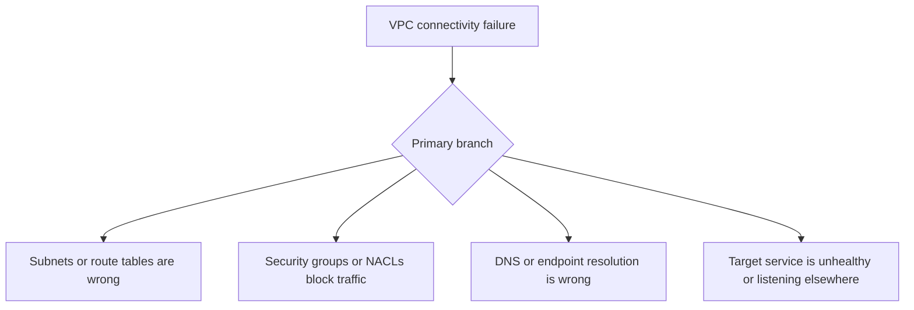

# VPC Connectivity

## 1. Summary
This playbook applies when a VPC-attached Lambda cannot reach private resources such as RDS, ElastiCache, ECS services, or internal endpoints. The failure may surface as timeout, connection refused, or DNS resolution issues, but the investigation should first prove whether the network path, security controls, or target itself is failing.



## 2. Common Misreadings
- If the Lambda is in the same VPC, connectivity should be automatic.
- Timeouts always mean the target service is down.
- Security groups are the only relevant network control.
- VPC configuration changes take effect only on new deployments.
- DNS problems cannot affect private targets.

## 3. Competing Hypotheses
- H1: Subnet or route-table selection is wrong — Primary evidence should confirm or disprove whether the function runs in subnets that cannot reach the target path.
- H2: Security groups or NACLs are blocking the traffic — Primary evidence should confirm or disprove whether stateful or stateless rules reject the connection.
- H3: Private DNS or endpoint resolution is incorrect — Primary evidence should confirm or disprove whether the function resolves the wrong address or cannot resolve the hostname at all.
- H4: The target service is unavailable or not listening on the expected address/port — Primary evidence should confirm or disprove whether the destination itself is unhealthy.

## 4. What to Check First
### Metrics
- `Errors`, `Duration`, and `Timeout`-like symptoms on the Lambda side.
- Target service health metrics such as RDS connections or ElastiCache engine metrics if applicable.
- If the issue is widespread, concurrency or retry metrics that show impact growth.

### Logs
- `connect ETIMEDOUT`, `ECONNREFUSED`, `getaddrinfo ENOTFOUND`, or TLS handshake errors in `/aws/lambda/$FUNCTION_NAME`.
- App logs showing target hostname, port, and stage of failure.
- REPORT lines showing whether the function waits until near timeout.

### Platform Signals
- Run `aws lambda get-function-configuration --function-name $FUNCTION_NAME` to capture subnets and security groups.
- Compare function VPC settings with the target resource network placement.
- Preserve the first failing hostname, port, and resolved path before changing routes or rules.

| Signal | Normal | Abnormal | Why it matters |
| --- | --- | --- | --- |
| VPC config | Correct subnets and security groups | Wrong subnet set or missing SG | First check for path feasibility |
| Error type | Successful connection or fast refusal with known cause | Timeout, name resolution failure, or inconsistent refusal | Distinguishes routing, DNS, and target-health issues |
| Target health | Resource available in same window | Target unhealthy or not listening | Prevents over-focusing on Lambda networking |
| Route path | Expected private path exists | Missing route or mismatched endpoint path | Explains silent timeouts |

## 5. Evidence to Collect
### Required Evidence
- Lambda VPC configuration with subnet and security group IDs.
- Exact hostname/IP and port the function is trying to reach.
- First failing log lines and REPORT lines.
- Target resource health status in the same UTC window.

### Useful Context
- Whether the issue began after subnet, SG, NACL, DNS, or route changes.
- Whether all subnets fail or only one availability zone.
- Whether the target is public, private, or behind another proxy.

### CLI Investigation Commands
#### 1. Confirm the Lambda VPC configuration

```bash
aws lambda get-function-configuration \
    --function-name $FUNCTION_NAME
```

Example output:

```json
{
  "FunctionName": "$FUNCTION_NAME",
  "VpcConfig": {
    "SubnetIds": ["subnet-aaaaaaaa", "subnet-bbbbbbbb"],
    "SecurityGroupIds": ["sg-1234abcd"],
    "VpcId": "vpc-xxxxxxxx"
  }
}
```

#### 2. Pull Lambda error metrics during the failure

```bash
aws cloudwatch get-metric-statistics \
    --namespace AWS/Lambda \
    --metric-name Errors \
    --dimensions Name=FunctionName,Value=$FUNCTION_NAME \
    --statistics Sum \
    --start-time 2026-04-07T17:00:00Z \
    --end-time 2026-04-07T17:30:00Z \
    --period 60
```

Example output:

```json
{
  "Datapoints": [
    {"Timestamp": "2026-04-07T17:06:00+00:00", "Sum": 8.0},
    {"Timestamp": "2026-04-07T17:07:00+00:00", "Sum": 10.0}
  ],
  "Label": "Errors"
}
```

#### 3. Read network failure signatures from logs

```bash
aws logs tail /aws/lambda/$FUNCTION_NAME \
    --since 30m \
    --format short
```

Example output:

```text
2026-04-07T17:06:44 INFO connecting to orders-db.internal:5432
2026-04-07T17:07:14 ERROR connect ETIMEDOUT orders-db.internal:5432
2026-04-07T17:07:14 REPORT RequestId: 12121212-3434-5656-7878-909090909090 Duration: 30000.00 ms Billed Duration: 30000 ms Memory Size: 1024 MB Max Memory Used: 178 MB
```

## 6. Validation and Disproof by Hypothesis
### H1: Subnet or route-table selection is wrong

| Observation | Normal | Abnormal |
| --- | --- | --- |
| Subnet placement | Function subnets have the expected target path | One or more configured subnets lack route to the destination |
| AZ pattern | All AZs behave similarly | Failures cluster to invocations using specific subnets |

### H2: Security groups or NACLs are blocking the traffic

| Observation | Normal | Abnormal |
| --- | --- | --- |
| Rule alignment | SG/NACL rules allow required port and ephemeral return path | Missing inbound/outbound or stateless return rule blocks traffic |
| Error type | Traffic reaches target or fails consistently elsewhere | Timeouts or refusals align with security policy mismatch |

### H3: Private DNS or endpoint resolution is incorrect

| Observation | Normal | Abnormal |
| --- | --- | --- |
| Hostname resolution | Target hostname resolves as expected | Wrong private address or DNS resolution failure |
| Name specificity | All names resolve consistently | Only private hosted-zone names fail |

### H4: The target service is unavailable or not listening on the expected address/port

| Observation | Normal | Abnormal |
| --- | --- | --- |
| Target health | Healthy target and listener | Target unhealthy, restarting, or wrong port |
| Multi-client behavior | Other clients can connect | Broader client set also fails against target |

## 7. Likely Root Cause Patterns
1. Lambda was attached to subnets that did not match the intended network path. Multi-subnet deployments can hide the issue until traffic lands on the wrong subnet or AZ.
2. Security rules were asymmetric or incomplete. NACLs are especially easy to miss because return traffic rules are stateless.
3. Private DNS was misconfigured or pointed at the wrong target. Operators often test by IP or from another host and miss the function's actual resolution path.
4. The destination service itself was unhealthy. Lambda network evidence must still be checked, but timeouts are frequently downstream availability problems.

## 8. Immediate Mitigations
1. Reconfigure the function to use the correct private subnets and security groups.

```bash
aws lambda update-function-configuration \
    --function-name $FUNCTION_NAME \
    --vpc-config SubnetIds=subnet-aaaaaaaa,subnet-bbbbbbbb,SecurityGroupIds=sg-1234abcd
```

2. Open the required ports in the function and target security groups.
3. Restore the correct private DNS record or endpoint configuration.
4. Fail over to a healthy target or alias if the service itself is unhealthy.

## 9. Prevention
1. Document the full path from Lambda subnet to private target.
2. Validate SG and NACL rules whenever adding a new dependency.
3. Keep DNS names, ports, and target endpoints under configuration control.
4. Test one function per subnet/AZ combination during releases.
5. Alert on both Lambda timeouts and target-service health metrics.

## See Also
- [Troubleshooting Playbooks](../index.md)
- [NAT Gateway Issues](nat-gateway-issues.md)
- [RDS Proxy Connectivity](rds-proxy-connectivity.md)

## Sources
- [Giving Lambda functions access to resources in an Amazon VPC](https://docs.aws.amazon.com/lambda/latest/dg/configuration-vpc.html)
- [Lambda networking troubleshooting](https://docs.aws.amazon.com/lambda/latest/dg/troubleshooting-networking.html)
- [Lambda function configuration](https://docs.aws.amazon.com/lambda/latest/dg/configuration-function-common.html)
