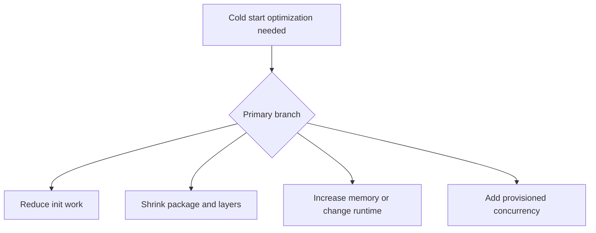

# Cold Start Optimization

## 1. Summary
This playbook is for the case where you already know cold starts are the main latency driver and need to reduce them systematically. The goal is to determine which lever matters most: initialization work, package composition, memory/CPU, runtime choice, or warm-capacity strategy.



## 2. Common Misreadings
- Provisioned concurrency should be the first change in every case.
- Artifact size matters only for container images.
- Memory affects only steady-state execution, not initialization.
- Lazy loading is always free.
- Cold-start optimization is unnecessary if averages look healthy.

## 3. Competing Hypotheses
- H1: Excessive initialization work is the biggest contributor — Primary evidence should confirm or disprove whether import-time setup dominates `Init Duration`.
- H2: Package size, layers, or image composition are inflating startup — Primary evidence should confirm or disprove whether deployment artifact complexity maps to init cost.
- H3: Runtime and memory choices are mismatched to the workload — Primary evidence should confirm or disprove whether more CPU or a different runtime significantly reduces init time.
- H4: The traffic pattern requires warm capacity, not code optimization alone — Primary evidence should confirm or disprove whether demand bursts repeatedly exceed available warm environments.

## 4. What to Check First
### Metrics
- Tail `Duration` behavior during bursts and idle transitions.
- `ConcurrentExecutions` and, if used, provisioned concurrency metrics.
- Any `Throttles` or spillover that coincide with slow starts.

### Logs
- REPORT lines with `Init Duration`.
- Application startup logs for imports, config load, SDK client creation, and first network call.
- Differences between warm and cold invocation log streams.

### Platform Signals
- Run `aws lambda get-function-configuration --function-name $FUNCTION_NAME` to capture runtime, memory, package type, layers, and VPC settings.
- Check provisioned concurrency config on the production alias if present.
- Compare init time before and after the last runtime, layer, or code change.

| Signal | Normal | Abnormal | Why it matters |
| --- | --- | --- | --- |
| Init Duration | Small and stable | Large and variable | Direct optimization target |
| Package/layer count | Minimal required dependencies | Bloated package or many layers | Startup complexity often hides here |
| Memory sizing | Balanced for workload | Low memory with high init duration | More CPU can reduce startup time |
| Provisioned capacity | Covers burst demand | Spillover requests still cold start | Shows whether capacity strategy is insufficient |

## 5. Evidence to Collect
### Required Evidence
- Cold invocation REPORT lines with `Init Duration`.
- Function configuration and package composition details.
- Burst traffic pattern or idle-to-active timeline.
- Current alias and provisioned concurrency settings.

### Useful Context
- Whether the function is ZIP- or image-based.
- Whether VPC networking or first outbound calls happen during init.
- Whether a smaller function with similar logic performs better.

### CLI Investigation Commands
#### 1. Inspect configuration and package details

```bash
aws lambda get-function \
    --function-name $FUNCTION_NAME
```

Example output:

```json
{
  "Configuration": {
    "Runtime": "nodejs22.x",
    "MemorySize": 1024,
    "PackageType": "Zip"
  },
  "Code": {
    "RepositoryType": "S3"
  }
}
```

#### 2. Check provisioned concurrency on the production alias

```bash
aws lambda get-provisioned-concurrency-config \
    --function-name $FUNCTION_NAME \
    --qualifier prod
```

Example output:

```json
{
  "RequestedProvisionedConcurrentExecutions": 5,
  "AvailableProvisionedConcurrentExecutions": 5,
  "AllocatedProvisionedConcurrentExecutions": 5,
  "Status": "READY"
}
```

#### 3. Pull recent log lines with init duration

```bash
aws logs tail /aws/lambda/$FUNCTION_NAME \
    --since 1h \
    --format short
```

Example output:

```text
2026-04-07T16:05:03 INFO loading shared schema validators
2026-04-07T16:05:04 INFO creating DynamoDB and SSM clients
2026-04-07T16:05:05 REPORT RequestId: 11112222-3333-4444-5555-666677778888 Duration: 1180.23 ms Billed Duration: 1181 ms Memory Size: 1024 MB Max Memory Used: 212 MB Init Duration: 951.04 ms
```

## 6. Validation and Disproof by Hypothesis
### H1: Excessive initialization work is the biggest contributor

| Observation | Normal | Abnormal |
| --- | --- | --- |
| Startup logs | Minimal essential work only | Imports, config fetches, and client setup dominate init |
| Warm vs cold delta | Similar execution profile | Large gap caused almost entirely by initialization |

### H2: Package size, layers, or image composition are inflating startup

| Observation | Normal | Abnormal |
| --- | --- | --- |
| Artifact makeup | Lean package and few layers | Heavy dependencies or multiple layers align with long init |
| Change correlation | No startup change after packaging update | Init worsens immediately after adding dependencies or layers |

### H3: Runtime and memory choices are mismatched to the workload

| Observation | Normal | Abnormal |
| --- | --- | --- |
| Memory test | More memory gives minimal gain | Higher memory sharply lowers init duration |
| Runtime comparison | Similar runtimes behave alike | Selected runtime consistently starts slower for the use case |

### H4: The traffic pattern requires warm capacity, not code optimization alone

| Observation | Normal | Abnormal |
| --- | --- | --- |
| Demand shape | Steady request level | Bursts or idle gaps repeatedly cause new environments |
| Provisioned capacity | Warm pool covers peaks | Spillover invokes remain cold despite optimization |

## 7. Likely Root Cause Patterns
1. Initialization does too much mandatory work. Global config fetches, schema compilation, and large dependency graphs are common startup-cost multipliers.
2. Artifact composition is oversized relative to the function's job. Layers and shared dependencies can help reuse, but they still add startup surface area.
3. Memory is too low for fast startup. Because Lambda adds CPU with memory, small memory settings can make init noticeably slower.
4. The workload pattern inherently needs warm capacity. Bursty user-facing APIs often need provisioned concurrency even after code optimization.

## 8. Immediate Mitigations
1. Increase memory to test whether additional CPU reduces init duration.

```bash
aws lambda update-function-configuration \
    --function-name $FUNCTION_NAME \
    --memory-size 1536
```

2. Add or raise provisioned concurrency on the hot alias.

```bash
aws lambda put-provisioned-concurrency-config \
    --function-name $FUNCTION_NAME \
    --qualifier prod \
    --provisioned-concurrent-executions 20
```

3. Remove unused dependencies, layers, and eager startup work.
4. Separate VPC-only dependencies into dedicated functions if they dominate startup cost.

## 9. Prevention
1. Benchmark cold starts after every major dependency or runtime change.
2. Keep function scope narrow so startup work stays small.
3. Use lazy initialization for non-critical paths.
4. Align provisioned concurrency with predictable traffic ramps.
5. Treat package size and layer count as performance budgets.

## See Also
- [Troubleshooting Playbooks](../index.md)
- [Cold Start Latency](../invocation-errors/cold-start-latency.md)
- [Concurrency Limits](concurrency-limits.md)

## Sources
- [Understanding the Lambda execution environment lifecycle](https://docs.aws.amazon.com/lambda/latest/dg/lambda-runtime-environment.html)
- [Configuring provisioned concurrency](https://docs.aws.amazon.com/lambda/latest/dg/provisioned-concurrency.html)
- [Lambda best practices](https://docs.aws.amazon.com/lambda/latest/dg/best-practices.html)
