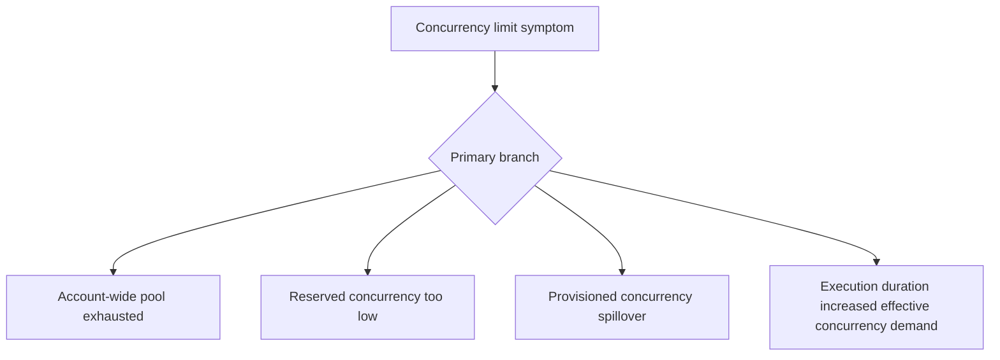

# Concurrency Limits

## 1. Summary
Concurrency limit incidents happen when expected scale-out stops because the function, alias, or account has reached a concurrency boundary. The symptom may appear as throttling, backlog growth, or user-facing latency, but the core problem is insufficient execution slots relative to arrival rate and duration.



## 2. Common Misreadings
- Concurrency is just another name for request rate.
- If there are no throttles yet, concurrency is not the issue.
- Provisioned concurrency replaces all other concurrency planning.
- Reserved concurrency always increases reliability.
- Only Lambda settings, not downstream speed, affect concurrency demand.

## 3. Competing Hypotheses
- H1: Regional account concurrency is the real bottleneck — Primary evidence should confirm or disprove whether other functions consumed the unreserved pool.
- H2: Reserved concurrency settings on this function are too restrictive — Primary evidence should confirm or disprove whether the function ceiling is below real demand.
- H3: Provisioned concurrency is configured but demand spills beyond it — Primary evidence should confirm or disprove whether warm capacity is insufficient for burst size.
- H4: Increased duration raised required concurrency faster than planned — Primary evidence should confirm or disprove whether execution-time growth, not traffic alone, created the limit event.

## 4. What to Check First
### Metrics
- `ConcurrentExecutions`, `UnreservedConcurrentExecutions`, `Throttles`, and `Duration`.
- If applicable, `ProvisionedConcurrencyUtilization` and `ProvisionedConcurrencySpilloverInvocations`.
- Event source backlog metrics.

### Logs
- Lambda caller logs showing `TooManyRequestsException` or retries.
- REPORT lines indicating duration changes that raise concurrency occupancy.
- Release logs indicating when reserved or provisioned concurrency changed.

### Platform Signals
- Run `aws lambda get-account-settings` and `aws lambda get-function-concurrency --function-name $FUNCTION_NAME`.
- Check alias-level provisioned concurrency config if used.
- Compare concurrency usage during healthy and failing windows.

| Signal | Normal | Abnormal | Why it matters |
| --- | --- | --- | --- |
| Account headroom | Unreserved capacity remains available | Account pool nearly exhausted | Identifies fleet-level contention |
| Function cap | Ceiling above expected load | Reserved concurrency reached repeatedly | Confirms function-level bottleneck |
| Spillover | Provisioned capacity covers demand | Spillover grows during peak | Shows warm-capacity shortfall |
| Duration | Stable occupancy time | Longer duration raises needed concurrency | Links performance regression to scale boundary |

## 5. Evidence to Collect
### Required Evidence
- Concurrency and throttle metrics for the incident window.
- Account and function concurrency settings.
- Provisioned concurrency config if present.
- Backlog or retry metrics from the invoking service.

### Useful Context
- Recent traffic profile changes.
- Recent duration regression or downstream slowdown.
- Any concurrency reservation changes for sibling functions.

### CLI Investigation Commands
#### 1. Inspect account concurrency settings

```bash
aws lambda get-account-settings
```

Example output:

```json
{
  "AccountLimit": {
    "ConcurrentExecutions": 1000,
    "UnreservedConcurrentExecutions": 18
  }
}
```

#### 2. Inspect function reserved concurrency

```bash
aws lambda get-function-concurrency \
    --function-name $FUNCTION_NAME
```

Example output:

```json
{
  "ReservedConcurrentExecutions": 40
}
```

#### 3. Check provisioned concurrency on the hot alias

```bash
aws lambda get-provisioned-concurrency-config \
    --function-name $FUNCTION_NAME \
    --qualifier prod
```

Example output:

```json
{
  "RequestedProvisionedConcurrentExecutions": 20,
  "AllocatedProvisionedConcurrentExecutions": 20,
  "AvailableProvisionedConcurrentExecutions": 0,
  "Status": "READY"
}
```

## 6. Validation and Disproof by Hypothesis
### H1: Regional account concurrency is the real bottleneck

| Observation | Normal | Abnormal |
| --- | --- | --- |
| Account headroom | Plenty of unreserved concurrency remains | Unreserved pool approaches zero |
| Cross-function impact | Only one function stressed | Multiple functions compete during the same window |

### H2: Reserved concurrency settings on this function are too restrictive

| Observation | Normal | Abnormal |
| --- | --- | --- |
| Reserved cap | Higher than peak need | Executions plateau at reserved limit |
| Account state | Account still has headroom | Function throttles despite available account capacity |

### H3: Provisioned concurrency is configured but demand spills beyond it

| Observation | Normal | Abnormal |
| --- | --- | --- |
| Warm capacity | Available provisioned concurrency remains | Available provisioned concurrency reaches zero |
| Latency pattern | No spillover penalties | Spillover invocations coincide with higher latency or throttles |

### H4: Increased duration raised required concurrency faster than planned

| Observation | Normal | Abnormal |
| --- | --- | --- |
| Duration trend | Flat during demand growth | Duration rises before concurrency ceiling is hit |
| Throughput | Stable completions per environment | Same concurrency processes fewer requests |

## 7. Likely Root Cause Patterns
1. Account-wide concurrency became crowded by unrelated workloads. Shared unreserved pools often create hidden coupling between independent Lambda functions.
2. Reserved concurrency was never updated after a traffic or SLA change. The cap remains safe for the past, not for current demand.
3. Provisioned concurrency sizing matches steady load but not bursts. The function still scales, but not with the warm latency profile operators expected.
4. A duration regression silently changed the concurrency equation. Longer runtimes mean the same request rate requires more concurrent environments.

## 8. Immediate Mitigations
1. Increase reserved concurrency for the affected function if downstream systems can sustain it.

```bash
aws lambda put-function-concurrency \
    --function-name $FUNCTION_NAME \
    --reserved-concurrent-executions 120
```

2. Increase provisioned concurrency on the production alias for known peak windows.
3. Roll back duration-increasing code or dependency changes.
4. Reduce upstream batch size or request rate temporarily if the system is saturating.

## 9. Prevention
1. Model concurrency as request rate multiplied by execution time.
2. Review account, reserved, and provisioned concurrency together.
3. Alert on low account headroom and rising spillover.
4. Re-baseline concurrency after every major latency change.
5. Keep critical functions isolated with explicit reservations where appropriate.

## See Also
- [Troubleshooting Playbooks](../index.md)
- [Throttling](../invocation-errors/throttling.md)
- [High Duration](high-duration.md)

## Sources
- [Lambda concurrency](https://docs.aws.amazon.com/lambda/latest/dg/lambda-concurrency.html)
- [Configuring provisioned concurrency](https://docs.aws.amazon.com/lambda/latest/dg/provisioned-concurrency.html)
- [Monitoring Lambda metrics in Amazon CloudWatch](https://docs.aws.amazon.com/lambda/latest/dg/monitoring-metrics.html)
