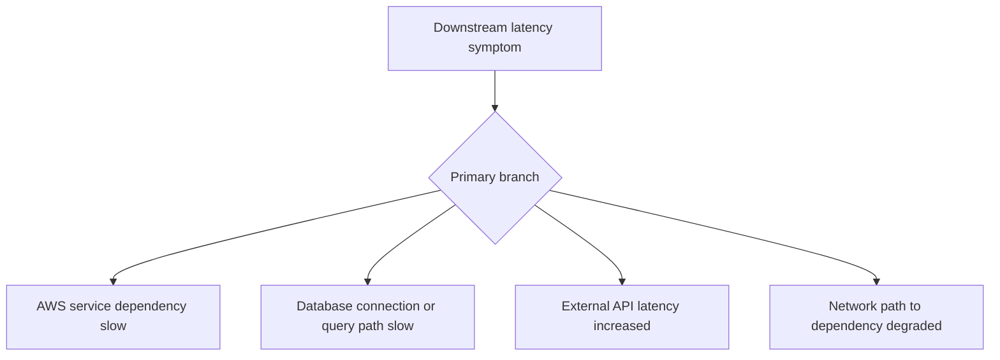

# Downstream Latency

## 1. Summary
Downstream latency incidents occur when Lambda itself remains mostly healthy but a dependency such as DynamoDB, RDS, another AWS API, or an external service dominates end-to-end execution time. The key is to prove the dependency is slow before changing Lambda sizing or concurrency.



## 2. Common Misreadings
- A slow Lambda always needs more memory.
- If the function logs no explicit error, the dependency is healthy.
- One fast dependency call disproves downstream issues.
- External APIs are the only downstream latency source.
- Network and dependency problems are always separate categories.

## 3. Competing Hypotheses
- H1: An AWS managed dependency became slower — Primary evidence should confirm or disprove whether service-side latency or throttling aligns with Lambda duration.
- H2: Database connection setup or query execution is the bottleneck — Primary evidence should confirm or disprove whether connect or query time dominates the invoke.
- H3: An external API is slow or rate-limiting — Primary evidence should confirm or disprove whether outbound HTTP latency or retries consume the duration budget.
- H4: The network path to the dependency is degraded — Primary evidence should confirm or disprove whether DNS, TLS, routing, NAT, or endpoint reachability causes the delay.

## 4. What to Check First
### Metrics
- `Duration`, `Errors`, and `Throttles` for the function.
- Dependency metrics such as DynamoDB latency, RDS CPU/connections, or API Gateway integration latency where available.
- Concurrency and backlog metrics to see whether slow downstream calls are saturating Lambda.

### Logs
- Step-level timing logs around each dependency call.
- Retry, timeout, or slow-query messages in `/aws/lambda/$FUNCTION_NAME`.
- REPORT lines showing whether total duration roughly equals one dependency stage.

### Platform Signals
- Run `aws lambda get-function-configuration --function-name $FUNCTION_NAME` to capture timeout, memory, and VPC context.
- Compare one healthy interval and one slow interval with the same request type.
- Check whether the function is VPC-attached and whether the dependency path depends on NAT or private endpoints.

| Signal | Normal | Abnormal | Why it matters |
| --- | --- | --- | --- |
| Stage timings | No single dependency dominates | One call consumes most invocation time | Directly isolates downstream bottleneck |
| Dependency metrics | Stable service latency | Service-side latency or throttling rises with Lambda duration | Confirms problem is not purely in code |
| Network path | Consistent connect and TLS times | Connection setup grows before first byte | Distinguishes service slowness from path slowness |
| Lambda resources | Stable CPU and memory headroom | Headroom normal despite long duration | Prevents unnecessary Lambda resizing |

## 5. Evidence to Collect
### Required Evidence
- Lambda stage or dependency timing logs.
- Duration and concurrency metrics during the incident.
- Function configuration with VPC details if applicable.
- Downstream service metrics or logs from the same UTC window.

### Useful Context
- Whether the issue started after database failover, route change, or external API release.
- Whether all dependencies are slow or only one.
- Whether retries or circuit breakers were enabled or changed.

### CLI Investigation Commands
#### 1. Confirm Lambda configuration context

```bash
aws lambda get-function-configuration \
    --function-name $FUNCTION_NAME
```

Example output:

```json
{
  "FunctionName": "$FUNCTION_NAME",
  "Timeout": 30,
  "MemorySize": 1024,
  "VpcConfig": {
    "SubnetIds": ["subnet-xxxxxxxx", "subnet-yyyyyyyy"],
    "SecurityGroupIds": ["sg-xxxxxxxx"]
  }
}
```

#### 2. Pull duration metrics during the slow window

```bash
aws cloudwatch get-metric-statistics \
    --namespace AWS/Lambda \
    --metric-name Duration \
    --dimensions Name=FunctionName,Value=$FUNCTION_NAME \
    --statistics Average Maximum \
    --start-time 2026-04-07T16:30:00Z \
    --end-time 2026-04-07T17:00:00Z \
    --period 60
```

Example output:

```json
{
  "Datapoints": [
    {"Timestamp": "2026-04-07T16:41:00+00:00", "Average": 4210.0, "Maximum": 6120.0},
    {"Timestamp": "2026-04-07T16:42:00+00:00", "Average": 4388.0, "Maximum": 6015.0}
  ],
  "Label": "Duration"
}
```

#### 3. Read logs for stage-level latency clues

```bash
aws logs tail /aws/lambda/$FUNCTION_NAME \
    --since 30m \
    --format short
```

Example output:

```text
2026-04-07T16:41:18 INFO resolved customer id in 12 ms
2026-04-07T16:41:23 WARN downstream call to orders-db query took 4988 ms
2026-04-07T16:41:23 REPORT RequestId: 22223333-4444-5555-6666-777788889999 Duration: 5120.18 ms Billed Duration: 5121 ms Memory Size: 1024 MB Max Memory Used: 201 MB
```

## 6. Validation and Disproof by Hypothesis
### H1: An AWS managed dependency became slower

| Observation | Normal | Abnormal |
| --- | --- | --- |
| Service metrics | Stable latency and no service throttles | AWS service latency or throttles align with Lambda duration |
| Lambda stage timings | Internal work dominates | Managed-service call dominates |

### H2: Database connection setup or query execution is the bottleneck

| Observation | Normal | Abnormal |
| --- | --- | --- |
| DB timing logs | Queries complete within normal range | Connect or query stage consumes most duration |
| Connection reuse | Stable pool or proxy behavior | Repeated cold connections or query waits appear |

### H3: An external API is slow or rate-limiting

| Observation | Normal | Abnormal |
| --- | --- | --- |
| HTTP client logs | Single fast attempt | High first-byte latency, retries, or 429/5xx responses |
| Provider correlation | No external incident | External status or timing matches Lambda slowdown |

### H4: The network path to the dependency is degraded

| Observation | Normal | Abnormal |
| --- | --- | --- |
| Connection setup | Fast DNS, TLS, and connect | Delays occur before application processing begins |
| Path specificity | Same dependency fast from all paths | Only VPC-attached or NAT-routed path is slow |

## 7. Likely Root Cause Patterns
1. A single dependency slowed enough to dominate every invocation. Lambda often becomes the observer of downstream latency, not the root cause.
2. Connection management is inefficient. Creating new database or HTTPS connections on every invocation can be the primary source of delay.
3. Retry behavior amplified dependency slowness. A mildly slow dependency can become a severe Lambda latency problem after client retries consume the timeout budget.
4. Networking adds hidden downstream delay. NAT, DNS, or endpoint routing issues can look like dependency slowness until the connection phases are timed separately.

## 8. Immediate Mitigations
1. Reduce client retries and set strict per-call timeouts below the function timeout.
2. Route traffic to a healthier dependency endpoint or read replica when available.
3. Increase memory only if CPU headroom is clearly helping the dependency handling path.

```bash
aws lambda update-function-configuration \
    --function-name $FUNCTION_NAME \
    --memory-size 1536
```

4. Roll back the last dependency, schema, or network change if the timing matches.

## 9. Prevention
1. Emit explicit timings for every major downstream call.
2. Reuse SDK and database clients across invocations where appropriate.
3. Set bounded retries with jitter and circuit breaking.
4. Track dependency health next to Lambda duration dashboards.
5. Separate network path diagnostics from application logic diagnostics.

## See Also
- [Troubleshooting Playbooks](../index.md)
- [Function Timeout](../invocation-errors/function-timeout.md)
- [Endpoint Timeout](../networking/endpoint-timeout.md)

## Sources
- [Lambda best practices](https://docs.aws.amazon.com/lambda/latest/dg/best-practices.html)
- [Monitoring Lambda metrics in Amazon CloudWatch](https://docs.aws.amazon.com/lambda/latest/dg/monitoring-metrics.html)
- [Troubleshoot execution issues in Lambda](https://docs.aws.amazon.com/lambda/latest/dg/troubleshooting-execution.html)
