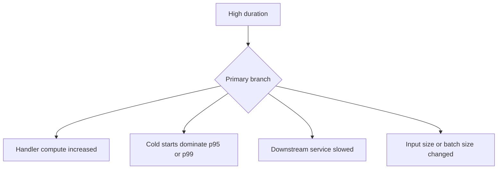

# High Duration

## 1. Summary
High duration means the Lambda function still completes, but execution time has drifted above the service-level objective or normal operating range. The practical question is whether the delay comes from the handler itself, cold starts, dependency latency, or workload shape.



## 2. Common Misreadings
- If the function succeeds, duration is only a cost issue.
- Average duration is enough to judge performance.
- Longer duration always means more CPU work.
- Duration regressions cannot affect concurrency.
- High duration and cold starts are the same problem.

## 3. Competing Hypotheses
- H1: Handler logic or runtime behavior regressed — Primary evidence should confirm or disprove whether application work now consumes more time than before.
- H2: Cold starts raised tail latency — Primary evidence should confirm or disprove whether `Init Duration` explains the slowest requests.
- H3: A downstream dependency is slower — Primary evidence should confirm or disprove whether one external call dominates end-to-end duration.
- H4: Input size, batch size, or payload complexity increased — Primary evidence should confirm or disprove whether workload shape changed the amount of work per invoke.

## 4. What to Check First
### Metrics
- `Duration` average, maximum, p95, and p99 in the incident window.
- `ConcurrentExecutions`, `Throttles`, and `Errors` on the same timeline.
- Event source backlog metrics if the function is queue- or stream-driven.

### Logs
- REPORT lines to compare slow and healthy invocations.
- Application timing logs around each major work stage.
- `Init Duration` evidence to separate warm and cold behavior.

### Platform Signals
- Run `aws lambda get-function-configuration --function-name $FUNCTION_NAME` for timeout, memory, runtime, and VPC context.
- Compare current version or alias with the last known good deployment.
- Correlate duration increases with deployment timestamps and dependency health.

| Signal | Normal | Abnormal | Why it matters |
| --- | --- | --- | --- |
| Duration percentiles | Tail stays near baseline | p95/p99 drift far above normal | Shows user-visible latency impact |
| REPORT lines | Similar duration distribution | Slow invokes cluster around one stage or init | Narrows which work dominates |
| Dependency timing | Stable external call times | One call expands with total duration | Separates internal vs downstream cause |
| Workload shape | Input complexity unchanged | Larger payloads or batches coincide with slow window | Connects demand quality to execution time |

## 5. Evidence to Collect
### Required Evidence
- Duration percentile view for the incident window.
- REPORT lines from healthy and slow invocations.
- Function configuration and current alias/version.
- Any stage-level or dependency timing logs.

### Useful Context
- Whether a deployment, layer change, or runtime upgrade happened recently.
- Whether traffic mix or event source batch size changed.
- Whether only one region, alias, or trigger path is affected.

### CLI Investigation Commands
#### 1. Confirm function configuration

```bash
aws lambda get-function-configuration \
    --function-name $FUNCTION_NAME
```

Example output:

```json
{
  "FunctionName": "$FUNCTION_NAME",
  "Runtime": "python3.12",
  "MemorySize": 1024,
  "Timeout": 30,
  "Version": "$LATEST"
}
```

#### 2. Pull duration metrics

```bash
aws cloudwatch get-metric-statistics \
    --namespace AWS/Lambda \
    --metric-name Duration \
    --dimensions Name=FunctionName,Value=$FUNCTION_NAME \
    --statistics Average Maximum \
    --start-time 2026-04-07T15:00:00Z \
    --end-time 2026-04-07T15:30:00Z \
    --period 60
```

Example output:

```json
{
  "Datapoints": [
    {"Timestamp": "2026-04-07T15:10:00+00:00", "Average": 780.0, "Maximum": 2440.0},
    {"Timestamp": "2026-04-07T15:11:00+00:00", "Average": 812.0, "Maximum": 2515.0}
  ],
  "Label": "Duration"
}
```

#### 3. Review recent logs for slow invocations

```bash
aws logs tail /aws/lambda/$FUNCTION_NAME \
    --since 30m \
    --format short
```

Example output:

```text
2026-04-07T15:10:24 INFO fetched order items in 95 ms
2026-04-07T15:10:24 INFO calculated discounts in 610 ms
2026-04-07T15:10:25 INFO wrote response in 40 ms
2026-04-07T15:10:25 REPORT RequestId: 77777777-6666-5555-4444-333333333333 Duration: 812.63 ms Billed Duration: 813 ms Memory Size: 1024 MB Max Memory Used: 245 MB
```

## 6. Validation and Disproof by Hypothesis
### H1: Handler logic or runtime behavior regressed

| Observation | Normal | Abnormal |
| --- | --- | --- |
| Stage timings | Same distribution as baseline | Compute or serialization stage now dominates |
| Version comparison | Old and new versions similar | Regression starts with new code or dependency version |

### H2: Cold starts raised tail latency

| Observation | Normal | Abnormal |
| --- | --- | --- |
| Init evidence | Slow requests lack init overhead | Slowest requests show high `Init Duration` |
| Warm invocations | Warm path also slow | Warm path is fast while first invokes are slow |

### H3: A downstream dependency is slower

| Observation | Normal | Abnormal |
| --- | --- | --- |
| Dependency timings | Calls stay within normal budget | One dependency expands with total duration |
| Lambda vs downstream trend | Lambda duration changes alone | Dependency latency graph matches Lambda duration spike |

### H4: Input size, batch size, or payload complexity increased

| Observation | Normal | Abnormal |
| --- | --- | --- |
| Event properties | Similar payload shape across windows | Larger or more complex inputs align with slow requests |
| Event source batching | Stable batch count | Duration rises after batch-size or payload-growth change |

## 7. Likely Root Cause Patterns
1. A new code path added expensive synchronous work. Serialization, compression, crypto, or per-record loops often raise duration without immediately causing errors.
2. Tail latency comes mostly from cold starts. Average duration may look steady while p95 and p99 degrade sharply after idle periods or bursts.
3. One dependency became slower or less predictable. Lambda durations often mirror database, API, or cache latency rather than any internal runtime problem.
4. The function is processing more data per invocation than before. Queue batch changes and richer payloads can create a silent duration regression.

## 8. Immediate Mitigations
1. Increase memory if evidence shows CPU-bound work or heavy initialization.

```bash
aws lambda update-function-configuration \
    --function-name $FUNCTION_NAME \
    --memory-size 1536
```

2. Roll back the last deployment or alias if the duration regression aligns to release time.
3. Reduce batch size or request complexity temporarily to restore SLA.
4. Use provisioned concurrency if cold starts are driving tail latency.

## 9. Prevention
1. Track duration percentiles, not only averages.
2. Emit timing logs for major handler stages and dependencies.
3. Benchmark performance after code, runtime, and layer changes.
4. Watch duration regressions as a concurrency risk signal.
5. Keep payload and batch growth under explicit review.

## See Also
- [Troubleshooting Playbooks](../index.md)
- [Cold Start Optimization](cold-start-optimization.md)
- [Downstream Latency](downstream-latency.md)

## Sources
- [Monitoring Lambda metrics in Amazon CloudWatch](https://docs.aws.amazon.com/lambda/latest/dg/monitoring-metrics.html)
- [Configuring Lambda memory](https://docs.aws.amazon.com/lambda/latest/dg/configuration-memory.html)
- [Understanding the Lambda execution environment lifecycle](https://docs.aws.amazon.com/lambda/latest/dg/lambda-runtime-environment.html)
