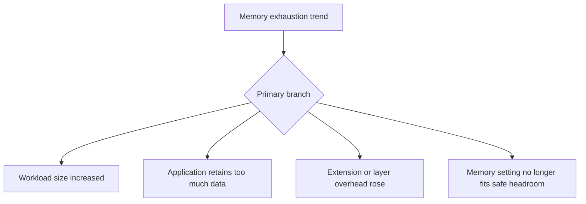

# Memory Exhaustion

## 1. Summary
Memory exhaustion is the performance stage before outright out-of-memory failure: the function still completes, but REPORT lines show `Max Memory Used` close to the configured limit and duration may rise because garbage collection or reduced headroom increases runtime overhead.



## 2. Common Misreadings
- If the function has not crashed, memory usage is acceptable.
- Memory pressure affects only memory, not duration.
- One high `Max Memory Used` sample is enough to resize permanently.
- Logging agents and layers have negligible footprint.
- A bigger timeout is a safer first move than more memory.

## 3. Competing Hypotheses
- H1: Payload or batch growth increased the working set — Primary evidence should confirm or disprove whether larger events map to higher memory use.
- H2: The application retains unnecessary objects or buffers — Primary evidence should confirm or disprove whether handler logic holds data longer than needed.
- H3: Layers, extensions, or runtime changes reduced headroom — Primary evidence should confirm or disprove whether baseline overhead rose independently of payload size.
- H4: The configured memory size is now too small for the normal workload — Primary evidence should confirm or disprove whether a modest memory increase restores healthy headroom and duration.

## 4. What to Check First
### Metrics
- `Errors` and `Duration` alongside the memory-pressure period.
- `Invocations` to see whether batch or demand patterns changed.
- Lambda Insights memory metrics if enabled.

### Logs
- REPORT lines with `Max Memory Used` near the configured size.
- Logs that reveal event size, batch size, or large object handling.
- Evidence of garbage collection or retry loops if the runtime surfaces them.

### Platform Signals
- Run `aws lambda get-function-configuration --function-name $FUNCTION_NAME` to confirm memory allocation and layers.
- Compare current version with the last healthy version to spot layer or extension additions.
- Preserve several REPORT lines from different payload sizes.

| Signal | Normal | Abnormal | Why it matters |
| --- | --- | --- | --- |
| Max Memory Used | Stable margin below limit | Repeated values close to the limit | Early warning before OOM |
| Duration | Independent of memory usage | Duration rises as memory headroom shrinks | Shows performance cost of pressure |
| Payload shape | Similar event size | Larger events align with memory peaks | Connects workload growth to risk |
| Version overhead | No baseline drift | New layer or runtime consumes extra baseline memory | Finds hidden non-handler memory use |

## 5. Evidence to Collect
### Required Evidence
- Multiple REPORT lines showing high memory use.
- Current memory size and layer configuration.
- Event payload or batch-size examples.
- Last known good configuration for comparison.

### Useful Context
- Whether the issue began after a dependency or observability change.
- Whether the function processes files, large query results, or large JSON payloads.
- Whether only one trigger path is affected.

### CLI Investigation Commands
#### 1. Confirm memory and layer configuration

```bash
aws lambda get-function-configuration \
    --function-name $FUNCTION_NAME
```

Example output:

```json
{
  "FunctionName": "$FUNCTION_NAME",
  "MemorySize": 768,
  "Layers": [
    {"Arn": "arn:aws:lambda:$REGION:<account-id>:layer:telemetry:5"}
  ]
}
```

#### 2. Pull recent duration metrics

```bash
aws cloudwatch get-metric-statistics \
    --namespace AWS/Lambda \
    --metric-name Duration \
    --dimensions Name=FunctionName,Value=$FUNCTION_NAME \
    --statistics Average Maximum \
    --start-time 2026-04-07T15:30:00Z \
    --end-time 2026-04-07T16:00:00Z \
    --period 60
```

Example output:

```json
{
  "Datapoints": [
    {"Timestamp": "2026-04-07T15:42:00+00:00", "Average": 1240.0, "Maximum": 1820.0},
    {"Timestamp": "2026-04-07T15:43:00+00:00", "Average": 1325.0, "Maximum": 1910.0}
  ],
  "Label": "Duration"
}
```

#### 3. Read REPORT lines from logs

```bash
aws logs tail /aws/lambda/$FUNCTION_NAME \
    --since 30m \
    --format short
```

Example output:

```text
2026-04-07T15:42:14 INFO processing 500 records from queue batch
2026-04-07T15:42:15 REPORT RequestId: 33333333-2222-1111-0000-999999999999 Duration: 1314.27 ms Billed Duration: 1315 ms Memory Size: 768 MB Max Memory Used: 731 MB
```

## 6. Validation and Disproof by Hypothesis
### H1: Payload or batch growth increased the working set

| Observation | Normal | Abnormal |
| --- | --- | --- |
| Event size | Stable record counts and payload size | Higher memory use aligns with larger events or batches |
| Trigger behavior | No workload shift | New upstream batching changed working set size |

### H2: The application retains unnecessary objects or buffers

| Observation | Normal | Abnormal |
| --- | --- | --- |
| Processing pattern | Streamed or chunked work | Full payloads or query results held in memory |
| Code change timing | No app memory regression | Recent logic change added caching or buffering |

### H3: Layers, extensions, or runtime changes reduced headroom

| Observation | Normal | Abnormal |
| --- | --- | --- |
| Baseline memory | Similar across versions | New layer/runtime consumes extra baseline memory |
| Payload sensitivity | Only large events affected | Even moderate events now show high memory use |

### H4: The configured memory size is now too small for the normal workload

| Observation | Normal | Abnormal |
| --- | --- | --- |
| Resize test | Higher memory has little effect | Higher memory restores headroom and lowers duration |
| REPORT lines | Max memory remains comfortably low | Max memory repeatedly reaches unsafe range |

## 7. Likely Root Cause Patterns
1. Workload size drifted beyond the original benchmark. Queue batches, richer event payloads, or larger database responses can quietly eliminate memory headroom.
2. The function buffers too much data at once. Reading full objects or aggregating entire result sets often causes both memory pressure and slower execution.
3. Observability and shared layers added hidden baseline cost. This matters most for small or medium memory allocations where tens of megabytes change the safety margin materially.
4. The memory setting simply no longer matches production reality. Because CPU scales with memory, increasing memory can improve both headroom and speed.

## 8. Immediate Mitigations
1. Increase function memory to restore headroom and CPU.

```bash
aws lambda update-function-configuration \
    --function-name $FUNCTION_NAME \
    --memory-size 1024
```

2. Reduce event source batch size or payload size if possible.
3. Roll back the most recent layer or extension addition if the timing matches.
4. Stream or chunk large in-memory operations.

## 9. Prevention
1. Review REPORT lines for memory headroom after every release.
2. Load test with the largest realistic payloads, not only typical ones.
3. Prefer streaming and incremental processing patterns.
4. Keep layer and extension footprints visible in performance reviews.
5. Alert before `Max Memory Used` gets close to the configured limit.

## See Also
- [Troubleshooting Playbooks](../index.md)
- [Out of Memory](../invocation-errors/out-of-memory.md)
- [High Duration](high-duration.md)

## Sources
- [Configuring Lambda memory](https://docs.aws.amazon.com/lambda/latest/dg/configuration-memory.html)
- [Troubleshoot memory issues in Lambda](https://docs.aws.amazon.com/lambda/latest/dg/troubleshooting-execution.html#troubleshooting-memory)
- [Lambda function logs](https://docs.aws.amazon.com/lambda/latest/dg/monitoring-cloudwatchlogs.html)
