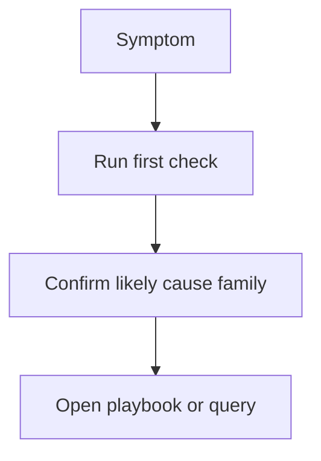

# Quick Diagnosis Cards

Use these cards during a live incident when you need the first command, the most likely cause family, and the best next playbook without reading a full guide.



## Function Returns Error

Three-line summary: the invoke reached your code, the handler or runtime produced an error, and the fastest evidence is usually already in the function log stream.

**First check command**

```bash
aws logs tail "/aws/lambda/$FUNCTION_NAME" \
    --since 15m \
    --region "$REGION"
```

**Likely cause**: unhandled exception, bad event parsing, missing environment variable, or downstream API failure.

**Best next page**: [Runtime Exceptions](./cloudwatch/application/runtime-exceptions.md) and [Runtime Crash Playbook](./playbooks/invocation-errors/runtime-crash.md)

## Function Times Out

Three-line summary: the runtime started, the handler did not finish before the configured timeout, and the key question is whether time was spent in init, handler logic, or a downstream dependency.

**First check command**

```bash
aws logs tail "/aws/lambda/$FUNCTION_NAME" \
    --since 15m \
    --region "$REGION"
```

**Likely cause**: slow downstream call, batch too large, CPU-bound work, or memory pressure increasing runtime.

**Best next page**: [Timeout Errors](./cloudwatch/application/timeout-errors.md) and [Function Timeout Playbook](./playbooks/invocation-errors/function-timeout.md)

## Function Throttled

Three-line summary: Lambda rejected or delayed work because concurrency was exhausted, the caller may see `TooManyRequestsException`, and the function log group might show little or nothing for the dropped invokes.

**First check command**

```bash
aws cloudwatch get-metric-statistics \
    --namespace AWS/Lambda \
    --metric-name Throttles \
    --dimensions Name=FunctionName,Value="$FUNCTION_NAME" \
    --start-time 2026-04-07T00:00:00Z \
    --end-time 2026-04-07T01:00:00Z \
    --period 300 \
    --statistics Sum \
    --region "$REGION"
```

**Likely cause**: reserved concurrency cap, account concurrency limit, burst traffic, or an event source mapping scaling faster than expected.

**Best next page**: [Throttle Trend](./cloudwatch/invocation/throttle-trend.md) and [Throttling Playbook](./playbooks/invocation-errors/throttling.md)

## Cold Start Too Slow

Three-line summary: the function is healthy after startup, but initialization cost is too high for the workload, especially after scale-out or idle periods.

**First check command**

```bash
aws logs start-query \
    --log-group-name "/aws/lambda/$FUNCTION_NAME" \
    --start-time 1712448000 \
    --end-time 1712451600 \
    --query-string 'fields @timestamp, @message | filter @message like /Init Duration/' \
    --region "$REGION"
```

**Likely cause**: large package, heavy dependency initialization, VPC networking overhead, or runtime-specific startup behavior.

**Best next page**: [Cold Start Duration](./cloudwatch/invocation/cold-start-duration.md) and [Cold Start Optimization Playbook](./playbooks/performance/cold-start-optimization.md)

## Out of Memory

Three-line summary: the function either crashed from memory exhaustion or ran close enough to the limit that duration and instability increased before failure.

**First check command**

```bash
aws lambda get-function-configuration \
    --function-name "$FUNCTION_NAME" \
    --region "$REGION"
```

**Likely cause**: large in-memory payloads, framework overhead, buffering, decompression, or insufficient memory size.

**Best next page**: [Memory Utilization](./cloudwatch/platform/memory-utilization.md) and [Memory Exhaustion Playbook](./playbooks/performance/memory-exhaustion.md)

## Permission Denied

Three-line summary: the invoke path or handler reached an IAM or resource policy boundary, and the fastest win is to identify which principal was denied against which action.

**First check command**

```bash
aws lambda get-policy \
    --function-name "$FUNCTION_NAME" \
    --region "$REGION"
```

**Likely cause**: missing invoke permission, incomplete execution role policy, missing KMS access, or a deployment-time role regression.

**Best next page**: [Runtime Exceptions](./cloudwatch/application/runtime-exceptions.md) and [Permission Denied Playbook](./playbooks/invocation-errors/permission-denied.md)

## VPC Timeout

Three-line summary: the function enters the runtime, but network calls stall or fail because the path to DNS, the internet, or a private dependency is incomplete or misconfigured.

**First check command**

```bash
aws lambda get-function-configuration \
    --function-name "$FUNCTION_NAME" \
    --region "$REGION"
```

**Likely cause**: missing NAT path, restrictive security groups, route table issue, DNS resolution failure, or subnet IP pressure.

**Best next page**: [Timeout Errors](./cloudwatch/application/timeout-errors.md) and [VPC Connectivity Playbook](./playbooks/networking/vpc-connectivity.md)

!!! tip
    If the first check does not confirm the symptom family within five minutes, switch from the card to the [Decision Tree](./decision-tree.md) so you do not stay anchored on the wrong hypothesis.

## See Also

- [Troubleshooting Hub](./index.md)
- [Decision Tree](./decision-tree.md)
- [Evidence Map](./evidence-map.md)
- [CloudWatch Query Library](./cloudwatch/index.md)
- [First 10 Minutes](./first-10-minutes/index.md)

## Sources

- [Troubleshoot Lambda invocation issues](https://docs.aws.amazon.com/lambda/latest/dg/troubleshooting-invocation.html)
- [Troubleshoot Lambda networking issues](https://docs.aws.amazon.com/lambda/latest/dg/troubleshooting-networking.html)
- [Monitoring Lambda functions with CloudWatch](https://docs.aws.amazon.com/lambda/latest/dg/monitoring-functions.html)
- [Lambda quotas](https://docs.aws.amazon.com/lambda/latest/dg/gettingstarted-limits.html)
